# ACS Reference Implementation over AGT — Shaping

## Frame (working)

**Source (user, verbatim):**

> we want to create a reference implementation of ACS, using the policies and infra defined here: https://github.com/microsoft/agent-governance-toolkit

> the goal here is that AGT is an open source set of policies; we want to show the world what using ACS as a wire contract can give you; this means we need to create adapters and have the ACS wire contract as a reference implementation for folks more familiar with ACS, then show why ACS takes things forward in a way that shows that it can account for threat models not remotely considered by AGT

> we don't need to showcase that AGT is incomplete, we just need to show how you can support something like AGT, or other implementations. we want to show how AGT can be completely expressed in ACS, first. this requires basically pulling what we can from the AGT, and showing that you don't need 7/8 different modules for each coding agent, you just need 1 ACS contract, and then AGT works across the rest of them. ACS is a normalizing wire contract

**Problem.** Governance integration is M×N today. AGT ships four per-agent host packages — and each has a *different architecture*: Copilot CLI is an in-process extension, Claude Code and Antigravity are subprocess hooks, OpenCode is an in-process TS plugin. Microsoft documents the resulting capability divergence in their own READMEs. Every new agent is another module, in every SDK, for every policy vendor. Every policy vendor repeats the work.

**Outcome.** A running system where one ACS contract sits between hosts and policy runtimes, and the multiplication collapses to addition. A host implements ACS once and is governable by any conformant runtime. AGT implements ACS once and governs any conformant host. The demo proves it by governing two structurally different agent hosts with one unforked AGT policy set and zero new AGT code.

**Sequencing.** Completeness first: AGT fully expressed in ACS, losslessly. The extension story — facts the contract carries that AGT delegates to the host — is headroom shown at the end, not a deficiency argument.

---

## Verified ground

See `spike-agt-integration.md` for the full investigation.

AGT top-level modules:

| Kind | Modules |
|---|---|
| Per-agent host packages | `agent-governance-antigravity-cli`, `agent-governance-claude-code`, `agent-governance-copilot-cli`, `agent-governance-opencode` |
| Language SDKs | `agent-governance-dotnet`, `-golang`, `-python`, `-rust`, `-typescript` |
| Policy runtime | `policy-engine` (MS-ACS spec `0.3.1-beta`, Rust core, library-only) |

MS-ACS surface to express (`policy-engine/spec/SPECIFICATION.md`, wire schemas):

| Element | Value |
|---|---|
| Intervention points | `agent_startup`, `input`, `pre_model_call`, `post_model_call`, `pre_tool_call`, `post_tool_call`, `output` — closed set; §22 "A host MUST NOT invent new identifiers in either set." |
| Verdicts | `allow`, `warn`, `deny`, `escalate`, `transform` |
| Policy input members | exactly five: `intervention_point`, `policy_target`, `snapshot`, `annotations`, `tool` |
| Transform bound | `^\$policy_target(\.\|\[\|$)`; other roots fail closed with `runtime_error:transform_target_forbidden` |
| Action identity | `input_identity` / `enforced_identity` = SHA-256 of canonical policy input, before / after transform |
| Error model | fail closed; any evaluation error yields `deny` with a reserved `runtime_error:` reason |
| Invocation | in-process SDK only. `AgentControl.from_path(manifest)` → `evaluate_intervention_point(point, snapshot)`. No HTTP/gRPC server exists |
| Stock policy | `agt_default.rego` bound at `data.agt.defaults.verdict`, configured entirely through `data.agt.defaults.config` YAML |
| IFC carriage | `result_labels` returned verbatim; "The core stores and propagates nothing" — the host must persist and re-supply labels |

The closed, five-member policy input is what makes "completely expressed in ACS" a provable claim rather than an aspiration.

---

## Requirements (R)

| ID | Requirement | Status |
|----|-------------|--------|
| **R0** | **One ACS contract normalizes host↔policy integration: AGT's policy layer, unforked, governs more than one agent host with no per-host AGT module** | Core goal |
| **R1** | **AGT is completely expressible in ACS** | Core goal |
| R1.1 | All 8 intervention points map to ACS hooks without loss | Must-have |
| R1.2 | All 5 verdicts map to ACS dispositions without loss — `warn` = `allow` with non-empty `policy_references` | Must-have |
| R1.3 | The AGT policy input's five members are constructible from an ACS envelope | Must-have |
| R1.4 | `enforced_identity` survives the adapter — approval binds to the action that executes | Must-have |
| R1.5 | 🟡 AGT's evaluation-layer fail-closed survives: an AGT `deny` verdict is delivered as an ACS `deny` and honored regardless of wire posture | Must-have |
| R1.6 | `transform`'s `$policy_target` bound survives as ACS `modify` | Must-have |
| R1.7 | 🟡 Wire-delivery failure applies the negotiated `on_decision_failure` posture (ACS default `proceed`) with every fail-open proceed audited — never conflated with AGT's evaluation-layer fail-closed | Must-have |
| R1.8 | 🟡 The three ACS mandatory fail-closed cases hold: malformed `modifications`, `DEFER` expiry, `ASK` expiry | Must-have |
| **R2** | 🟡 **Interop is real, and stays real** | Must-have |
| R2.1 | AGT's published policy library decides, used as shipped — driven only through `data.agt.defaults.config` | Must-have |
| R2.2 | AGT's engine runs unforked, at a pinned upstream version | Must-have |
| R2.3 | No change to AGT source is required to run the demo | Must-have |
| R2.4 | 🟡 Coupling is to AGT's declared contract surfaces only — `manifest.schema.json`, the `policy-input` / `verdict` / `snapshot` wire schemas, the intervention-point and verdict enums, and `data.agt.defaults.config`. Never SDK internals or private APIs | Must-have |
| R2.5 | 🟡 Scheduled CI re-runs the conformance harness against upstream AGT `main`, so drift surfaces as a failing case rather than silent rot | Must-have |
| R2.6 | 🟡 A drift failure names what changed in AGT's own terms — which intervention point, verdict, or schema field — so the fix is obvious | Must-have |
| R2.7 | 🟡 Non-breaking upstream AGT releases require no code change here | Must-have |
| **R3** | **The M×N collapse is demonstrated** | Core goal |
| R3.1 | Two structurally different hook surfaces governed by one AGT policy set | Must-have |
| R3.2 | The host adapter contains zero AGT-specific code — verifiable by inspection | Must-have |
| R3.3 | The AGT bridge contains zero host-specific code — verifiable by inspection | Must-have |
| R3.4 | Adding the second host requires zero new AGT code | Must-have |
| R3.5 | Claude Code is host #1 | Decided |
| R3.6 | 🟡 OpenCode is host #2 — in-process TS plugin against Claude Code's subprocess hooks | Leaning yes |
| R3.7 | No runtime swap. AGT is the only policy runtime in the demo | Decided |
| R3.8 | 🟡 Show that a capability frozen out of one AGT host module is reachable through the contract, framed as capability drift rather than defect | Leaning yes |
| **R4** | **AGT gains, doesn't lose** | Must-have |
| R4.1 | No capability regression versus AGT's native `agent-governance-claude-code` | Must-have |
| R4.2 | Nothing in the demo requires AGT to change | Must-have |
| R4.3 | Framing is integration-surface reduction, never deficiency | Must-have |
| R4.4 | AGT's native modules are described accurately as the baseline, not caricatured | Must-have |
| **R5** | **The ACS wire contract reads as a reference** | Must-have |
| R5.1 | Every hook firing is inspectable as an ACS envelope, not buried in library internals | Must-have |
| R5.2 | An ACS-first reader can trace one action end to end without reading AGT source | Must-have |
| R5.3 | Declares which ACS profiles it claims and which it does not | Must-have |
| R5.4 | Which `steps/*` hooks the implementation instruments | Undecided |
| **R6** | **The stateless/stateful split holds** | Must-have |
| R6.1 | AGT's engine stays stateless — complete policy input per decision | Must-have |
| R6.2 | Session state (SessionContext, Intent, lineage) lives in the ACS Guardian layer | Must-have |
| R6.3 | State is not duplicated across the two layers | Leaning yes |
| **R7** | **Runnable and reproducible** | Must-have |
| R7.1 | Starts with one command on a laptop | Must-have |
| R7.2 | No cloud account or paid dependency on the demo path | Must-have |
| R7.3 | Deterministic enough to demo live | Undecided |
| **R8** | **Headroom is visible, but it is not the pitch** | Leaning yes |
| R8.1 | 🟡 ACS provenance carries the IFC labels AGT's `result_labels` explicitly delegates to the host | Leaning yes |
| R8.2 | Unconsumed hooks cost AGT nothing — an AGT-profile host ignores them cleanly | Must-have |
| R8.3 | Whether the demo runs an actual policy over an ACS-only hook, or just shows the surface exists | Undecided |

---

## Known tension

**R1.2 vs. AGT `warn` — resolved, no spec change needed.** ACS has no `warn` in the `decision` enum, but it has the equivalent: an `allow` whose `policy_references` array is non-empty. The action proceeds, the rule that fired is named with `rule_id`, `reason_codes` categorizes it, `reasoning` explains it. A consumer separates observe-only from clean allow by testing `policy_references`. The round trip is lossless both ways. AGT's stock `drift` rule emits `warn`, so this path is exercised, not theoretical. The mapping doc's line — "ACS can encode this as `allow` plus metadata, but it is not first-class today" — undersells structured fields as metadata and should be corrected there too.

**R1.1 vs. `pre_model_call` / `post_model_call` — open.** ACS v0.1.0 has no model-call hook. The mapping doc proposes `steps/modelCall` (pre and post) for v0.2, 1:1 with AGT. Without it, two of AGT's eight points have no clean ACS target and R1.1 fails. This is the one place the reference implementation becomes a forcing function for v0.2 rather than a consumer of v0.1.0 alone.

---

## A: Guardian service in front of AGT

The literal reading of the spec. Hosts are ACS clients; a Guardian is a server; the wire is real. AGT is embedded in the Guardian as a library, since no server exists.

| Part | Mechanism | Flag |
|------|-----------|:----:|
| **A1** | **Host adapters — one per host, ACS-only** | |
| A1.1 | Claude Code: hook JSON → ACS request envelope over local HTTP; ACS decision → `permissionDecision` / `updatedInput` / `updatedToolOutput` | |
| A1.2 | OpenCode: same shape, driven from `tool.execute.before` / `.after` in-process plugin hooks | |
| **A2** | ACS Guardian service: JSON-RPC 2.0 over HTTP, validates every envelope against the v0.1.0 schemas | |
| **A3** | Session layer in the Guardian: SessionContext hash chain, Intent, provenance lineage; persists AGT `result_labels` and re-supplies as `input.ifc.source_labels` | |
| **A4** | AGT bridge: embeds the AGT **Node** SDK ⚠️ *amended, was Python*; ACS envelope → 5-member policy input; `evaluateInterventionPoint`; verdict → ACS decision | |
| **A5** | Envelope tap: every request and response rendered as pretty JSON in a live viewer | |
| **A6** | Demo runbook: one AGT policy bundle, both hosts, side by side with AGT's native packages | |

## B: In-process ACS library

Same mapping, no network. Envelopes are constructed and schema-validated but passed in memory.

| Part | Mechanism | Flag |
|------|-----------|:----:|
| **B1** | Host adapters call a Guardian library directly instead of a socket | |
| **B2** | ACS envelope objects built and validated against v0.1.0 schemas, never serialized | |
| **B3** | Session layer in-process | |
| **B4** | AGT bridge, as A4 | |
| **B5** | Envelope tap writes to a log file | |
| **B6** | Demo runbook, as A6 | |

## C: Contract-first — the mapping is the deliverable

The runtime exists, but the artifact Microsoft reads is a machine-checked mapping table plus a green conformance matrix. The demo is evidence for it, not the product.

| Part | Mechanism | Flag |
|------|-----------|:----:|
| **C1** | Normative ACS ↔ MS-ACS mapping as data: 8 intervention points, 5 verdicts, the 5 policy-input members, action identity, error taxonomy | |
| **C2** | Conformance harness: a round-trip case per point and per verdict proving no loss. A red cell is a spec defect, not a bug | |
| **C3** | Host adapters driven by a per-host hook-mapping file rather than handwritten dispatch | |
| **C4** | Guardian service, session layer, and AGT bridge, as A2–A4 | |
| **C5** | Published artifact = mapping table + test matrix; the running demo is the proof it holds | |
| **C6** | Upstream drift watch: the same harness runs on a schedule against AGT `main`. A red cell names the changed intervention point, verdict, or schema field | |

---

## Fit Check

Post-spike. All flags cleared, so the check now discriminates.

| Req | Requirement | Status | A | B | C |
|-----|-------------|--------|---|---|---|
| R0 | One ACS contract normalizes host↔policy integration: AGT's policy layer, unforked, governs more than one agent host with no per-host AGT module | Core goal | ✅ | ✅ | ✅ |
| R1 | AGT is completely expressible in ACS | Core goal | ❌ | ❌ | ✅ |
| R2 | 🟡 Interop is real, and stays real | Must-have | ❌ | ❌ | ✅ |
| R3 | The M×N collapse is demonstrated | Core goal | ✅ | ✅ | ✅ |
| R4 | AGT gains, doesn't lose | Must-have | ✅ | ✅ | ✅ |
| R5 | The ACS wire contract reads as a reference | Must-have | ✅ | ❌ | ✅ |
| R6 | The stateless/stateful split holds | Must-have | ✅ | ❌ | ✅ |
| R7 | Runnable and reproducible | Must-have | ✅ | ✅ | ✅ |
| R8 | Headroom is visible, but it is not the pitch | Leaning yes | ✅ | ✅ | ✅ |

**Notes:**
- R1 fails A and B: both assert complete expressibility, neither proves it. Only C2 turns "completely expressed" into a per-case result someone can check. On the claim the whole pitch rests on, asserted is not enough. Adding R1.7 and R1.8 does not move these verdicts — all three shapes *can* implement the posture split; only C demonstrates it case by case, now via the extended N44.
- 🟡 R2 fails A and B on drift (R2.5, R2.6): without a conformance harness there is nothing to re-run against upstream, so an AGT change is discovered by a human noticing, or not at all. C6 makes drift a named failing case. MS-ACS is `0.3.1-beta` and warns of breaking changes between minor versions, so this is a live risk, not a theoretical one.
- R5 fails B: envelopes that are never serialized are not inspectable on the wire, which is what R5.1 asks for.
- R6 fails B: an in-process Guardian sharing a heap with the host adapter makes the stateless/stateful split an assertion rather than an observable property.
- **C is selected.** It carries every requirement A does and is the only shape that proves R1.
- ⚠️ **A4's SDK choice is load-bearing for R1.4, discovered during V1 planning.** AGT's PyO3 binding surfaces only `action_identity`, collapsing `input_identity` and `enforced_identity`; the Node binding serializes both. Every shape embeds A4, so on the Python SDK R1.4 ("`enforced_identity` survives the adapter") would be unverifiable in *all three* columns and C's R1 ✅ would not survive contact with C2's harness. A4 is amended to the Node SDK and the verdicts stand as written. No other row moves.

---

## Spikes

All resolved — see `spike-agt-integration.md`.

| # | Spike | Outcome |
|---|-------|---------|
| **S1** | How is AGT's engine invoked unforked? | Library-only, in-process, no server. Guardian embeds an SDK. Rego needs the `opa` CLI; Cedar is built in |
| **S2** | Which ACS dispositions can Claude Code express? | All five. `permissionDecision` covers allow/deny/ask/defer; `updatedInput` and `updatedToolOutput` cover modify |
| **S3** | Same for host #2 | AGT's four host packages have four architectures with documented capability divergence. OpenCode beats Copilot CLI on every axis |
| **S4** | What ships in the stock bundle? | 11 Rego modules plus Cedar parity, fixed priority order, fully config-driven. `result_labels` carriage is delegated to the host |

### Follow-ups

| # | Item |
|---|------|
| F1 | Confirm by hand that Claude Code `PostToolUse.updatedToolOutput` rewrites tool results as documented |
| F2 | Confirm an OpenCode plugin can express deny and modify through `tool.execute.before` / `.after` |
| ~~F3~~ | ✅ **Resolved: Rego.** The premise was wrong — the SDK bundles OPA 0.70.0 as a platform package, so Rego needs no external binary and Cedar's only advantage disappears. Stock bundle verified 105/105 under the bundled OPA and system OPA 1.18.2. Closes D7 |

---

## Detail C: Affordances

### Places

| # | Place | Description |
|---|-------|-------------|
| P1 | Claude Code session | Host #1. Subprocess command hooks |
| P2 | OpenCode session | Host #2. In-process TS plugin |
| P3 | ACS Guardian service | The ACS wire boundary and all session state |
| P3.1 | AGT bridge | Subplace of P3. Embedded AGT runtime, stateless |
| P4 | Envelope Inspector | Live view of ACS traffic |
| P5 | Conformance Report | Coverage matrix, mapping table, drift check |

### UI Affordances

| # | Place | Component | Affordance | Control | Wires Out | Returns To |
|---|-------|-----------|------------|---------|-----------|------------|
| U1 | P1 | claude-code | prompt input | type | → N1 | — |
| U2 | P1 | claude-code | tool permission outcome in transcript | render | — | — |
| U3 | P1 | claude-code | rewritten tool output in transcript | render | — | — |
| U10 | P2 | opencode | prompt input | type | → N10 | — |
| U11 | P2 | opencode | tool decision surface | render | — | — |
| U12 | P2 | opencode | redacted tool output | render | — | — |
| U20 | P4 | inspector | envelope stream, request/response JSON pairs | render | — | — |
| U21 | P4 | inspector | decision badge: decision + `policy_references` + `reason_codes` | render | — | — |
| U22 | P4 | inspector | session chain view: SessionContext entries and lineage | render | — | — |
| U23 | P4 | inspector | posture badge: negotiated `on_decision_failure`, plus a running count of audited fail-open proceeds | render | — | — |
| U30 | P5 | conformance | coverage matrix, 8 intervention points × 5 verdicts | render | — | — |
| U31 | P5 | conformance | drift detail: changed point, verdict, or schema field | render | — | — |
| U32 | P5 | conformance | rendered ACS ↔ MS-ACS mapping table | render | — | — |

### Code Affordances

| # | Place | Component | Affordance | Control | Wires Out | Returns To |
|---|-------|-----------|------------|---------|-----------|------------|
| N1 | P1 | acs-hook shim | generic hook entrypoint, reads hook JSON on stdin | call | → N2 | — |
| N2 | P1 | `@acs/host-adapter` | `buildEnvelope(event, payload, hookmap)` | call | → N4 | — |
| N3 | P1 | `@acs/host-adapter` | `renderDecision(decision, hookmap)` → `hookSpecificOutput` on stdout | call | → U2, → U3 | — |
| N4 | P1 | `@acs/host-adapter` | `guardianClient.post()` JSON-RPC over HTTP | call | → N20 | → N7 |
| N5 | P1 | `@acs/host-adapter` | `handshake()` — `handshake/hello`; negotiates `timeout_config`, `on_decision_failure`, profiles | call | → N28 | → S13 |
| N6 | P1 | `@acs/host-adapter` | `applyFailurePosture()` — no decision within timeout → negotiated posture (default `proceed`); writes an audit event on every fail-open proceed | call | → S14, → N3 | — |
| N7 | P1 | `@acs/host-adapter` | `validateDecision()` — malformed `modifications` → `DENY`; `ASK`/`DEFER` expiry → their `timeout_*` defaults | call | → N3, → N6 | — |
| N10 | P2 | acs-plugin shim | OpenCode plugin hooks: `session.start`, `event`, `tool.execute.before/after/error` | call | → N11 | — |
| N11 | P2 | `@acs/host-adapter` | `buildEnvelope()` — **same module as N2** | call | → N13 | — |
| N12 | P2 | `@acs/host-adapter` | `renderDecision()` — **same module as N3** | call | → U11, → U12 | — |
| N13 | P2 | `@acs/host-adapter` | `guardianClient.post()` — **same module as N4** | call | → N20 | → N16 |
| N14 | P2 | `@acs/host-adapter` | `handshake()` — **same module as N5** | call | → N28 | → S15 |
| N15 | P2 | `@acs/host-adapter` | `applyFailurePosture()` — **same module as N6** | call | → S16, → N12 | — |
| N16 | P2 | `@acs/host-adapter` | `validateDecision()` — **same module as N7** | call | → N12, → N15 | — |
| N20 | P3 | guardian | `POST /acs` JSON-RPC 2.0 endpoint | call | → N21 | — |
| N21 | P3 | guardian | `validateEnvelope()` against v0.1.0 schemas | call | → N22, → N27 | — |
| N22 | P3 | guardian | `appendSessionEntry()` — hash-chained SessionContext | call | → S3, → N23 | — |
| N23 | P3 | guardian | `assembleSnapshot()` — envelope + session state → AGT snapshot | call | → N30 | — |
| N24 | P3 | guardian | `mapVerdict()` — AGT verdict → ACS decision; `warn` → `allow` + `policy_references` | call | → N25, → N26 | → N4, → N13 |
| N25 | P3 | guardian | `persistResultLabels()` — AGT `result_labels` into ACS lineage | call | → S5 | — |
| N26 | P3 | guardian | `writeEnvelopeTap()` | call | → S6 | — |
| N27 | P3 | guardian | `denyOnInvalidEnvelope()` — schema or bridge failure returns an explicit ACS `deny` **decision**, not a bare error, so the host honors it instead of falling back to posture | call | → N26 | → N4, → N13 |
| N28 | P3 | guardian | `handshakeResponder()` — ServerHello: `timeout_config`, `on_decision_failure`, `profiles_accepted` | call | → N26 | → N5, → N14 |
| N30 | P3.1 | agt-bridge | `evaluateInterventionPoint(point, snapshot)` — Node SDK | call | — | → N24 |
| N31 | P3.1 | agt-bridge | `AgentControl.fromPath(manifest.yaml)` at boot | call | — | → N30 |
| N40 | P5 | conformance | `acs-agt-conformance` runner | call | → N41, → N42, → N43, → N44 | — |
| N41 | P5 | conformance | intervention-point round trip, validated against `policy-input.schema.json` | call | — | → N47 |
| N42 | P5 | conformance | verdict round trip: AGT verdict → ACS decision → AGT verdict, assert identity | call | — | → N47 |
| N43 | P5 | conformance | `enforced_identity` recomputation check | call | — | → N47 |
| N44 | P5 | conformance | failure-domain check: an AGT evaluation error arrives as an honored `deny`; a delivery failure applies the negotiated posture and writes an audit event | call | — | → N47 |
| N45 | P5 | conformance | `fetchUpstreamSurfaces()` — AGT wire schemas and enums at `main` | call | → S12 | — |
| N46 | P5 | conformance | `diffSurfaces()` — pinned versus upstream | call | — | → N47 |
| N47 | P5 | conformance | `renderMatrix()` | call | → U30, → U31 | — |
| N48 | P5 | conformance | `renderMappingTable()` | call | → U32 | — |
| N50 | P4 | inspector | `tailEnvelopeLog()` | observe | → U20, → U21, → U22 | — |
| N51 | P4 | inspector | `tailAuditSinks()` — host-side fail-open audit events and negotiated posture | observe | → U23 | — |

### Data Stores

| # | Place | Store | Description |
|---|-------|-------|-------------|
| S1 | P1 | `claude-code.hookmap.yaml` | Claude Code hook names ↔ ACS `steps/*`; ACS decisions ↔ `permissionDecision` / `updatedInput` / `updatedToolOutput` |
| S2 | P2 | `opencode.hookmap.yaml` | OpenCode plugin hooks ↔ ACS `steps/*`; ACS decisions ↔ plugin return values |
| S13 | P1 | `negotiated session config` | ServerHello result: `timeout_config`, `on_decision_failure`, startup posture, `profiles_accepted` |
| S14 | P1 | `audit sink` | Every fail-open proceed, per §6.4's MUST |
| S15 | P2 | `negotiated session config` | Same shape as S13 |
| S16 | P2 | `audit sink` | Same shape as S14 |
| S3 | P3 | `sessionContext` | Hash-chained entries per `session_id` |
| S4 | P3 | `intent` | Immutable Intent baseline per session |
| S5 | P3 | `provenance` | `origin` / `derived_from` lineage, carrying AGT `result_labels` between steps |
| S6 | P3 | `envelope log` | JSONL of every request and response |
| S7 | P3.1 | `manifest.yaml` | Binds the `rego` policy to `data.agt.defaults.verdict`; declares intervention points, tools, approval |
| S8 | P3.1 | `data.agt.defaults.config` | Thresholds, allowlists, pattern lists — the only place policy behaviour is authored |
| S9 | P3.1 | AGT stock bundle | `policy/lib/*.rego` at the pinned ref. Requires the `opa` CLI on PATH |
| S12 | P5 | upstream AGT surfaces | Wire schemas and enums fetched from `main` |

### Shared Data Stores

| # | Store | Description | Read by |
|---|-------|-------------|---------|
| S10 | `mapping.yaml` | The normative ACS ↔ MS-ACS mapping (C1) | N23, N24 (runtime) and N41, N42, N48 (harness) |
| S11 | `agt.lock` | Pinned upstream AGT ref | N31 (bridge) and N46 (differ) |

**S10 is the load-bearing design choice.** The same mapping file drives the runtime *and* the conformance harness. If the adapter and the claimed mapping ever diverge, the matrix goes red. That is what makes C1 a contract rather than documentation, and it is why C wins R1 in the fit check.

### Wiring

```mermaid
flowchart TB
    subgraph P1["P1: Claude Code session"]
        U1["U1: prompt input"]
        U2["U2: tool permission outcome"]
        U3["U3: rewritten tool output"]
        N1["N1: acs-hook shim"]
        N2["N2: buildEnvelope()"]
        N3["N3: renderDecision()"]
        N4["N4: guardianClient.post()"]
        N5["N5: handshake()"]
        N6["N6: applyFailurePosture()"]
        N7["N7: validateDecision()"]
        S1["S1: claude-code.hookmap.yaml"]
        S13["S13: negotiated session config"]
        S14["S14: audit sink"]
    end

    subgraph P2["P2: OpenCode session"]
        U10["U10: prompt input"]
        U11["U11: tool decision surface"]
        U12["U12: redacted tool output"]
        N10["N10: acs-plugin shim"]
        N11["N11: buildEnvelope() — same module as N2"]
        N12["N12: renderDecision() — same as N3"]
        N13["N13: guardianClient.post() — same as N4"]
        N14["N14: handshake() — same as N5"]
        N15["N15: applyFailurePosture() — same as N6"]
        N16["N16: validateDecision() — same as N7"]
        S2["S2: opencode.hookmap.yaml"]
        S15["S15: negotiated session config"]
        S16["S16: audit sink"]
    end

    subgraph P3["P3: ACS Guardian service"]
        N20["N20: POST /acs JSON-RPC"]
        N21["N21: validateEnvelope()"]
        N22["N22: appendSessionEntry()"]
        N23["N23: assembleSnapshot()"]
        N24["N24: mapVerdict()"]
        N25["N25: persistResultLabels()"]
        N26["N26: writeEnvelopeTap()"]
        N27["N27: denyOnInvalidEnvelope()"]
        N28["N28: handshakeResponder()"]
        S3["S3: sessionContext chain"]
        S4["S4: intent"]
        S5["S5: provenance + result_labels"]
        S6["S6: envelope log"]

        subgraph P31["P3.1: AGT bridge"]
            N30["N30: evaluateInterventionPoint()"]
            N31["N31: AgentControl.fromPath()"]
            S7["S7: manifest.yaml"]
            S8["S8: data.agt.defaults.config"]
            S9["S9: AGT stock bundle (pinned)"]
        end
    end

    subgraph P4["P4: Envelope Inspector"]
        U20["U20: envelope stream"]
        U21["U21: decision badge"]
        U22["U22: session chain view"]
        U23["U23: posture badge"]
        N50["N50: tailEnvelopeLog()"]
        N51["N51: tailAuditSinks()"]
    end

    subgraph P5["P5: Conformance Report"]
        U30["U30: 8x5 coverage matrix"]
        U31["U31: drift detail"]
        U32["U32: mapping table"]
        N40["N40: conformance runner"]
        N41["N41: point round trip"]
        N42["N42: verdict round trip"]
        N43["N43: enforced_identity check"]
        N44["N44: fail-closed check"]
        N45["N45: fetchUpstreamSurfaces()"]
        N46["N46: diffSurfaces()"]
        N47["N47: renderMatrix()"]
        N48["N48: renderMappingTable()"]
        S12["S12: upstream AGT surfaces"]
    end

    subgraph shared["DATA STORES (shared)"]
        S10["S10: mapping.yaml"]
        S11["S11: agt.lock"]
    end

    U1 --> N1
    N1 --> N2
    S1 -.-> N2
    N2 --> N4
    N4 --> N20
    N4 -.-> N7
    N7 --> N3
    N7 -->|no decision| N6
    N6 --> S14
    N6 --> N3
    N5 --> N28
    N5 -.-> S13
    S13 -.-> N6
    S1 -.-> N3
    N3 --> U2
    N3 --> U3

    U10 --> N10
    N10 --> N11
    S2 -.-> N11
    N11 --> N13
    N13 --> N20
    N13 -.-> N16
    N16 --> N12
    N16 -->|no decision| N15
    N15 --> S16
    N15 --> N12
    N14 --> N28
    N14 -.-> S15
    S15 -.-> N15
    S2 -.-> N12
    N12 --> U11
    N12 --> U12

    N20 --> N21
    N21 --> N22
    N21 -->|error| N27
    N22 --> S3
    N22 --> N23
    S3 -.-> N23
    S4 -.-> N23
    S5 -.-> N23
    S10 -.-> N23
    N23 --> N30

    S7 -.-> N31
    S8 -.-> N31
    S9 -.-> N31
    S11 -.-> N31
    N31 -.-> N30
    N30 -.-> N24

    S10 -.-> N24
    N24 --> N25
    N24 --> N26
    N25 --> S5
    N26 --> S6
    N27 --> N26
    N28 --> N26
    N28 -.-> N5
    N28 -.-> N14
    N24 -.-> N4
    N24 -.-> N13
    N27 -.-> N4
    N27 -.-> N13

    S6 -.-> N50
    N50 --> U20
    N50 --> U21
    N50 --> U22
    S14 -.-> N51
    S16 -.-> N51
    N51 --> U23

    N40 --> N41
    N40 --> N42
    N40 --> N43
    N40 --> N44
    S10 -.-> N41
    S10 -.-> N42
    N41 -.-> N47
    N42 -.-> N47
    N43 -.-> N47
    N44 -.-> N47
    N45 --> S12
    S11 -.-> N46
    S12 -.-> N46
    N46 -.-> N47
    N47 --> U30
    N47 --> U31
    S10 -.-> N48
    N48 --> U32

    classDef ui fill:#ffb6c1,stroke:#d87093,color:#000
    classDef nonui fill:#d3d3d3,stroke:#808080,color:#000
    classDef store fill:#e6e6fa,stroke:#9370db,color:#000

    class U1,U2,U3,U10,U11,U12,U20,U21,U22,U23,U30,U31,U32 ui
    class N1,N2,N3,N4,N5,N6,N7,N10,N11,N12,N13,N14,N15,N16,N20,N21,N22,N23,N24,N25,N26,N27,N28,N30,N31,N40,N41,N42,N43,N44,N45,N46,N47,N48,N50,N51 nonui
    class S1,S2,S3,S4,S5,S6,S7,S8,S9,S10,S11,S12,S13,S14,S15,S16 store
```

### What the breadboard proves

| Requirement | Where it shows up |
|---|---|
| R3.2 — host adapter has zero AGT-specific code | N2/N3/N4 name no AGT concept. The only per-host artifacts are S1 and S2, both pure data |
| R3.3 — AGT bridge has zero host-specific code | N30/N31 receive an assembled snapshot. Nothing in P3.1 knows a host exists |
| R3.4 — second host costs no AGT code | P2 reuses N2/N3/N4 verbatim. Only S2 and the N10 shim are new |
| R6.1 — AGT stays stateless | Every store lives in P3, never P3.1 |
| R6.2 — session state in the Guardian | S3, S4, S5 |
| R1.5 — AGT's evaluation fail-closed survives | N27 returns an explicit `deny` **decision**, so §6.4's "honor any decision that arrives" carries AGT's invariant intact |
| R1.7 — wire posture is negotiated, not hard-coded | N5/N14 negotiate it into S13/S15; N6/N15 apply it and audit every fail-open proceed to S14/S16 |
| R1.8 — mandatory fail-closed cases | N7/N16 |
| R2.5/R2.6 — drift is a named failure | N45, N46 → U31 |

---

## Open decisions

| # | Decision | Status | Why it matters |
|---|----------|--------|----------------|
| D1 | R3.6 — confirm OpenCode as host #2, replacing Copilot CLI | Recommended, unconfirmed | Same "AGT already supports it" property, far lower setup friction, and the sharpest architectural contrast with Claude Code |
| D2 | R3.7 — swap the runtime too? | Decided: no | Keeps every arm one Microsoft recognizes; costs the vendor-neutrality demonstration |
| D3 | R5.4 — hook coverage | Open | All 19 is a spec exercise; the 8 AGT consumes is the minimum that proves R1 |
| D4 | R1.1 — spec `steps/modelCall` for v0.2 as part of this work, or map AGT's two model-call points onto existing hooks and declare the seam | Open | Decides whether this is an implementation project or a spec-and-implementation project |
| D5 | R7.3 — determinism | Open | A scripted transcript demos reliably; a live model demos honestly |
| D6 | Shape selection | **Decided: C** | C is the only shape that proves R1 rather than asserting it |
| ~~D7~~ | F3 — Rego or Cedar for the demo bundle | ✅ **Decided: Rego** | The deciding factor was wrong. Cedar's advantage was removing an external binary, but the SDK ships OPA 0.70.0 as a platform package — so Rego, the canonical binding, costs nothing extra. Verified: stock bundle 105/105 under the bundled OPA |
| D8 | 🟡 Which `on_decision_failure` the reference ships as its default | Open, leaning `proceed` | The spec default is `proceed` (fail-open). Shipping the spec default is the honest choice, but a security-facing demo that fails open needs the audit trail on screen (U23) to read correctly. V1 negotiates and stores it (N5/N28/S13); V3 applies it (N6), so the decision is only needed by V3 |
| D9 | ⚠️ **New.** Report the `./` bundle-path fail-open upstream to AGT? | Open | A `./`-prefixed `bundle:` silently voids all policy and returns `allow` with no error. It is a fail-open in a governance tool and affects any AGT host, not just us. Reporting is the good-citizen move and consistent with R4.3's non-adversarial framing; it is also unattributed outbound traffic, so it needs an explicit decision before anything is sent |
