# ACS Normative IR — Shaping

Sibling to [`acs-reference-impl-shaping.md`](./acs-reference-impl-shaping.md). Separate work stream, same repo (R8.1), and deliberately independent of the AGT bridge and host adapters (R8.2).

## Frame (working)

**Source (user, verbatim):**

> separately from the reference implementation, I want you to start working on converting the normative spec to normative IR

> For **ACS specifically**, I'd build a **Datalog-centered executable conformance verifier**, not a Lean-first implementation.
>
> The reason is that the ACS spec is fundamentally a **protocol plus trace semantics**. It contains requirements such as handshake-before-hook traffic, bounded `DEFER`, single-hop `ASK`, provenance lineage, replay protection, append-only/hash-linked session state, disposition-specific required fields, and ordering requirements like deterministic evaluation occurring before agent evaluation.

> ### Don't force everything into Datalog
>
> | ACS requirement | Mechanism |
> | --- | --- |
> | JSON shape/types/enums/required fields | **JSON Schema 2020-12** |
> | Ordering, lineage, cross-event invariants | **Datalog / Soufflé** |
> | SHA-256, signatures, timestamps, URI parsing | **normal TypeScript/Rust/Python code** feeding facts |
> | Policy-engine-specific behavior | **adapter/test harness**, optionally Rego |

> But I would **not make Rego the formal definition of ACS conformance**. ACS says custom policy engines are allowed, so tying the conformance definition to the reference policy engine creates an unnecessary conceptual coupling.

> ### The most important part: create a normative IR
>
> The thing I'd invest in most isn't actually the language. It's turning every normative ACS statement into a structured requirement. That requirement catalog becomes the **formal bridge between human-readable ACS and executable ACS**.
>
> ```text
> Normative prose
>       ↕
> Requirement ID
>       ↕
> Formal predicate
>       ↕
> Executable verifier
>       ↕
> Conformance test
> ```
>
> So when `ACS-0.2` changes a sentence, you can immediately know which rule and which conformance tests must change.

> **TypeScript/Rust verifier shell + JSON Schema + Soufflé Datalog + TLA+ model.** Then optionally add **Lean later to prove the verifier's core semantics correct**.
>
> > **Datalog verifies ACS implementations.**
> > **TLA+ verifies the ACS protocol design.**
> > **Lean verifies that your verifier is mathematically faithful to a formal definition of ACS.**

**Source — decisions on the four blocking questions (user, verbatim):**

> I think you should add explicit requirement identifiers to ACS if the goal is a serious conformance/verifier ecosystem. Your instinct is aligned with established standards-testing practice, not an unusual formal-methods embellishment.
>
> W3C's older QA guidance is remarkably explicit here: testable assertions should be unambiguously identifiable, carry a unique assertion ID, and identify the specification location from which they come.
>
> The important nuance is that I would not make 200 visible `[ACS-REQ-017]` labels part of the reading experience. […] Put a stable machine-readable anchor immediately on each atomic normative requirement […] But tools and tests get a permanent address.
>
> Then maintain a generated requirements manifest rather than hand-maintaining duplicate prose […] Tests reference only `ACS-REQ-017`, not quoted English.

> ### The subtle part: IDs don't solve semantic-change detection
>
> You're exactly right that quote matching is inadequate. But an ID alone doesn't quite solve this either. […] No machine can reliably determine whether that is purely editorial.
>
> So I would make the CI model conservative: normative text changed → `ACS-REQ-017` changed → all tests claiming `ACS-REQ-017` become "needs review". Not necessarily "invalid," but stale until reviewed. Then the reviewer can classify the change: editorial → tests remain valid; semantic → tests must be updated/re-reviewed; split/merge/new requirement → issue new requirement IDs.
>
> That gives you the exact dependency graph you want without pretending NLP can distinguish copy edits from semantic changes.

> ### I would establish four identifier rules
>
> IDs are permanent and opaque. `ACS-REQ-017`, not `ACS-3.4.2-MUST-1`. Section numbers change.
> Never renumber or reuse IDs. If requirement 17 disappears, 017 stays retired.
> Editorial changes retain the ID. Tests get review-triggered but don't get new identities.
> Splits and genuinely new obligations get new IDs.

> ### On doing this upstream
>
> For ACS specifically, I would not open a surprise PR containing ~200 marker insertions first. The project's current contribution guide explicitly says to get feedback before investing substantial effort, and says changes to the specification itself should go through a Discussion before the PR. […] I'd make the governance sequence: Discussion → tiny proof-of-concept PR → bulk mechanical PR. The Discussion would propose the mechanism, not debate all 200 IDs.

> 2. do it in `/Users/arielfogel/Pillar/ACS_reference_implementation/`

> I'd **include `concepts/provenance.md` and `concepts/intent.md` in the normative corpus, but not treat every sentence in them as a requirement**. That distinction solves the problem cleanly. […] I'd make the IR have at least these node types: Requirement, Definition, Invariant, Informative. […] Then a requirement can depend on definitions.
>
> This is especially important because **normative definitions can change conformance without adding or removing a single MUST**. […] So I would define: **Corpus membership is determined by normative status, not RFC 2119 grep. Requirement discovery is a separate operation.**
>
> I'd therefore produce two explicit outputs: 1. Normative source census […] 2. Normative provision census.

> ## First pass: deep, but with a cheap wide census
>
> I would **not choose "all 203, no backend."** […] So it's **wide discovery, deep implementation**. If you force me to choose only one, choose **deep**.
>
> The biggest risk right now is not that you miss requirement #184. It's that you design an IR that looks plausible for 203 rows and then discover when implementing the verifier that it cannot faithfully express ACS. Soufflé is going to force questions that eyeballing won't.
>
> Don't do §1–§3 just because they come first. Pick perhaps 20 requirements intentionally spanning [18 semantic kinds]. […] That last group matters. It tests your **conformance semantics**, not merely your Datalog syntax. For instance `MAY archive entries...` should probably generate **no obligation merely because archival didn't occur**. Whereas "If archival occurs, it MUST preserve X, Y, Z" does produce an obligation conditional on an implementation choice. Your IR needs to represent that distinction.
>
> If you go wide first and discover at requirement 150 that your model of `subject`, `condition`, `modality`, `predicate` cannot express one of ACS's stateful semantics, you may have to reinterpret 149 entries.

> One more thing I'd add: **definitions should get stable IDs too**, not just `MUST`s. That's the missing piece in your §7 / §8.4 problem. […] Then a changed provenance definition can invalidate precisely the formal rules and tests that depend on it, even if no RFC 2119 sentence changed.

**Problem.** ACS v0.1.0's normative content is prose. There are ~203 RFC 2119 keyword occurrences across the corpus and **zero provision identifiers** — nothing to cite, nothing to test against, nothing to diff. Four consequences follow:

1. **No conformance claim is checkable.** "ACS-Core conformant" is a sentence, not a measurement. `conformance.md` describes seven profiles in prose; nothing enumerates what each profile actually obliges, so nothing can report which obligations a deployment met.
2. **Spec edits are silent.** A sentence can change meaning in v0.2 with no signal to any implementer, test, or downstream verifier.
3. **Definition changes are invisible even to a keyword diff.** `specification.md` §7 and §8.4 delegate normative force to `concepts/provenance.md` and `concepts/intent.md`. Those two files carry 3 RFC 2119 keyword occurrences between them, so a change that alters what "provenance lineage" *means* — and therefore what §7's `MUST` obliges — produces no keyword delta at all.
4. **Defects hide in the prose.** Verified while surveying: `specification.md` **has no `## 9.` heading**. Three normative statements — "Approver authentication is REQUIRED", "Guardian MUST verify approver identity against policy", "Approvers MUST NOT return ASK" — sit orphaned inside §8.6 *Chain head publication*, while §6 and §8.4 both hyperlink to `§9.1`/`§9.2` as if §9 existed. Nobody caught it because nothing enumerates the provisions.

**Outcome.** Every normative provision in ACS — obligation, definition, and invariant alike — carries a permanent opaque ID living in the prose itself, a declared node type, and (for testable obligations) a machine-readable predicate over one fact vocabulary. `acs verify <implementation>` emits a W3C-style conformance report with per-provision verdicts and evidence. A spec PR reports its own normative impact: which provisions changed, which rules and tests went stale, which new obligations have no test, and which normative statements were left unmarked.

**Sequencing.** Wide mechanical census immediately; deep compiled vertical slice before the 203-item editorial conversion. The census is cheap and bounds the problem. The vertical slice is what discovers whether the IR can express ACS at all — and a compiler discovers that, where inspection does not.

**Non-goals.** The full Soufflé rule set, the TLA+ model, the verifier shell, and Lean are *consumers* of the IR, shaped later. R6 exists to keep the IR from foreclosing them.

---

## Verified ground

Surveyed at ACS `c259f57` (v0.1.0, `version.txt` = `0.1.0`) — the pinned `spec/acs` submodule, tracking `Agent-Control-Standard/ACS`, mirrored at the user's fork `afogel/ACS_official`.

### Normative corpus and its density

| File | RFC 2119 keyword occurrences |
|---|---|
| `docs/spec/instrument/specification.md` | 111 |
| `docs/spec/instrument/hooks.md` | 27 |
| `docs/spec/conformance.md` | 22 |
| `docs/spec/trace/extend_opentelemetry.md` | 8 |
| `docs/spec/trace/events.md` | 7 |
| `docs/spec/inspect/README.md` | 7 |
| `docs/concepts/agents.md` | 6 |
| `docs/concepts/README.md` | 3 |
| `docs/topics/ACS_in_action_example.md` | 2 |
| `docs/spec/instrument/extend_mcp.md` | 2 |
| `docs/concepts/session-lifecycle.md` | 2 |
| `docs/concepts/intent.md` | 2 |
| `docs/spec/inspect/extend_cyclonedx.md` | 1 |
| `docs/concepts/trust.md` | 1 |
| `docs/concepts/identity.md` | 1 |
| `docs/acs.md` | 1 |
| **Total** | **203** |

By keyword: `MUST` 70, `MAY` 44, `SHOULD` 34, `MUST NOT` 23, `OPTIONAL` 21, `RECOMMENDED` 7, `REQUIRED` 4. No `SHALL` / `SHALL NOT` / `SHOULD NOT` anywhere.

`concepts/provenance.md` and `concepts/intent.md` are cited as *"(normative)"* from `specification.md` §7 and §8.4 while carrying 2 and 1 keyword occurrences. **Keyword count is not a proxy for normative weight**, which is why R1.1 makes corpus membership a declaration and provision discovery a separate operation.

### What already exists, and must not be duplicated

`specification/v0.1.0/` ships **48 JSON Schema files**: `request-envelope.json`, `response-envelope.json`, `handshake.json`, `provenance.json`, `provenance-summary.json`, `context-entry.json`, `ask-details.json`, `defer-details.json`, `modifications.json`, 26 under `hooks/` (including 6 strict `*.acs-provenance.json` variants), 2 under `agbom/`, `inspect/format-mapping.json`, and `trace/{otel,ocsf}-mapping.json`.

The JSON-Schema layer of the four-layer architecture is **already built and shipped**. The IR cites it (R5), never restates it.

### What has no identifier

`grep -rE '\bACS-[A-Z]*-?[0-9]{2,4}\b' docs specification` → **0 matches**. No ID space, no numbering convention, no prior art to stay compatible with. The IR defines the space and carries the whole burden of choosing one that survives v0.2.

### Structural facts that constrain the mechanism

| # | Fact | Consequence |
|---|---|---|
| 1 | `specification.md` has **no `## 9.` heading**; §9.1 and §9.2 exist and are hyperlinked from §6 and §8.4, but §9's preamble sits under §8.6 | Section anchors are **not** a reliable key. A binding keyed on `#8…` would mis-attribute three provisions, one of which (`Approvers MUST NOT return ASK`) is a named security invariant. Confirms R2.1's "never a section number" |
| 2 | 🟡 **`attr_list` is enabled but disqualified** — measured in [X3](./spike-marker-span.md). Of its four paragraph forms, three render the braces as **visible page text**; only an own-line `{: #id }` creates an anchor, and it attaches to the whole block (`<p id>` / `<td id>`) | Two independent disqualifications: block granularity cannot address §6.1's three-provision cell or §10.3's four-provision sentence, and a misplaced attribute list publishes `{ #acs-req-017 }` on the live site. Raw `<a id>` survived all 8 tested positions with no such failure mode. **This corrects the first pass, which claimed attr_list markers render as anchors** |
| 3 | Normative content lives in **tables and registries with no RFC 2119 keyword**: §6's *Required fields* column, §6.1's *Required* column, §7's *Required* column, §10.1's algorithm-registry status column, §17/§17.1's error-code registry, §7.2's channel-to-trust mapping, the `DEFER` reason enum, `timeout_decision` default `deny`, `skew_window_ms` RECOMMENDED default `300000` | A keyword-anchored census is **necessary but not sufficient**. Also: markers must work inside table cells (E2.3) |
| 4 | Conformance is **tiered** across 7 profiles, declared per-session in the handshake | A verdict without profile scope is meaningless. Profile is a first-class field |
| 5 | Many provisions are **conditional on negotiated session state** — `provenance_producer: deterministic`; populating the OPTIONAL `trust` enum; `on_decision_failure` posture; `scope_mode: strict` | Activation conditions are a first-class field. A flat MUST list would report false violations against conformant deployments |
| 6 | Provisions bind **at least six actors**: Observed Agent, Guardian, Approver, the *framework* (distinct from the agent — §1.2, §7, §8.4 all bind "the framework, not the LLM"), the deployment, and the verifier/auditor | Actor is first-class, and distinct from the party a violation is *reported against* |
| 7 | Some normative statements are **not observable from a trace**: §11 platform independence, §12.2 prompt-construction rules, §12.2 "MUST NOT have access to deterministic-layer policy code", §7.2 "MUST NOT instruct the LLM to produce it", §1.2 "The agent MUST NOT have knowledge of hooks" | Evidence class is first-class, and `non-testable` must be a legitimate reviewable value, not a dropped row |
| 8 | `conformance.md` states ACS-Core "does NOT assert that a deployment's policies are strict" and "A permissive Guardian is a conformant but permissive deployment, not a violation" | The IR must not conflate *policy strictness* with *protocol conformance*. The most impressive-sounding Datalog rules — untrusted data reaching a sensitive sink, information-flow violations — are policy questions ACS deliberately leaves open |
| 9 | `CONTRIBUTING.md` asks contributors to get feedback before investing substantial effort, and routes specification changes through a Discussion before a PR | The marker rollout is a governance sequence, not a single PR (R8.5) |
| 10 | The submodule is **pinned**, so the corpus cannot drift underneath the IR while markers are still unmerged upstream | Quote-matching — unsound as a steady state because it cannot distinguish a reword from a semantic change — is *sound as a staging mechanism*, because a pinned corpus has zero drift by construction. This is what makes E3 safe |
| 11 | 🟡 **`concepts/` already has a normative-callout convention.** Ten statements across six files use `> **Title (normative).** …` — `provenance.md` ×2, `intent.md` ×2, `agents.md` ×2, `trust.md` ×2, `session-lifecycle.md`, `identity.md` | The authors already separated normative from explanatory prose there, mechanically. Including `concepts/` does not mean hand-reading every sentence, so **D-g gets much cheaper**. It also settles `trust.md`: *"A Guardian MUST NOT treat an asserted fact as attested"* is unique normative force §7.1 does not restate |
| 12 | 🟡 **The same obligation is stated in two documents.** Approver authentication and "Approvers MUST NOT return ASK" appear in both `specification.md:257`/`:259` (the orphaned §9 preamble) and `concepts/agents.md:21`/`:23`. Intent immutability is *not* a duplicate — `intent.md:13` prohibits modification of the data, `specification.md:241` obliges the framework to ignore or reject *attempts* and adds a `SHOULD` on auditing | Cross-document restatement needs an explicit relation (R2.9). An IR can mechanically check that two statements of one obligation have not drifted apart — a defect class nothing currently catches. The intent case is independent evidence the Requirement/Definition split (R1.4) and `depends_on` (R3.7) carry weight |
| 13 | 🟡 **Zero keyword occurrences sit inside inline `` `code` `` spans**, and zero in headings or code fences. All 203 are in paragraphs (145), list items (33), table cells (17), and blockquotes (8) | No use-versus-mention ambiguity to resolve, and only four block types for the extractor to handle |
| 14 | 🟡 **ACS documents its own provision taxonomy and an altitude rule.** `concepts/README.md:11` — cross-cutting *invariants* live in `concepts/`, tagged `(normative)`; `:14` — *"hoist the invariant and leave the mechanics […] restated in two pillars […] is at the wrong altitude"*; `:31` — every page carries the canonical *definition*, its invariants, and a `Referenced by` footer. `specification.md:241` states the split from the pillar side: *"The invariant is defined in [Concepts › Intent] […] The framework MUST enforce it"* | The IR's Requirement/Definition/Invariant taxonomy is **discovered in the spec, not imposed on it** ([X5](./spike-provision-taxonomy.md)). Settles D-h: Invariants have at least six members |
| 15 | 🟡 **`concepts/README.md:33` is an authored precedence rule** — *"treat these pages as canonical where they disagree with a pillar's inline copy"* — accompanying a declared in-progress migration away from inline restatement | Gives R2.9's `restates` its direction without our having to choose one, and turns the agreement check into the migration worklist the note promises (R6.6) |
| 16 | 🟡 **Eight of nine concept pages carry a `Referenced by` footer** naming the pillar sections that consume the concept — `trust`, `provenance`, `intent`, `identity`, `capability`, `session-lifecycle`, `skill`, `agents` | R3.7's `depends_on` graph is **partly authored already**, in the reverse direction. Seed from the footers, then lint both ways: a footer with no provision depending back is a missing edge or a stale footer. This is the decisive argument against deferring Invariants |
| 17 | 🟡 **19 statements assert ACS requires nothing** in some area — §11 *"spec mandates none"*, §14 *"No isolation rules in v0.1"*, §10 *"defines no in-band key-exchange"*, §4.1 *"undefined in v0.1"*, `conformance.md:30` *"A permissive Guardian is a conformant but permissive deployment, not a violation"*, `identity.md:21` tagged `(normative)`, plus §15's 10-row Out of Scope table | Distinct from Informative (ignored by conformance) *and* from `non-testable` (required but unobservable). Produces the fifth node type `Exclusion` and R4.8 |

### Provision families visible in the corpus

Raw material for the fact vocabulary (E6), and the sanity test that it is sufficient.

| Family | Examples from the corpus |
|---|---|
| **Temporal / ordering** | Handshake before any hook traffic (§4); `sessionStart` before any other `steps/*` for the `session_id` (§5); deterministic layer always runs before agent layer (§2); Intent fixed *before* untrusted data enters (§8.4); `agbom/snapshot` once per session before content-bearing hooks (`conformance.md`) |
| **Graph / lineage** | `derived_from` is an array of in-session `provenance_id`s (§7); `agent_generated` trust = min over `derived_from` (§7.1); `cited_provenance_ids` reference real provenance objects (§6.1); `max_lineage_depth` aggregation (§8.3) |
| **Hash-chain / crypto recomputation** | `entry_hash = SHA-256(JCS(entry minus entry_hash, previous_hash) ‖ raw(previous_hash))` (§8.2); `previous_hash` required on every entry but the first (§8.1); published `chain_hash` covered by the response signature (§8.6); JCS-canonical signed input with `signature` removed (§10); hybrid `len‖sig‖len‖sig` encoding (§10.2); `request_hash` for ACS-Audit (§8.1) |
| **Replay / freshness** | Reject `timestamp` outside `skew_window_ms` → `-32006` (§10.3); reject duplicate `request_id` in session → `-32005`; SHOULD reject duplicate `nonce` in a sliding window |
| **Disposition well-formedness** | Per-disposition required fields (§6); `DEFER` requires `resolution_method` + `resolution_timeout_ms` + `timeout_decision` (§6); `modifications` exclusivity — `modified_content` XOR {`redactions`,`parameter_overrides`} (§6.3); disjoint-target rule including ancestor/descendant (§6.3) |
| **Relational / role** | Approvers MUST NOT return `ASK` (§9, *orphaned*); single-hop only; Guardian MUST verify approver identity; Guardian MUST NOT return `ASK` to an approver-incapable client and MUST substitute `DEFER`+`timeout_decision: deny` or `DENY`+`reason_codes: ["approver_unavailable"]` (§9.2) |
| **Bounded resource** | Cascading deferrals MUST be bounded per session (§6); substituted `DEFER` still counts toward the cascade limit (§9.2) |
| **Enforcement / honoring** | Observed Agent MUST wait up to the negotiated timeout and MUST apply the verdict (§6.4); malformed `modifications` → MUST fail closed as DENY (§6.3); every fail-open proceed MUST be an audit event (§6.4, §4.1); a decision arriving in time MUST be honored regardless of posture (§6.4) |
| **Method-specific exemption** | `system/ping` MUST always return `allow`, MUST NOT enter the chain, MUST NOT require a signature, MUST NOT return an ACS-specific error (§13) |
| **Error registry** | Every mandated refusal maps to a fixed code (§17.1) — 8 codes with named raise conditions |
| **Negotiation** | Unknown fields MUST be ignored (§3, §4); `provenance_producer: none` + `policy_requires_provenance` → MUST refuse with `-32002` (§4); array input to a non-batching Guardian → MUST return `-32600` (§3) |
| **Permission without obligation** | Guardians MAY archive when SessionContext exceeds a threshold (§8.5) — *and if they do*, archival MUST preserve `chain_hash`, `provenance_summary`, `intent`. Batching MAY be accepted (§3). A Guardian MAY refuse a session lacking a required profile (`conformance.md`) |
| **Non-testable / design intent** | Platform independence (§11); prompt-construction rules (§12.2); "MUST NOT instruct the LLM to produce it" (§7.2); "The agent MUST NOT have knowledge of hooks" (§1.2) |

---

## Requirements (R)

| ID | Requirement | Status |
|----|-------------|--------|
| **R0** | 🟡 **Every normative provision in ACS — obligation, definition, and invariant — carries a permanent ID, a declared type, and (where testable) a machine-readable predicate, so a verifier can render a per-provision conformance verdict with evidence and a spec edit can name exactly what it invalidated** | Core goal |
| **R1** | 🟡 **Coverage is provable, and the corpus is declared rather than grepped** | Core goal |
| R1.1 | 🟡 Corpus membership is determined by declared normative status, not by RFC 2119 grep. Provision discovery is a separate operation from corpus definition | Must-have |
| R1.2 | 🟡 A **normative source census** declares every document and section that participates in conformance, its status, and what makes it normative (`referenced_by`) | Must-have |
| R1.3 | 🟡 A **normative provision census** reports, per source, counts by provision type plus every keyword occurrence left unbound, with a machine-readable reason | Must-have |
| R1.4 | 🟡 Provisions are **typed** — Requirement, Definition, Invariant, **Exclusion**, Informative — so an obligation is never invented where the authors wrote none. The first four are the altitudes `concepts/README.md` already declares ([X5](./spike-provision-taxonomy.md)) | Must-have |
| R1.5 | 🟡 Definitions and Invariants carry stable IDs, not only obligations | Must-have |
| R1.6 | Every RFC 2119 keyword occurrence in the corpus is bound to a provision ID or excluded with a machine-readable reason. No silent omissions | Must-have |
| R1.7 | Keyword-free normative statements are captured — required-field table columns, enum registries, default values, the error-code registry | Must-have |
| R1.8 | 🟡 One sentence may yield several provisions, each independently addressable — the marker must be placeable mid-paragraph, not only per block | Must-have |
| R1.9 | 🟡 Both censuses are reviewable by a spec editor who has never seen the IR | Must-have |
| **R2** | 🟡 **The prose↔IR binding survives spec edits, and change propagates as review rather than as breakage** | Core goal |
| R2.1 | 🟡 Each provision is addressed by a permanent, **opaque** ID carried in the prose itself — never a section number, never a structured path | Must-have |
| R2.2 | 🟡 IDs are never renumbered and never reused. A withdrawn provision is tombstoned, not deleted | Must-have |
| R2.3 | 🟡 An editorial reword keeps the ID; a split or a genuinely new obligation gets new IDs; a semantic replacement records `superseded_by` | Must-have |
| R2.4 | 🟡 Changed normative text marks dependent rules and tests **stale, pending review** — never silently invalid and never silently fine. A human classifies the change as editorial, semantic, or split | Must-have |
| R2.5 | 🟡 The mechanical half of the IR is **generated** from the marked prose (ID, type, source, level, text, text hash) and never hand-maintained as duplicate prose | Must-have |
| R2.6 | 🟡 A changed **Definition** marks its dependent Requirements stale even when no RFC 2119 sentence changed anywhere | Must-have |
| R2.7 | 🟡 Rules and tests cite provision IDs only, never quoted English | Must-have |
| R2.8 | A schema change propagates the same way — schema-delegating provisions pin the subschema they rely on | Must-have |
| R2.9 | 🟡 **When one obligation is stated in two documents, both are marked and the IR asserts they agree.** Drift between them is a lint failure, not a discovery made years later. **Direction is not ours to choose** — `concepts/README.md:33` declares the concept page canonical where it disagrees with a pillar's inline copy, so `restates` points from the pillar copy to the concept provision | Must-have |
| **R3** | **Predicates are executable, from a single authority** | Core goal |
| R3.1 | Every testable Requirement carries a machine-readable predicate, not restated prose | Must-have |
| R3.2 | Predicates are written over one declared fact vocabulary — named relations with declared arity and types — so provisions compose and share terms | Must-have |
| R3.3 | The IR predicate is the authority for at least one backend: the backend rule is generated from it, never merely cross-referenced by ID | Must-have |
| R3.4 | A violation names its subject and carries the facts that witness it, sufficient to explain the failure without re-running the verifier | Must-have |
| R3.5 | 🟡 Facts Datalog cannot compute — SHA-256, JCS canonicalization, signature verification, URI parsing, timestamp windows — enter as pre-computed facts from ordinary code, and that boundary is declared per provision rather than left implicit | Must-have |
| R3.6 | A provision the vocabulary cannot express is visibly flagged, never silently approximated by a weaker predicate | Must-have |
| R3.7 | 🟡 Requirements declare their dependency on Definitions and Invariants explicitly, so the traceability graph is machine-walkable in both directions | Must-have |
| R3.8 | 🟡 **Where the IR compiles to more than one backend, the backends are held equivalent by differential execution over shared fixtures, and divergence fails CI** — two engines are only safe when agreement is asserted rather than assumed ([X4](./spike-engine-dependency.md)) | Must-have |
| R3.9 | 🟡 Running the verifier on a laptop requires no build toolchain — every native artifact arrives prebuilt through the package manager, matching the posture the AGT SDK already establishes across five platforms | Must-have |
| **R4** | **Faithful to how ACS conformance actually works** | Must-have |
| R4.1 | Each provision declares its normative level (MUST, MUST NOT, SHOULD, MAY, RECOMMENDED, OPTIONAL, REQUIRED) | Must-have |
| R4.2 | Each declares the actor it binds — Observed Agent, Guardian, Approver, framework, deployment, verifier — distinctly from the party a violation is reported against | Must-have |
| R4.3 | Each declares which conformance profile activates it, so a verdict is scoped to what the session negotiated | Must-have |
| R4.4 | Each declares its evidence class — what observation could falsify it — with `non-testable` a legitimate, reviewable value rather than a dropped row | Must-have |
| R4.5 | Conditional provisions carry their activating condition (`provenance_producer: deterministic`, `trust` populated, `scope_mode: strict`, `on_decision_failure` posture) | Must-have |
| R4.6 | 🟡 **Permission is modelled distinctly from obligation.** A `MAY` that was not exercised generates no obligation and no violation; a `MAY` that *was* exercised can carry conditional obligations (§8.5 archival is the type case) | Must-have |
| R4.7 | Protocol conformance is never conflated with policy strictness — a permissive Guardian is conformant, and no predicate may report otherwise | Must-have |
| R4.8 | 🟡 **A deliberate non-requirement is represented distinctly from an untestable one.** The verifier never reports a violation in an area ACS leaves open, and the report distinguishes *"ACS says nothing here"* from *"we cannot observe this."* 19 corpus statements assert ACS requires nothing; R4.7 is one case of this class | Must-have |
| **R5** | **Reuses what the spec already ships** | Must-have |
| R5.1 | Shape, type, enum, and required-field provisions delegate to the 48 existing Draft 2020-12 schemas instead of restating them | Must-have |
| R5.2 | The delegation is precise — schema file plus JSON Pointer — so the IR cites a specific constraint, not a whole file | Must-have |
| R5.3 | No second copy of the wire contract exists anywhere in the IR | Must-have |
| **R6** | **Serves more than one consumer without foreclosing the others** | Must-have |
| R6.1 | Soufflé rule generation for the temporal, graph, and relational families | Must-have |
| R6.2 | The IR names which provisions are protocol invariants, so a TLA+ model checks a declared list rather than an ad-hoc one | Must-have |
| R6.3 | A test↔provision coverage report is derivable: which provisions have conformance tests, which do not | Must-have |
| R6.4 | A W3C-style human conformance report renders from the IR — provision, level, profile, verdict, evidence | Must-have |
| R6.5 | Nothing in the IR's structure forecloses a later Lean formalization of the same predicates | Leaning yes |
| R6.6 | 🟡 The cross-document agreement check emits the **migration worklist** `concepts/README.md:33` promises — which inline pillar copies still need replacing by a reference to the canonical concept page | Must-have |
| **R7** | **Usable by spec editors, not only by tooling** | Must-have |
| R7.1 | Adding or editing a provision does not require touching a compiler or code generator | Must-have |
| R7.2 | A provision change reads as a reviewable diff in a pull request | Must-have |
| R7.3 | 🟡 A spec PR reports its own **normative impact**: provisions changed and their now-stale tests, provisions added with no test, provisions removed without a tombstone, and normative statements left unmarked | Must-have |
| R7.4 | Editorial workflow is preserved — the IR does not take over authoring the spec's prose or conflict with `STYLE.md`'s voice | Must-have |
| R7.5 | 🟡 Markers are invisible in the rendered spec. A reader sees the sentence, not an identifier | Must-have |
| R7.6 | The catalog renders as a human-readable provision index alongside the spec | Leaning yes |
| **R8** | 🟡 **Lands in the right place, by the right process** | Must-have |
| R8.1 | 🟡 Home is `ACS_reference_implementation`, in its own top-level tree | **Decided** |
| R8.2 | 🟡 The IR tree depends on the pinned `spec/acs` submodule and on nothing else in this repo — no AGT bridge, no host adapters, no `mapping.yaml`. Verifiable by inspection | Must-have |
| R8.3 | Upstreamable to the ACS spec repo without carrying reference-implementation or AGT-specific choices | Must-have |
| R8.4 | 🟡 The reference implementation may consume the IR and become a verifier target; the IR never depends on it | Must-have |
| R8.5 | 🟡 Upstream marker adoption goes **Discussion → small proof-of-concept PR → bulk mechanical PR**. No surprise 200-marker PR | **Decided** |
| R8.6 | 🟡 The Discussion proposes the *mechanism*, demonstrated on ~5 provisions from different families showing prose ↕ ID ↕ rule ↕ tests — not 200 IDs to debate | Must-have |
| R8.7 | 🟡 Until markers land upstream, the IR works against the pinned submodule without requiring any upstream change to be merged first | Must-have |

---

## Known tension

**R2.4's staleness model resolves the tension that blocked shape selection.** The earlier framing wanted CI to *fail* on a changed sentence, which forces the tool to decide whether a reword was semantic — something it cannot do. Recasting the outcome as `needs-review` propagated across the dependency graph moves the judgment to the reviewer while keeping the graph exact. The tool answers "what is affected" (mechanical, and correct); the human answers "did the obligation change" (judgment, and unavoidable).

**R2.6 is the requirement the earlier shaping missed entirely.** A changed Definition alters what an unchanged `MUST` obliges. Without typed provisions and `depends_on` edges, that change is invisible to every mechanism considered — keyword census, quote hash, and inline markers alike, because none of them is looking at the concept files. This is why R1.4/R1.5 exist and why the corpus includes `concepts/`.

**R7.5 vs. R1.8 — resolved by the marker syntax, not by compromise.** Invisible markers and mid-paragraph addressability both hold only with raw `<a id>` anchors. `attr_list`'s `{ #id }` is invisible too but attaches to a block, so a paragraph carrying three obligations (§10.3 carries exactly three in one sentence) could address only one. Fact 2 records this.

**R4.6 is a conformance-semantics requirement disguised as a modelling detail.** 44 of the 203 occurrences are `MAY` and 21 are `OPTIONAL` — nearly a third of the corpus. If the IR treats permission as a weak obligation, a third of the catalog generates false violations. §8.5 is the type case: *"Guardian Agents MAY archive entries […] Archival MUST preserve `chain_hash`, `provenance_summary`, and `intent`."* Non-archival is conformant; archival that drops `intent` is not.

**R4.7 vs. the temptation of an impressive verifier.** The most compelling-sounding Datalog rules are *policy* questions ACS deliberately leaves to the deployment (Fact 8). A verifier reporting them as conformance violations measures the wrong thing and misrepresents the standard as stricter than it is.

**R8.2 vs. R8.1 — same repo, no coupling.** The IR living beside the AGT bridge is a convenience of location, not of dependency. The existing shaping doc's R3.2/R3.3 already establish "verifiable by inspection" as this repo's idiom for a boundary that must not leak; R8.2 borrows it.

---

## Shapes

Shapes **A** (side-car catalog, quote binding), **B** (inline markers, catalog derived from prose), **C** (IR-first, prose generated), and **D** (inline anchors + side-car predicates) were explored in the first pass. All four failed the fit check, and the user's decisions resolve the open components. Retained as an audit trail; superseded by **E**.

- **A** failed R2.2/R2.4 — quote binding cannot distinguish a reword from a semantic change, and cannot see an added obligation. **Recovered in E3 as a staging mechanism only**, where Fact 10 makes its weakness inapplicable.
- **B** failed R1.8, R2.5, R2.8, R3.4, R5.1, R5.2, R6.5, R7.4 — predicates embedded in prose have nowhere to put a shared vocabulary, a second atom from the same sentence, or a structured schema pointer.
- **C** failed R5.x, R7.1, R7.2, R7.4 — a community-governed spec with a prose `STYLE.md` cannot have its normative sections generated from YAML. **Closed explicitly.**
- **D** was the closest and is E's ancestor; it lacked typed provisions, definition dependencies, the staleness model, the two-census split, and any governance path.

### E: Typed provisions, invisible anchors, generated manifest, staleness graph

`E = D + provision taxonomy (E1) + definition dependencies (E1.3) + staleness propagation (E5.2) + two censuses (E8) + governance sequencing (E11)`, with A2's quote locator demoted to a staging role (E3).

| Part | Mechanism | Flag |
|------|-----------|:----:|
| **E1** | **Provision taxonomy and identity** | |
| E1.1 | 🟡 Five node types: `Requirement` (`ACS-REQ-NNN`), `Definition` (`ACS-DEF-NNN`), `Invariant` (`ACS-INV-NNN`), `Exclusion` (`ACS-EXC-NNN`), and Informative (unmarked, ignored by conformance). The first three are the altitudes `concepts/README.md` already declares — Definitions and Invariants in `concepts/`, enforcement Requirements in the pillars | |
| E1.2 | Zero-padded opaque sequential numbers per type, allocated once from a monotonic counter file; tombstone records carry withdrawn IDs forward so the counter never rewinds | |
| E1.3 | 🟡 `depends_on` edges from Requirements to the Definitions and Invariants they rely on — **seeded from the eight `Referenced by` footers**, then authored and reviewed, since the edge is a judgment. Linted in both directions: a footer with no provision depending back is a missing edge or a stale footer | |
| E1.4 | 🟡 Node type is assigned by editorial judgment, not derived from marker syntax — X5 found the `(normative)` callouts are a mix of Invariants, Requirements, and one Exclusion. The tool marks; the editor types | |
| **E2** | **Marker mechanism** | |
| E2.1 | 🟡 `<a id="acs-req-017"></a>` opens a provision; `<!--/acs-req-017-->` closes it. **Both mandatory.** Verified in [X3](./spike-marker-span.md) across all four block types, mid-sentence, inside table cells carrying inline code and links, in nested and ordered list items, in blockquotes, and spanning a stem paragraph into a following list | |
| E2.2 | 🟡 **Span rule — resolved.** Text runs anchor → terminator. No implicit boundary rule, therefore no silent over- or under-capture, and **no sentence segmentation anywhere in the extractor**. Mandatory because 35% of keyword-bearing blocks end in non-normative prose, and which trailing sentences belong to the obligation is editorial judgment no rule recovers | |
| E2.3 | 🟡 **Table cells — resolved.** Anchor and terminator both survive in cells, including cells with inline code and links, and multiple provisions per cell are addressable. §6.1's three-provision `policy_references` cell is expressible | |
| E2.4 | 🟡 The terminator is an HTML comment rather than a second anchor, so the rendered `id` namespace stays 1:1 with provisions — every `acs-req-NNN` in the published spec is a citable provision and nothing else | |
| **E3** | **Staging overlay (retires on upstream merge)** | |
| E3.1 | Marker map: `{provision_id, source_file, verbatim_quote}` resolved against the pinned submodule. Sound here and only here — Fact 10: a pinned corpus has zero drift, so quote matching cannot go stale | |
| E3.2 | Applier materializes a marked copy of the corpus for the extractor to read | |
| E3.3 | Once markers land upstream, the overlay is deleted and the extractor reads the submodule directly. The overlay is also the exact payload of the bulk marker PR (E11.3) | |
| **E4** | **Generated manifest** | |
| E4.1 | 🟡 Extractor walks the marked corpus, reads each anchor→terminator span, and emits per provision: `id`, `type`, `source_file`, `block_type` (paragraph / list item / table cell / blockquote — the four that occur), `section_slug` (informational, regenerated, never a join key), `level`, `text`, `text_hash` | |
| E4.2 | Never hand-edited. A manifest out of sync with the corpus is a CI failure | |
| **E5** | **Authored semantic layer** | |
| E5.1 | 🟡 One record per provision, joined by ID: `actor`, `reported_against`, `profile`, `activation`, `modality_kind` (obligation / permission / conditional-on-exercise), `evidence_class`, `predicate`, `evidence_fields`, `external_facts`, `schema_refs`, `depends_on`, `restates` (R2.9), `status`, `since`, `superseded_by`, `reviewed_against` | |
| E5.2 | **Staleness propagation** — `reviewed_against` pins the `text_hash` the record was last reviewed against. A mismatch sets `needs-review` and walks `depends_on` in reverse, plus test citations, marking everything downstream `needs-review` without ever marking it invalid | |
| **E6** | **Fact vocabulary** — declared relations with arity and types, sized against the 13 provision families | ⚠️ |
| **E7** | 🟡 **Predicate language and multi-target compiler** | ⚠️ |
| E7.1 | External-fact boundary declared per provision: which facts arrive pre-computed from ordinary code (SHA-256, JCS, signature verification, URI parsing, timestamp windows) rather than being derived in Datalog | ⚠️ |
| E7.2 | 🟡 **In-process evaluator** — semi-naive fixpoint with stratified negation, path-carrying transitive closure, and counting aggregation, over the rule subset the compiler emits. The laptop path is `bun install` and nothing else (R3.9) | ⚠️ |
| E7.3 | 🟡 **Soufflé emission** — the generated `.dl` as a published, human-readable, independently executable artifact. Emission, not execution: no contributor installs Soufflé, and R6.1 asks only for generation | ⚠️ |
| E7.4 | 🟡 **Differential oracle** — CI installs Soufflé 2.5 from the official `ubuntu-24.04` `.deb` and asserts both engines derive identical violation sets over shared fixtures (R3.8) | ⚠️ |
| E7.5 | 🟡 **Evidence-projecting rules** — every generated `Violation` binds its subject and witness columns, enforced by the compiler. This satisfies R3.4 in place of an engine provenance facility ([X4](./spike-engine-dependency.md)) | ⚠️ |
| **E8** | **Two censuses** | |
| E8.1 | Source census: every document, its normative status, and `referenced_by` for the ones that inherit normative force by citation | |
| E8.2 | 🟡 Provision census: per source, counts by node type, plus every unbound keyword occurrence with a reason. Reasons include `restatement_of: ACS-REQ-NNN` — X3 found an occurrence count is an *upper bound* on provisions, not a count, because ACS restates rules inside their own parentheticals | |
| **E9** | **spec-lint CI** | |
| E9.1 | A new RFC 2119 keyword occurrence with no marker and no census exclusion → fail | |
| E9.2 | Changed provision text → report affected rules and tests as `needs-review` | |
| E9.3 | Removed provision → its ID must be tombstoned, else fail | |
| E9.4 | Duplicate ID → fail | |
| E9.5 | A rule or test citing an unknown ID → fail | |
| E9.6 | 🟡 **Marker well-formedness** — an anchor with no terminator, a terminator with no anchor, an ID mismatch between the pair, or nested spans → fail. This is what makes the mandatory-terminator rule safe to rely on | |
| E9.7 | 🟡 **Cross-document agreement (R2.9)** — provisions linked by `restates` must still agree; divergence → `needs-review` on the pillar copy, since `concepts/README.md:33` makes the concept page canonical. Also emits the **migration worklist** (R6.6): every inline pillar copy still awaiting replacement by a reference | |
| E9.8 | Normative-impact PR comment rendering E9.1–E9.7 | |
| **E12** | 🟡 **Verdict scoping** — the layer the source's four-layer table did not name but ACS's tiered conformance requires | |
| E12.1 | Profile activation: drop provisions the session's negotiated profiles never activated (R4.3), and apply per-provision `activation` conditions (R4.5) | |
| E12.2 | Modality application: obligation vs permission vs conditional-on-exercise, so an unexercised `MAY` yields no verdict (R4.6) — 65 of 203 occurrences are `MAY`/`OPTIONAL` | |
| E12.3 | Exclusion suppression: an area ACS deliberately leaves open never produces a violation, and is reported as an Exclusion rather than a pass (R4.8) | |
| **E10** | **Renderers** — provision index, coverage report, W3C-style conformance report | |
| **E11** | **Upstream governance path** | |
| E11.1 | Discussion proposing the mechanism, demonstrated on ~5 provisions from different families: prose ↕ ID ↕ predicate ↕ rule ↕ tests | |
| E11.2 | Small proof-of-concept PR covering only those provisions | |
| E11.3 | Bulk mechanical marker PR — the materialized E3 overlay | |

**Departure from the source, and why.** The source sketched `ACS-DEF-PROV-003`, whose `PROV` segment is structure inside an ID that identifier rule 1 says must be opaque — a definition moving between concept files would either carry a misleading segment or need renumbering, which rule 2 forbids. E1.1 uses fully opaque `ACS-DEF-011`. The type prefix stays because it partitions the counters and makes a citation self-describing; nothing below it does. Similarly, `section:` is retained as a regenerated convenience field, never a key (Fact 1 is the reason).

---

## Fit Check: R × E

| Req | Requirement | Status | E |
|-----|-------------|--------|---|
| R0 | Every normative provision in ACS — obligation, definition, and invariant — carries a permanent ID, a declared type, and (where testable) a machine-readable predicate, so a verifier can render a per-provision conformance verdict with evidence and a spec edit can name exactly what it invalidated | Core goal | ❌ |
| R1.1 | Corpus membership is determined by declared normative status, not by RFC 2119 grep. Provision discovery is a separate operation from corpus definition | Must-have | ✅ |
| R1.2 | A normative source census declares every document and section that participates in conformance, its status, and what makes it normative (`referenced_by`) | Must-have | ✅ |
| R1.3 | A normative provision census reports, per source, counts by provision type plus every keyword occurrence left unbound, with a machine-readable reason | Must-have | ✅ |
| R1.4 | 🟡 Provisions are typed — Requirement, Definition, Invariant, **Exclusion**, Informative — so an obligation is never invented where the authors wrote none. The first four are the altitudes `concepts/README.md` already declares | Must-have | ✅ |
| R1.5 | 🟡 Definitions and Invariants carry stable IDs, not only obligations | Must-have | ✅ |
| R1.6 | Every RFC 2119 keyword occurrence in the corpus is bound to a provision ID or excluded with a machine-readable reason. No silent omissions | Must-have | ✅ |
| R1.7 | Keyword-free normative statements are captured too — required-field table columns, enum registries, default values, the error-code registry | Must-have | 🟡 ✅ |
| R1.8 | One sentence may yield several provisions, each independently addressable — the marker must be placeable mid-paragraph, not only per block | Must-have | 🟡 ✅ |
| R1.9 | Both censuses are reviewable by a spec editor who has never seen the IR | Must-have | ✅ |
| R2.1 | Each provision is addressed by a permanent, opaque ID carried in the prose itself — never a section number, never a structured path | Must-have | ✅ |
| R2.2 | IDs are never renumbered and never reused. A withdrawn provision is tombstoned, not deleted | Must-have | ✅ |
| R2.3 | An editorial reword keeps the ID; a split or a genuinely new obligation gets new IDs; a semantic replacement records `superseded_by` | Must-have | ✅ |
| R2.4 | Changed normative text marks dependent rules and tests stale, pending review — never silently invalid and never silently fine. A human classifies the change as editorial, semantic, or split | Must-have | ✅ |
| R2.5 | The mechanical half of the IR is generated from the marked prose (ID, type, source, level, text, text hash) and never hand-maintained as duplicate prose | Must-have | 🟡 ✅ |
| R2.6 | A changed Definition marks its dependent Requirements stale even when no RFC 2119 sentence changed anywhere | Must-have | ✅ |
| R2.7 | Rules and tests cite provision IDs only, never quoted English | Must-have | ✅ |
| R2.8 | A schema change propagates the same way — schema-delegating provisions pin the subschema they rely on | Must-have | ✅ |
| R2.9 | 🟡 When one obligation is stated in two documents, both are marked and the IR asserts they agree. Drift between them is a lint failure, not a discovery made years later. Direction is not ours to choose — `concepts/README.md:33` declares the concept page canonical where it disagrees with a pillar's inline copy, so `restates` points from the pillar copy to the concept provision | Must-have | ✅ |
| R3.1 | Every testable Requirement carries a machine-readable predicate, not restated prose | Must-have | ❌ |
| R3.2 | Predicates are written over one declared fact vocabulary — named relations with declared arity and types — so provisions compose and share terms | Must-have | ❌ |
| R3.3 | The IR predicate is the authority for at least one backend: the backend rule is generated from it, never merely cross-referenced by ID | Must-have | ❌ |
| R3.4 | A violation names its subject and carries the facts that witness it, sufficient to explain the failure without re-running the verifier | Must-have | ✅ |
| R3.5 | Facts Datalog cannot compute — SHA-256, JCS canonicalization, signature verification, URI parsing, timestamp windows — enter as pre-computed facts from ordinary code, and that boundary is declared per provision rather than left implicit | Must-have | ❌ |
| R3.6 | A provision the vocabulary cannot express is visibly flagged, never silently approximated by a weaker predicate | Must-have | ❌ |
| R3.7 | Requirements declare their dependency on Definitions and Invariants explicitly, so the traceability graph is machine-walkable in both directions | Must-have | ✅ |
| R3.8 | 🟡 Where the IR compiles to more than one backend, the backends are held equivalent by differential execution over shared fixtures, and divergence fails CI — two engines are only safe when agreement is asserted rather than assumed | Must-have | 🟡 ❌ |
| R3.9 | 🟡 Running the verifier on a laptop requires no build toolchain — every native artifact arrives prebuilt through the package manager, matching the posture the AGT SDK already establishes across five platforms | Must-have | 🟡 ✅ |
| R4.1 | Each provision declares its normative level (MUST, MUST NOT, SHOULD, MAY, RECOMMENDED, OPTIONAL, REQUIRED) | Must-have | ✅ |
| R4.2 | Each declares the actor it binds — Observed Agent, Guardian, Approver, framework, deployment, verifier — distinctly from the party a violation is reported against | Must-have | ✅ |
| R4.3 | Each declares which conformance profile activates it, so a verdict is scoped to what the session negotiated | Must-have | ✅ |
| R4.4 | Each declares its evidence class — what observation could falsify it — with `non-testable` a legitimate, reviewable value rather than a dropped row | Must-have | ✅ |
| R4.5 | Conditional provisions carry their activating condition (`provenance_producer: deterministic`, `trust` populated, `scope_mode: strict`, `on_decision_failure` posture) | Must-have | ✅ |
| R4.6 | Permission is modelled distinctly from obligation. A `MAY` that was not exercised generates no obligation and no violation; a `MAY` that was exercised can carry conditional obligations | Must-have | ✅ |
| R4.7 | Protocol conformance is never conflated with policy strictness — a permissive Guardian is conformant, and no predicate may report otherwise | Must-have | ✅ |
| R4.8 | 🟡 A deliberate non-requirement is represented distinctly from an untestable one. The verifier never reports a violation in an area ACS leaves open, and the report distinguishes *"ACS says nothing here"* from *"we cannot observe this."* 19 corpus statements assert ACS requires nothing; R4.7 is one case of this class | Must-have | 🟡 ✅ |
| R5.1 | Shape, type, enum, and required-field provisions delegate to the 48 existing Draft 2020-12 schemas instead of restating them | Must-have | ✅ |
| R5.2 | The delegation is precise — schema file plus JSON Pointer — so the IR cites a specific constraint, not a whole file | Must-have | ✅ |
| R5.3 | No second copy of the wire contract exists anywhere in the IR | Must-have | ✅ |
| R6.1 | Soufflé rule generation for the temporal, graph, and relational families | Must-have | ❌ |
| R6.2 | The IR names which provisions are protocol invariants, so a TLA+ model checks a declared list rather than an ad-hoc one | Must-have | ✅ |
| R6.3 | A test↔provision coverage report is derivable: which provisions have conformance tests, which do not | Must-have | ✅ |
| R6.4 | A W3C-style human conformance report renders from the IR — provision, level, profile, verdict, evidence | Must-have | ✅ |
| R6.5 | Nothing in the IR's structure forecloses a later Lean formalization of the same predicates | Leaning yes | ✅ |
| R6.6 | 🟡 The cross-document agreement check emits the migration worklist `concepts/README.md:33` promises — which inline pillar copies still need replacing by a reference to the canonical concept page | Must-have | 🟡 ✅ |
| R7.1 | Adding or editing a provision does not require touching a compiler or code generator | Must-have | ✅ |
| R7.2 | A provision change reads as a reviewable diff in a pull request | Must-have | ✅ |
| R7.3 | A spec PR reports its own normative impact: provisions changed and their now-stale tests, provisions added with no test, provisions removed without a tombstone, and normative statements left unmarked | Must-have | ✅ |
| R7.4 | Editorial workflow is preserved — the IR does not take over authoring the spec's prose or conflict with `STYLE.md`'s voice | Must-have | ✅ |
| R7.5 | Markers are invisible in the rendered spec. A reader sees the sentence, not an identifier | Must-have | ✅ |
| R7.6 | The catalog renders as a human-readable provision index alongside the spec | Leaning yes | ✅ |
| R8.1 | Home is `ACS_reference_implementation`, in its own top-level tree | Decided | ✅ |
| R8.2 | The IR tree depends on the pinned `spec/acs` submodule and on nothing else in this repo — no AGT bridge, no host adapters, no `mapping.yaml`. Verifiable by inspection | Must-have | ✅ |
| R8.3 | Upstreamable to the ACS spec repo without carrying reference-implementation or AGT-specific choices | Must-have | ✅ |
| R8.4 | The reference implementation may consume the IR and become a verifier target; the IR never depends on it | Must-have | ✅ |
| R8.5 | Upstream marker adoption goes Discussion → small proof-of-concept PR → bulk mechanical PR. No surprise 200-marker PR | Decided | ✅ |
| R8.6 | The Discussion proposes the mechanism, demonstrated on ~5 provisions from different families showing prose ↕ ID ↕ rule ↕ tests — not 200 IDs to debate | Must-have | ✅ |
| R8.7 | Until markers land upstream, the IR works against the pinned submodule without requiring any upstream change to be merged first | Must-have | ✅ |

**Notes — 🟡 down from 10 failures to 7, all now traced to 2 flagged mechanisms:**

- ✅ **E2.2 (span rule) — closed by [X3](./spike-marker-span.md).** R1.8 and R2.5 now pass. A provision's text runs anchor → terminator, both mandatory. The rule is mandatory rather than conditional because 35% of keyword-bearing blocks end in non-normative prose, so a "terminator where needed" rule would place an undetectable judgment on the editor in a third of cases.
- ✅ **E2.3 (table-cell markers) — closed by X3.** R1.7 now passes. Anchors and terminators both survive in table cells, including cells carrying inline code and links, and multiple provisions per cell are addressable.
- ❌ **E6 (fact vocabulary)** → fails R3.2 and R3.6. R3.6 in particular cannot be satisfied without a vocabulary, because "inexpressible" is only definable relative to one. **X1 resolves.**
- ❌ **E7 / E7.1–E7.5 (predicate language, external-fact boundary, both emitters, the oracle, evidence projection)** → fails R3.1, R3.3, R3.5, R3.8, R6.1. **X2 resolves.** 🟡 [X4](./spike-engine-dependency.md) fixed *where* these run and narrowed X2 to a single candidate, but the language itself is still undesigned, so the flag stands.
- ❌ **R0** fails while any of the above do.
- 🟡 **R3.9 passes because of X4**, not by default: the laptop path adds no binary at all, where a Soufflé dependency would have added a source build on five of six platform configurations.

Everything not listed passes, including R2.9. The remaining 8 failures are all downstream of the predicate language — the marker, extraction, taxonomy, and execution-environment layers are now unflagged, which is what makes it safe to slice.

🟡 **E12 added without changing any verdict.** R4.3, R4.5, R4.6, and R4.8 already passed on E5.1's fields; E12 gives them an owning mechanism rather than leaving profile and modality scoping implicit in the breadboard's `N45`/`N46`/`N47`. It carries no flag — the logic is filtering over declared fields, understood concretely.

---

## Detail E: Affordances

Shape E detailed into concrete affordances. The IR lives at `ir/` — its own top-level tree, reading the pinned `spec/acs` submodule and nothing else in this repo (R8.2).

### Places

| # | Place | Description |
|---|-------|-------------|
| **P1** | Terminal — `acs-ir` CLI | Where a maintainer runs the IR. Commands in, reports out |
| **P2** | Provision index | Rendered human-readable catalog of every provision (R7.6) |
| **P3** | Conformance report | W3C-style per-provision verdicts with evidence (R6.4) |
| **P4** | Census report | Source census and provision census, editor-reviewable (R1.9) |
| **P5** | GitHub PR — normative impact | The comment a spec PR gets, naming what it invalidated (R7.3) |
| **P6** | Published ACS spec site | Where markers become citable anchors and stay invisible (R7.5) |
| **P7** | Upstream spec repo — Discussion and PRs | The governance path (R8.5, R8.6) |
| **TRIGGER: CI** | Scheduled and per-PR `spec-lint` | Not navigable; fires N20 |

### UI Affordances

| # | Place | Component | Affordance | Control | Wires Out | Returns To |
|---|-------|-----------|------------|---------|-----------|------------|
| U1 | P1 | `ir/markers` | `acs-ir markers apply` | invoke | → N1 | — |
| U2 | P1 | `ir/extract` | `acs-ir extract` | invoke | → N4 | — |
| U3 | P1 | `ir/census` | `acs-ir census` | invoke | → N10 | — |
| U4 | P1 | `ir/lint` | `acs-ir lint` | invoke | → N20 | — |
| U5 | P1 | `ir/compile` | `acs-ir compile` | invoke | → N31 | — |
| U6 | P1 | `ir/verify` | `acs-ir verify <trace>` | invoke | → N40 | — |
| U7 | P1 | `ir/render` | `acs-ir render` | invoke | → N50, → N51, → N52 | — |
| U8 | P1 | `ir/markers` | `acs-ir markers patch` | invoke | → N60 | — |
| U9 | P1 | `ir/lint` | lint failures, by rule, with `file:line` | render | — | — |
| U10 | P1 | `ir/catalog` | stale-provision list: ID, why, what it invalidated | render | — | — |
| U11 | P1 | `ir/verify` | verdict summary: pass / fail / needs-review counts by profile | render | — | — |
| U31 | P1 | `ir/verify` | 🟡 differential divergence report — provision, fixture, and the tuples only one engine derived | render | — | — |
| U32 | P4 | `ir/render` | 🟡 migration worklist — inline pillar copies still awaiting replacement by a reference to the canonical concept page (R6.6) | render | — | — |
| U33 | P4 | `ir/render` | 🟡 dependency-edge audit — `Referenced by` footers with no provision depending back, and authored edges with no footer | render | — | — |
| U34 | P3 | `ir/render` | 🟡 exclusion roster — areas ACS deliberately leaves open, distinct from the non-testable roster (R4.8) | render | — | — |
| U12 | P2 | `ir/render` | provision index — ID, type, level, actor, profile, evidence class, status | render | — | — |
| U13 | P2 | `ir/render` | per-provision detail — verbatim text, predicate, `depends_on`, `restates`, citing tests | render | → U26 | — |
| U14 | P2 | `ir/render` | test-coverage table — provisions with tests, provisions without (R6.3) | render | — | — |
| U15 | P3 | `ir/render` | per-provision verdict row | render | — | — |
| U16 | P3 | `ir/render` | profile-scoped summary — obligations active per claimed profile, met and unmet | render | — | — |
| U17 | P3 | `ir/render` | evidence detail — the subject and the facts that witness the violation (R3.4) | render | — | — |
| U18 | P3 | `ir/render` | non-testable roster — provisions no trace can falsify, listed not hidden (R4.4) | render | — | — |
| U19 | P4 | `ir/render` | source census — document, normative status, `referenced_by` | render | — | — |
| U20 | P4 | `ir/render` | provision census — per source, counts by node type | render | — | — |
| U21 | P4 | `ir/render` | unbound-occurrence table — every keyword not bound, with its reason | render | — | — |
| U22 | P5 | `ir/lint` | changed provisions and the tests now `needs-review` | render | — | — |
| U23 | P5 | `ir/lint` | added provisions with no conformance test | render | — | — |
| U24 | P5 | `ir/lint` | removed provisions missing a tombstone | render | — | — |
| U25 | P5 | `ir/lint` | unmarked normative statements, `file:line` | render | — | — |
| U26 | P6 | `spec/acs` | provision anchor deep link — `…/specification/#acs-req-017` | click | — | — |
| U27 | P6 | `spec/acs` | the normative sentence, unchanged and marker-free to the eye | render | — | — |
| U28 | P7 | governance | Discussion — mechanism proposal plus 5 worked provisions (R8.6) | author | → U29 | — |
| U29 | P7 | governance | proof-of-concept PR — those 5 provisions only | author | → U30 | — |
| U30 | P7 | governance | bulk marker PR — the materialized overlay | author | → P6 | — |

### Code Affordances

| # | Place | Component | Affordance | Control | Wires Out | Returns To |
|---|-------|-----------|------------|---------|-----------|------------|
| N1 | P1 | `ir/markers` | `applyOverlay()` | call | → N2, → S3 | — |
| N2 | P1 | `ir/markers` | `resolveQuote()` — verbatim match against the pinned corpus | call | — | → N1 |
| N3 | P1 | `ir/ids` | `allocateId()` — monotonic per type, tombstone-aware | call | → S6 | → N1 |
| N4 | P1 | `ir/extract` | `extractProvisions()` | call | → N5, → N6, → S4 | — |
| N5 | P1 | `ir/extract` | `readSpan()` — anchor → `<!--/id-->`, across the four block types | call | — | → N4 |
| N6 | P1 | `ir/extract` | `hashText()` — normalize whitespace, SHA-256 | call | — | → N4 |
| N10 | P1 | `ir/census` | `runCensus()` | call | → N11, → N12, → S11 | — |
| N11 | P1 | `ir/census` | `sourceCensus()` — declared status plus `referenced_by` | call | — | → N10 |
| N12 | P1 | `ir/census` | `provisionCensus()` — counts by type, unbound occurrences with reasons | call | → N13, → N14 | → N10 |
| N13 | P1 | `ir/census` | `keywordScan()` — RFC 2119 sweep, block-type aware | call | — | → N12 |
| N14 | P1 | `ir/census` | `calloutScan()` — `> **… (normative).**` in `concepts/`; candidates only, since node type is editorial (E1.4) | call | — | → N12 |
| N19 | P1 | `ir/census` | `seedDependsOn()` — parse the eight `Referenced by` footers into candidate `depends_on` edges, and lint them against authored edges in both directions | call | — | → N12, → U33 |
| N15 | P1 | `ir/catalog` | `loadCatalog()` — join S4 ⋈ S5 on ID | call | — | → N16, → N20, → N31, → N40, → N50 |
| N16 | P1 | `ir/catalog` | `checkStaleness()` — `reviewed_against` vs `text_hash` | call | → N17, → N18, → S12 | — |
| N17 | P1 | `ir/catalog` | `walkDependsOn()` — reverse-walk Requirement ← Definition (R2.6) | call | — | → N16 |
| N18 | P1 | `ir/catalog` | `checkRestatement()` — cross-document agreement, concept page canonical (R2.9); also emits the migration worklist (R6.6) | call | → U32 | → N16 |
| N20 | P1 | `ir/lint` | `specLint()` | call | → N21, → N22, → N23, → N24, → N25, → N26, → N16 | — |
| N21 | P1 | `ir/lint` | `lintUnmarkedKeyword()` (E9.1) | call | — | → N20 |
| N22 | P1 | `ir/lint` | `lintMarkerPairing()` — unpaired, mismatched, or nested spans (E9.6) | call | — | → N20 |
| N23 | P1 | `ir/lint` | `lintTombstone()` (E9.3) | call | — | → N20 |
| N24 | P1 | `ir/lint` | `lintDuplicateId()` (E9.4) | call | — | → N20 |
| N25 | P1 | `ir/lint` | `lintUnknownCitation()` — a rule or test citing an unknown ID (E9.5) | call | — | → N20 |
| N26 | P1 | `ir/lint` | `lintSchemaRefs()` — pinned subschema hash vs actual (R2.8) | call | — | → N20 |
| N27 | P1 | `ir/lint` | `renderImpactComment()` (E9.8) | call | → U22, → U23, → U24, → U25 | — |
| N30 | P1 | `ir/vocabulary` | `loadVocabulary()` — relations, arity, types | call | — | → N31, → N41 |
| N31 | P1 | `ir/compile` | `compilePredicate()` — IR predicate → typed rule IR, checked against the vocabulary | call | → N32, → N34, → N35, → N36 | — |
| N32 | P1 | `ir/compile` | `flagInexpressible()` — predicate the vocabulary cannot type (R3.6) | call | — | → N31, → U9 |
| N33 | P1 | `ir/compile` | `emitTlaInvariants()` — the declared invariant list (R6.2) | call | → S15 | — |
| N34 | P1 | `ir/compile` | `emitSouffleProgram()` — the published, independently runnable `.dl` (E7.3) | call | → S8 | — |
| N35 | P1 | `ir/compile` | `emitEvaluatorRules()` — the in-process engine's rule set (E7.2) | call | → S16 | — |
| N36 | P1 | `ir/compile` | `requireEvidenceColumns()` — reject a `Violation` rule that binds no subject or witness (E7.5, R3.4) | call | — | → N31, → U9 |
| N40 | P1 | `ir/verify` | `verify()` | call | → N41, → N42, → N43, → N44 | — |
| N41 | P1 | `ir/verify` | `normalizeTrace()` — envelope log → relation facts | call | → S9 | — |
| N42 | P1 | `ir/verify` | `computeExternalFacts()` — SHA-256, JCS, signature verification, URI parse, timestamp window (E7.1) | call | → S10 | — |
| N43 | P1 | `ir/verify` | `validateSchemas()` — Ajv against the 48 pinned schemas, per `schema_refs` | call | — | → N45 |
| N44 | P1 | `ir/verify` | `evaluate()` — in-process semi-naive fixpoint over S16 ⊕ S9 ⊕ S10 → violations with evidence columns | call | — | → N45 |
| N45 | P1 | `ir/verify` | `scopeByProfile()` — drop provisions the session's profiles never activated (R4.3, R4.5) | call | → N46 | — |
| N46 | P1 | `ir/verify` | `applyModality()` — obligation vs permission vs conditional-on-exercise (R4.6) | call | → N47 | — |
| N47 | P1 | `ir/verify` | `attachEvidence()` — subject plus witnessing facts (R3.4) | call | → U11, → U15, → U17 | — |
| N50 | P1 | `ir/render` | `renderProvisionIndex()` | call | → U12, → U13, → U14 | — |
| N51 | P1 | `ir/render` | `renderConformanceReport()` | call | → U15, → U16, → U17, → U18, → U34 | — |
| N52 | P1 | `ir/render` | `renderCensus()` | call | → U19, → U20, → U21, → U32, → U33 | — |
| N60 | P1 | `ir/markers` | `materializeMarkerPatch()` — overlay → git patch against the spec repo (E11.3) | call | → P7 | — |
| N61 | TRIGGER: CI | `.github/workflows` | `spec-lint` job, per-PR and scheduled | invoke | → N20, → N27 | — |
| N62 | TRIGGER: CI | `.github/workflows` | `differential` job — `apt install souffle` (official `ubuntu-24.04` `.deb`), then N63 | invoke | → N63 | — |
| N63 | P1 | `ir/verify` | `differentialCheck()` — run Soufflé over S8 and the evaluator over S16 across the same fixtures, assert identical violation sets (R3.8) | call | → U31 | — |

### Data Stores

| # | Place | Store | Description |
|---|-------|-------|-------------|
| S1 | P1 | `spec/acs/docs/**.md` | **Read-only, pinned.** The normative corpus |
| S2 | P1 | `ir/markers/overlay.yaml` | Marker map: `{provision_id, source_file, quote}` (E3.1). Retires when markers land upstream |
| S3 | P1 | `ir/.build/marked/` | Materialized marked corpus (E3.2). Post-merge this is S1 itself |
| S4 | P1 | `ir/manifest/provisions.json` | **Generated, never hand-edited.** `id`, `type`, `source_file`, `block_type`, `section_slug`, `level`, `text`, `text_hash` |
| S5 | P1 | `ir/provisions/*.yaml` | **Authored.** One record per provision, joined to S4 by ID |
| S6 | P1 | `ir/ids/{counter,tombstones}.yaml` | Monotonic allocation and retired IDs (E1.2) |
| S7 | P1 | `ir/vocabulary/relations.yaml` | The fact vocabulary — relations, arity, types (E6) |
| S8 | P1 | `ir/dist/rules.dl` | 🟡 Generated Soufflé program — a **published** artifact, not a build temp: readable and runnable by an external auditor without our TypeScript (E7.3) |
| S16 | P1 | `ir/.build/rules.json` | 🟡 Generated rule set for the in-process evaluator (E7.2). Same authority as S8, different target |
| S9 | P1 | `ir/.build/facts/` | Normalized trace facts |
| S10 | P1 | `ir/.build/external-facts/` | Pre-computed crypto, hash, URI, and timestamp facts (E7.1) |
| S11 | P1 | `ir/census/{sources,provisions}.yaml` | Both censuses (E8) |
| S12 | P1 | `ir/.build/stale.json` | Provisions, rules, and tests marked `needs-review` (E5.2) |
| S13 | P1 | `spec/acs/specification/v0.1.0/**.json` | **Read-only, pinned.** The 48 schemas the IR cites rather than restates |
| S14 | P1 | `ir/test/conformance/**` | Conformance tests and fixture traces, each citing provision IDs only (R2.7). Inside `ir/` — the repo-root `test/` belongs to the AGT reference implementation, which is a *verifier target* (R8.4), not part of the IR |
| S15 | P1 | `ir/.build/invariants.tla` | The declared protocol-invariant list (R6.2) |

### Wiring

```mermaid
flowchart TB
    subgraph P1["P1: Terminal — acs-ir CLI"]
        subgraph markers["ir/markers"]
            U1["U1: markers apply"]
            U8["U8: markers patch"]
            N1["N1: applyOverlay()"]
            N2["N2: resolveQuote()"]
            N3["N3: allocateId()"]
            N60["N60: materializeMarkerPatch()"]
        end
        subgraph extract["ir/extract"]
            U2["U2: extract"]
            N4["N4: extractProvisions()"]
            N5["N5: readSpan()"]
            N6["N6: hashText()"]
        end
        subgraph census["ir/census"]
            U3["U3: census"]
            N10["N10: runCensus()"]
            N11["N11: sourceCensus()"]
            N12["N12: provisionCensus()"]
            N13["N13: keywordScan()"]
            N14["N14: calloutScan()"]
            N19["N19: seedDependsOn()"]
        end
        subgraph catalog["ir/catalog"]
            N15["N15: loadCatalog()"]
            N16["N16: checkStaleness()"]
            N17["N17: walkDependsOn()"]
            N18["N18: checkRestatement()"]
            U10["U10: stale list"]
        end
        subgraph lint["ir/lint"]
            U4["U4: lint"]
            N20["N20: specLint()"]
            N21["N21: unmarkedKeyword"]
            N22["N22: markerPairing"]
            N23["N23: tombstone"]
            N24["N24: duplicateId"]
            N25["N25: unknownCitation"]
            N26["N26: schemaRefs"]
            N27["N27: renderImpactComment()"]
            U9["U9: lint failures"]
        end
        subgraph compile["ir/compile"]
            U5["U5: compile"]
            N30["N30: loadVocabulary()"]
            N31["N31: compilePredicate()"]
            N32["N32: flagInexpressible()"]
            N33["N33: emitTlaInvariants()"]
            N34["N34: emitSouffleProgram()"]
            N35["N35: emitEvaluatorRules()"]
            N36["N36: requireEvidenceColumns()"]
        end
        subgraph verify["ir/verify"]
            U6["U6: verify trace"]
            N40["N40: verify()"]
            N41["N41: normalizeTrace()"]
            N42["N42: computeExternalFacts()"]
            N43["N43: validateSchemas()"]
            N44["N44: evaluate() in-process"]
            N45["N45: scopeByProfile()"]
            N46["N46: applyModality()"]
            N47["N47: attachEvidence()"]
            N63["N63: differentialCheck()"]
            U11["U11: verdict summary"]
            U31["U31: divergence report"]
        end
        subgraph render["ir/render"]
            U7["U7: render"]
            N50["N50: renderProvisionIndex()"]
            N51["N51: renderConformanceReport()"]
            N52["N52: renderCensus()"]
        end
    end

    subgraph stores["DATA STORES"]
        S1[("S1: pinned corpus")]
        S2[("S2: overlay.yaml")]
        S3[("S3: marked corpus")]
        S4[("S4: provisions.json")]
        S5[("S5: provisions/*.yaml")]
        S6[("S6: ids + tombstones")]
        S7[("S7: relations.yaml")]
        S8[("S8: rules.dl published")]
        S16[("S16: rules.json")]
        S9[("S9: trace facts")]
        S10[("S10: external facts")]
        S11[("S11: census")]
        S12[("S12: stale.json")]
        S13[("S13: 48 schemas")]
        S14[("S14: conformance tests")]
        S15[("S15: invariants.tla")]
    end

    subgraph P2["P2: Provision index"]
        U12["U12: index"]
        U13["U13: provision detail"]
        U14["U14: coverage table"]
    end
    subgraph P3["P3: Conformance report"]
        U15["U15: verdict row"]
        U16["U16: profile summary"]
        U17["U17: evidence detail"]
        U18["U18: non-testable roster"]
        U34["U34: exclusion roster"]
    end
    subgraph P4["P4: Census report"]
        U19["U19: source census"]
        U20["U20: provision census"]
        U21["U21: unbound occurrences"]
        U32["U32: migration worklist"]
        U33["U33: dependency-edge audit"]
    end
    subgraph P5["P5: GitHub PR — normative impact"]
        U22["U22: changed + stale tests"]
        U23["U23: added, no test"]
        U24["U24: removed, no tombstone"]
        U25["U25: unmarked statements"]
    end
    subgraph P6["P6: Published ACS spec site"]
        U26["U26: #acs-req-017 anchor"]
        U27["U27: the sentence, marker-free"]
    end
    subgraph P7["P7: Upstream spec repo"]
        U28["U28: Discussion + 5 provisions"]
        U29["U29: PoC PR"]
        U30["U30: bulk marker PR"]
    end
    trig(["TRIGGER: CI spec-lint"])

    %% marker + extraction
    U1 --> N1
    N1 --> N2
    N1 --> N3
    N3 --> S6
    S1 -.-> N2
    S2 -.-> N1
    N1 --> S3
    U2 --> N4
    N4 --> N5
    N4 --> N6
    S3 -.-> N5
    N4 --> S4

    %% census
    U3 --> N10
    N10 --> N11
    N10 --> N12
    N12 --> N13
    N12 --> N14
    N12 --> N19
    S1 -.-> N13
    S1 -.-> N14
    S1 -.-> N19
    N19 -.-> U33
    N10 --> S11

    %% catalog + staleness
    S4 -.-> N15
    S5 -.-> N15
    N15 -.-> N16
    N16 --> N17
    N16 --> N18
    N18 -.-> U32
    N16 --> S12
    S12 -.-> U10

    %% lint
    U4 --> N20
    trig --> N61["N61: spec-lint job"]
    N61 --> N20
    N61 --> N27
    N20 --> N21
    N20 --> N22
    N20 --> N23
    N20 --> N24
    N20 --> N25
    N20 --> N26
    N20 --> N16
    S6 -.-> N23
    S13 -.-> N26
    S14 -.-> N25
    N20 -.-> U9
    N20 --> N27
    N27 --> U22
    N27 --> U23
    N27 --> U24
    N27 --> U25

    %% compile
    U5 --> N31
    S7 -.-> N30
    N30 -.-> N31
    N15 -.-> N31
    N31 --> N32
    N31 --> N36
    N32 -.-> U9
    N36 -.-> U9
    N31 --> N34
    N31 --> N35
    N34 --> S8
    N35 --> S16
    N31 --> N33
    N33 --> S15

    %% verify
    U6 --> N40
    N40 --> N41
    N40 --> N42
    N40 --> N43
    N40 --> N44
    N41 --> S9
    N42 --> S10
    S16 -.-> N44
    S9 -.-> N44
    S10 -.-> N44
    S13 -.-> N43
    N43 -.-> N45
    N44 -.-> N45
    N45 --> N46
    N46 --> N47
    N47 -.-> U11
    N47 -.-> U15
    N47 -.-> U17

    %% differential oracle (CI only)
    trig2(["TRIGGER: CI differential"])
    trig2 --> N62["N62: apt install souffle"]
    N62 --> N63
    S8 -.-> N63
    S16 -.-> N63
    S14 -.-> N63
    N63 -.-> U31

    %% render
    U7 --> N50
    U7 --> N51
    U7 --> N52
    N15 -.-> N50
    S14 -.-> N50
    N50 -.-> U12
    N50 -.-> U13
    N50 -.-> U14
    N51 -.-> U16
    N51 -.-> U18
    N51 -.-> U34
    S11 -.-> N52
    N52 -.-> U19
    N52 -.-> U20
    N52 -.-> U21
    N52 -.-> U32
    N52 -.-> U33
    U13 --> U26

    %% governance
    U8 --> N60
    S2 -.-> N60
    N60 --> U28
    U28 --> U29
    U29 --> U30
    U30 --> P6

    classDef ui fill:#ffb6c1,stroke:#d87093,color:#000
    classDef nonui fill:#d3d3d3,stroke:#808080,color:#000
    classDef store fill:#e6e6fa,stroke:#9370db,color:#000
    classDef trigger fill:#98fb98,stroke:#228b22,color:#000
    class U1,U2,U3,U4,U5,U6,U7,U8,U9,U10,U11,U12,U13,U14,U15,U16,U17,U18,U19,U20,U21,U22,U23,U24,U25,U26,U27,U28,U29,U30,U31,U32,U33,U34 ui
    class N1,N2,N3,N4,N5,N6,N10,N11,N12,N13,N14,N15,N16,N17,N18,N19,N20,N21,N22,N23,N24,N25,N26,N27,N30,N31,N32,N33,N34,N35,N36,N40,N41,N42,N43,N44,N45,N46,N47,N50,N51,N52,N60,N61,N62,N63 nonui
    class S1,S2,S3,S4,S5,S6,S7,S8,S9,S10,S11,S12,S13,S14,S15,S16 store
    class trig,trig2 trigger
```



### What the breadboard proves

**The generated/authored seam is a single join.** S4 is written only by N4 and never by a human; S5 is written only by a human and never by a tool. N15 is the one place they meet, joining on ID. That is what makes R2.5 and R7.1 hold simultaneously — the tooling owns the mechanical half, the editor owns the semantic half, and neither can corrupt the other's file.

**Staleness has exactly one computation and three inputs.** N16 reads `reviewed_against` from S5 and `text_hash` from S4, then reverse-walks `depends_on` (N17) and `restates` (N18). R2.4, R2.6, and R2.9 are all the same mechanism with different edges, which is why they cost one affordance rather than three.

**The four-layer split from the source is visible as distinct wires into N45.** N43 carries JSON Schema, N44 carries Datalog semantics, N42 carries ordinary-code facts, and profile/modality scoping (N45, N46) is the layer the source's table did not name but ACS's tiered conformance requires. The `optionally Rego` cell is absent by design — R4.7 and the source's own argument against coupling conformance to the reference policy engine.

🟡 **One authority, two targets, one asserted equivalence.** After [X4](./spike-engine-dependency.md), `N31` fans out to `N34` (published Soufflé `.dl`) and `N35` (in-process rule set) from the same typed rule IR, and `N63` asserts in CI that both derive identical violations. The `.dl` is in `ir/dist/`, not `ir/.build/` — it is a deliverable an external auditor runs without our TypeScript, which is the one thing Soufflé uniquely gives a standards project. `N36` is what makes R3.4 hold without an engine provenance facility: a `Violation` rule that binds no subject or witness fails to compile.

**Two stores are read-only and pinned.** S1 and S13 come from the submodule. Nothing in `ir/` writes to `spec/acs`, and nothing in `ir/` reads `packages/guardian`, `hosts/`, or `mapping.yaml` — R8.2 verifiable by inspection of the store table alone.

**The overlay is a load-bearing temporary.** S2 feeds both N1 (staging: materialize a marked corpus locally) and N60 (governance: emit the patch that makes itself redundant). E3.3's retirement is not aspirational — it is the same file consumed by the two paths, so the day U30 merges, S2 is deleted and S3 becomes S1.

**The non-testable roster is a rendered artifact, not an omission.** U18 exists because R4.4 makes `non-testable` a value rather than a dropped row. §11, §12.2, §7.2, and §1.2 appear in the conformance report as provisions the verifier explicitly cannot falsify.

**One gap the breadboard exposes.** N31 and N44 both depend on S7, and S7 has no producer affordance — the fact vocabulary is authored by hand with no tool validating it against the provision families it is meant to cover. X1 is what produces S7's first version; whether it needs a `vocabulary lint` (relations declared but never used, provisions citing undeclared relations) is a question for X1 rather than an omission here.

---

## Spikes

X1 and X2 are executed **as the deep vertical slice**, not before it: the source's central argument is that a compiler discovers vocabulary and predicate inadequacy where inspection does not. So the spike deliverable is the working compiler plus ~20 entries, and the spike questions are what that build must answer. X3 is cheap, mechanical, and blocks the census, so it runs first and alone.

| # | Spike | Resolves | Blocks |
|---|-------|----------|--------|
| ~~**X3**~~ | ✅ **Closed — [`spike-marker-span.md`](./spike-marker-span.md).** Span is anchor → mandatory `<!--/id-->` terminator; no implicit boundary, no sentence segmentation. All four block types verified, table cells included. attr_list disqualified (leaks visible braces in 3 of 4 forms, and is block-granular). Surfaced three things the shaping did not have: the `restatement_of` census exclusion, `concepts/`'s existing normative-callout convention, and cross-document restatement (R2.9) | E2.2, E2.3 | — |
| **X1** | **Fact vocabulary sufficiency.** Derive the relation set from the 13 provision families, then test it against the hardest member of each: §8.2 chain hashing, §6.3 modify disjointness including ancestor/descendant paths, §7.1 trust monotonicity over `derived_from`, §6 bounded cascading deferral, §9.2 approver-incapable substitution, §8.5 permission-with-conditional-obligation | E6 | R3.2, R3.6, R0 |
| **X2** | 🟡 **Predicate language and the external-fact boundary — narrowed to one candidate by [X4](./spike-engine-dependency.md).** Candidate (c), Soufflé as the authoring surface, is dead: it would make the laptop path depend on parsing Soufflé and would put authority in the `.dl` rather than the IR, against R3.3. Candidate (a), hand-written Soufflé per provision, cannot also produce the in-process rules without a translator — which is (b) with extra steps. **Remaining: (b) a typed DSL with multiple compile targets.** What X2 must now answer is its concrete syntax and type system, how the external-fact boundary is declared per provision, and how `requireEvidenceColumns()` is expressed as a compiler check rather than a convention | E7, E7.1–E7.5 | R3.1, R3.3, R3.5, R3.8, R6.1 |

**Specimen selection for X1/X2 — semantic diversity, not document order.** The source's kinds, mapped onto concrete ACS provisions:

| Kind | Candidate provision |
|---|---|
| structural | `response-envelope.json` discriminated union on non-decision methods |
| prohibition | array-shaped input to a non-batching Guardian → `-32600` (§3) |
| local predicate | per-disposition required fields (§6) |
| enum / value | the four permitted `DEFER` reasons (§6) |
| temporal | handshake before any hook traffic (§4) |
| ordering | deterministic layer before agent layer (§2) |
| cardinality | cascading deferrals bounded per session (§6) |
| graph | `derived_from` lineage over in-session `provenance_id`s (§7) |
| recursive | `agent_generated` trust = min over transitive `derived_from` (§7.1) |
| stateful | `Intent.parsed` fixed at establishment, growing only via `intent_extension` (§8.4, §9.1) |
| integrity | `entry_hash` chain computation (§8.2) |
| uniqueness | `provenance_id` unique within session (§7) |
| negotiation | no common `acs_version` → `UNSUPPORTED_VERSION` (§4) |
| cross-message | published `chain_hash` covered by the response signature (§8.6) |
| externally computed | JCS-canonical signed input with `signature` removed (§10) |
| environmental | provenance populated outside the LLM's output path (§7.2) — `non-testable` |
| SHOULD | mismatched `chain_hash` SHOULD trigger an audit event (§8.5) |
| MAY / permission | Guardians MAY archive above a byte threshold (§8.5) — no obligation from non-occurrence |
| conditional-on-exercise | *if* archival occurs it MUST preserve `chain_hash`, `provenance_summary`, `intent` (§8.5) |
| definition-dependent | a Requirement whose force comes from `concepts/provenance.md`, exercising R2.6 |

Twenty kinds, and §8.5 alone covers three of them — useful, because it means one prose paragraph exercises the permission/obligation distinction end to end.

---

## Open decisions

| # | Decision | Blocks |
|---|----------|--------|
| ~~**D-f**~~ | ✅ **Closed — attribution on upstream ACS contributions.** Ariel's `afogel` identity may carry on the E11 Discussion and PRs to `Agent-Control-Standard/ACS`. No Claude session attribution anywhere — no `Co-Authored-By`, no tool signature, no generated-with footer, on commits or in Discussion/PR text | — |
| ~~**D-g**~~ | ✅ **Closed — [`spike-provision-taxonomy.md`](./spike-provision-taxonomy.md).** All eight concept pages are in the corpus. `concepts/README.md:31` settles the internal split: callouts are Invariants (or Requirements — editorial per E1.4), **non-callout body prose is the canonical Definition and is normative**, and the `Referenced by` footer is dependency data rather than a provision. `capability.md` and `skill.md` are in despite having no callouts — they carry definitions and footers. `README.md` itself is the taxonomy's source, not a provision source | — |
| ~~**D-h**~~ | ✅ **Closed — extract Invariants in the first pass.** They have at least six identifiable members, ACS's own editorial policy defines the category and its altitude (`concepts/README.md:11,14,31`), and eight `Referenced by` footers already encode the `depends_on` edges that deferring would force us to re-author. Also produced a fifth node type, `Exclusion`, and R4.8 / R6.6 | — |
| ~~**D-i**~~ | ✅ **Closed — [`spike-engine-dependency.md`](./spike-engine-dependency.md).** Soufflé is a CI-only differential oracle and a published `.dl` artifact, never a local runtime dependency; local evaluation is in-process TypeScript. Measured: Soufflé ships **no macOS and no arm64 binary**, and Homebrew has a single `arm64_tahoe` bottle, so five of six of this repo's platform configurations would need a `bison`+`cmake` source build. The workload is ~10³ facts against a tool built for 10⁹. Soufflé's provenance facility — the source's stated reason for choosing it — is replaceable by evidence-projecting rules, which the compiler can *enforce*. Produced R3.8, R3.9, E7.2–E7.5, and narrowed X2 to one candidate | — |
