# ACS Normative IR — Slices

Implementation plan for **Shape E**. Ground truth for slice definitions and per-slice affordances; [`normative-ir-shaping.md`](./normative-ir-shaping.md) remains ground truth for R, shapes, parts, and the fit check. Every affordance ID here refers to **Detail E** in that document.

Sibling to [`acs-reference-impl-slices.md`](./acs-reference-impl-slices.md) — different work stream, same repo, no shared code (R8.2).

## Sequencing rationale

The source's instruction was **wide mechanical census immediately, deep compiled vertical slice before the 203-item editorial conversion**:

> If you go wide first and discover at requirement 150 that your model of `subject`, `condition`, `modality`, `predicate` cannot express one of ACS's stateful semantics, you may have to reinterpret 149 entries.

So V1 is the wide census (Phase 0), V2–V6 are the deep vertical on ~20 semantically diverse specimens (Phase 1), and V7 is the wide conversion once the mechanism is proven. V8 is the upstream governance path.

**Three hard constraints carried from the spikes:**

| From | Constraint | Effect on slicing |
|---|---|---|
| [X4](./spike-engine-dependency.md) | The differential oracle must land in the **same slice that first emits a rule** | V5 ships Soufflé-in-CI. A slice that shipped an unverified hand-rolled fixpoint evaluator would ship a conformance verdict nobody has checked |
| [X3](./spike-marker-span.md) | Anchor **and** terminator are both mandatory; unpaired markers must be lintable | V2 cannot ship without `lintMarkerPairing()`, so N22 is pulled forward out of V4 |
| Source | X1 and X2 execute *as* the vertical slice, not before it | V5 is where the fact vocabulary and predicate DSL get designed — by a compiler, not by inspection |

## Slice Summary

| # | Slice | Mechanism | Demo |
|---|-------|-----------|------|
| **V1** | The corpus, inventoried | E8, E1.3 | 203 occurrences across four block types, eight normative sources with their `Referenced by` edges — and every occurrence still unbound, listed |
| **V2** | Twenty provisions, marked and indexed | E1, E2, E3, E4, E5.1, E10 | Twenty provisions spanning all five node types, each a citable anchor with verbatim text; the unbound count drops by twenty |
| **V3** | Staleness propagates | E5.2 | Change one word in a concept page. The tool names the invariant, the §8.4 Requirement that depends on it, and that Requirement's tests |
| **V4** | The spec PR polices itself | E9 | A PR that adds an unmarked `MUST` and deletes a marked provision fails, and the comment names both, with line numbers |
| **V5** | Predicates compile, and both engines agree | E6, E7 | Twenty predicates compiled to two targets; the TypeScript evaluator and Soufflé derive identical violation sets over the same fixtures |
| **V6** | The conformance report | E7.1, E12, E10 | `acs-ir verify <trace>` → per-provision verdicts with witnessing facts, scoped to negotiated profiles, with exclusions and non-testables listed rather than hidden |
| **V7** | All 203 | E8 as the gate | Zero unbound occurrences |
| **V8** | Upstream | E11 | `#acs-req-0037` is a live deep link on the published spec, and the sentence reads unchanged |

---

## V1: The corpus, inventoried

**Demo:** `acs-ir census` prints two reports. The source census names all eight concept pages and every pillar document with its normative status and what makes it normative. The provision census reports 203 keyword occurrences by block type, the ten `(normative)` callouts, the eight `Referenced by` footers as candidate dependency edges — and **203 unbound**, because nothing has captured them yet.

**Why this is the demo, not a weakness.** The honest first artifact is the complete inventory of what must be captured. It bounds the problem, it is reviewable by a spec editor who has never seen the IR (R1.9), and its unbound count is the burn-down every later slice reduces.

| # | Place | Component | Affordance | Control | Wires Out | Returns To |
|---|-------|-----------|------------|---------|-----------|------------|
| U3 | P1 | `ir/census` | `acs-ir census` | invoke | → N10 | — |
| U19 | P4 | `ir/render` | source census — document, normative status, `referenced_by` | render | — | — |
| U20 | P4 | `ir/render` | provision census — per source, counts by node type | render | — | — |
| U21 | P4 | `ir/render` | unbound-occurrence table — every keyword not bound, with its reason | render | — | — |
| U33 | P4 | `ir/render` | dependency-edge audit — footers with no provision depending back | render | — | — |
| N10 | P1 | `ir/census` | `runCensus()` | call | → N11, → N12, → S11 | — |
| N11 | P1 | `ir/census` | `sourceCensus()` | call | — | → N10 |
| N12 | P1 | `ir/census` | `provisionCensus()` | call | → N13, → N14, → N19 | → N10 |
| N13 | P1 | `ir/census` | `keywordScan()` — block-type aware | call | — | → N12 |
| N14 | P1 | `ir/census` | `calloutScan()` — candidates only, type is editorial (E1.4) | call | — | → N12 |
| N19 | P1 | `ir/census` | `seedDependsOn()` — parse the eight `Referenced by` footers | call | — | → N12, → U33 |
| N52 | P1 | `ir/render` | `renderCensus()` | call | → U19, → U20, → U21, → U33 | — |
| S1 | P1 | store | `spec/acs/docs/**.md` — read-only, pinned | — | — | → N13, N14, N19 |
| S11 | P1 | store | `ir/census/{sources,provisions}.yaml` | — | — | → N52 |

**Reference numbers to reproduce** (measured in X3, at `c259f57`): paragraph 145, list item 33, table cell 17, blockquote 8, total 203; zero in headings, code fences, or inline code spans. If V1's scan disagrees with those, V1's scan is wrong.

**Wires to future slices:** `N52` also feeds `U32` (V3) and `U34` (V6); those columns render empty until then.

---

## V2: Twenty provisions, marked and indexed

**Demo:** `acs-ir markers apply && acs-ir extract && acs-ir render` produces a provision index of twenty provisions. Each carries its opaque ID, node type, level, bound actor, activating profile, evidence class, and verbatim text. Re-running `acs-ir census` shows the unbound count fall from 203 to 183.

**Specimen selection is the substance of this slice.** Twenty provisions chosen for **semantic diversity, not document order**, per the source's insistence. The kinds, mapped to concrete provisions (from the shaping doc's specimen table):

| Kind | Provision | Node type |
|---|---|---|
| structural | `response-envelope.json` discriminated union on non-decision methods | Requirement |
| prohibition | array input to a non-batching Guardian → `-32600` (§3) | Requirement |
| local predicate | per-disposition required fields (§6) | Requirement |
| enum / value | the four permitted `DEFER` reasons (§6) | Requirement |
| temporal | handshake before any hook traffic (§4) | Requirement |
| ordering | deterministic layer before agent layer (§2) | Requirement |
| cardinality | cascading deferrals bounded per session (§6) | Requirement |
| graph | `derived_from` lineage over in-session `provenance_id`s (§7) | Requirement |
| recursive | `agent_generated` trust = min over transitive `derived_from` (§7.1) | Requirement |
| stateful | `Intent.parsed` fixed at establishment (§8.4 + `intent.md:13`) | Requirement + **Invariant** |
| integrity | `entry_hash` chain computation (§8.2) | Requirement |
| uniqueness | `provenance_id` unique within session (§7) | Requirement |
| negotiation | no common `acs_version` → `UNSUPPORTED_VERSION` (§4) | Requirement |
| cross-message | published `chain_hash` covered by the response signature (§8.6) | Requirement |
| externally computed | JCS-canonical signed input, `signature` removed (§10) | Requirement |
| environmental | provenance populated outside the LLM's output path (§7.2) | Requirement, `non-testable` |
| SHOULD | mismatched `chain_hash` SHOULD trigger an audit event (§8.5) | Requirement |
| MAY / permission | Guardians MAY archive above a byte threshold (§8.5) | Requirement, permission |
| conditional-on-exercise | *if* archival occurs it MUST preserve `chain_hash`, `provenance_summary`, `intent` (§8.5) | Requirement |
| definition-dependent | lineage is the union of its inputs' lineage (`provenance.md:19`) | **Definition** |
| exclusion | `tenant_id` reserved, no isolation rules in v0.1 (§14) | **Exclusion** |
| cross-document restatement | approver authentication (`agents.md:21` ↔ `specification.md:257`) | Requirement + `restates` |

That is 22 rows covering 20-odd provisions — §8.5 alone supplies three kinds, and the Intent and approver rows each supply two provisions, which is deliberate: one prose paragraph exercising the permission/obligation distinction end to end, and one obligation exercising R2.9.

| # | Place | Component | Affordance | Control | Wires Out | Returns To |
|---|-------|-----------|------------|---------|-----------|------------|
| U1 | P1 | `ir/markers` | `acs-ir markers apply` | invoke | → N1 | — |
| U2 | P1 | `ir/extract` | `acs-ir extract` | invoke | → N4 | — |
| U7 | P1 | `ir/render` | `acs-ir render` | invoke | → N50 | — |
| U12 | P2 | `ir/render` | provision index — ID, type, level, actor, profile, evidence class, status | render | — | — |
| U13 | P2 | `ir/render` | per-provision detail — verbatim text, `depends_on`, `restates`, citing tests | render | → U26 | — |
| U14 | P2 | `ir/render` | test-coverage table — provisions with tests, provisions without | render | — | — |
| N1 | P1 | `ir/markers` | `applyOverlay()` | call | → N2, → N3, → S3 | — |
| N2 | P1 | `ir/markers` | `resolveQuote()` — verbatim match against the pinned corpus | call | — | → N1 |
| N3 | P1 | `ir/ids` | `allocateId()` — monotonic per type, tombstone-aware | call | → S6 | → N1 |
| N4 | P1 | `ir/extract` | `extractProvisions()` | call | → N5, → N6, → S4 | — |
| N5 | P1 | `ir/extract` | `readSpan()` — anchor → `<!--/id-->`, four block types | call | — | → N4 |
| N6 | P1 | `ir/extract` | `hashText()` — normalize whitespace, SHA-256 | call | — | → N4 |
| N15 | P1 | `ir/catalog` | `loadCatalog()` — join S4 ⋈ S5 on ID | call | — | → N50 |
| N22 | P1 | `ir/lint` | `lintMarkerPairing()` — **pulled forward from V4** (X3 constraint) | call | — | → U9 |
| N50 | P1 | `ir/render` | `renderProvisionIndex()` | call | → U12, → U13, → U14 | — |
| S2 | P1 | store | `ir/markers/overlay.yaml` — `{provision_id, source_file, quote}` | — | — | → N1 |
| S3 | P1 | store | `ir/.build/marked/` — materialized marked corpus | — | — | → N5 |
| S4 | P1 | store | `ir/manifest/provisions.json` — **generated, never hand-edited** | — | — | → N15 |
| S5 | P1 | store | `ir/provisions/*.yaml` — **authored**, joined to S4 by ID | — | — | → N15 |
| S6 | P1 | store | `ir/ids/{counter,tombstones}.yaml` | — | — | → N3 |

**N22 is pulled forward out of V4 deliberately.** X3 made the terminator mandatory. A slice that inserts markers without a pairing lint can silently ship an anchor whose span runs to the end of a block — the exact over-capture X3 measured at 35%. The lint is what makes the mandatory rule real, so it ships with the markers, not two slices later.

**The generated/authored seam is established here and never crossed again.** S4 is written only by N4. S5 is written only by a human. N15 is the sole join. R2.5 and R7.1 both depend on that holding from V2 onward.

---

## V3: Staleness propagates

**Demo:** Edit one word inside the `> **Intent immutability (normative).**` callout in `concepts/intent.md`. Run `acs-ir lint`. It reports the Invariant as `needs-review`, **and** the §8.4 Requirement that `depends_on` it, **and** that Requirement's conformance tests — none of which contain the edited word.

That is R2.6 demonstrated in one command: **a definition or invariant change invalidating an unchanged `MUST`.** No keyword count moved, no pillar sentence changed, and the tool still named exactly what is now unreviewed.

| # | Place | Component | Affordance | Control | Wires Out | Returns To |
|---|-------|-----------|------------|---------|-----------|------------|
| U10 | P1 | `ir/catalog` | stale-provision list — ID, why, what it invalidated | render | — | — |
| U32 | P4 | `ir/render` | migration worklist — inline pillar copies awaiting replacement by a reference (R6.6) | render | — | — |
| N16 | P1 | `ir/catalog` | `checkStaleness()` — `reviewed_against` vs `text_hash` | call | → N17, → N18, → S12 | — |
| N17 | P1 | `ir/catalog` | `walkDependsOn()` — reverse-walk Requirement ← Definition/Invariant | call | — | → N16 |
| N18 | P1 | `ir/catalog` | `checkRestatement()` — concept page canonical (R2.9); emits the worklist | call | → U32 | → N16 |
| S12 | P1 | store | `ir/.build/stale.json` | — | — | → U10 |

**One computation, three edge types.** R2.4 (own text changed), R2.6 (a dependency changed), and R2.9 (a restatement diverged) are the same mechanism over different edges — which is why they cost one affordance rather than three. Nothing is ever marked *invalid*; the reviewer classifies the change as editorial, semantic, or split.

**The migration worklist is a free deliverable.** `concepts/README.md:33` promises a migration away from inline pillar restatement. N18 already has to compare restated pairs, so enumerating the ones still awaiting replacement costs nothing extra and hands spec editors a to-do list they currently assemble by hand.

---

## V4: The spec PR polices itself

**Demo:** Open a PR against the spec submodule that (a) adds a sentence containing `MUST` with no marker and (b) deletes a marked provision without tombstoning its ID. CI fails, and the PR comment names both — the unmarked statement with `file:line`, and the ID that needs a tombstone.

| # | Place | Component | Affordance | Control | Wires Out | Returns To |
|---|-------|-----------|------------|---------|-----------|------------|
| U4 | P1 | `ir/lint` | `acs-ir lint` | invoke | → N20 | — |
| U9 | P1 | `ir/lint` | lint failures, by rule, with `file:line` | render | — | — |
| U22 | P5 | `ir/lint` | changed provisions and the tests now `needs-review` | render | — | — |
| U23 | P5 | `ir/lint` | added provisions with no conformance test | render | — | — |
| U24 | P5 | `ir/lint` | removed provisions missing a tombstone | render | — | — |
| U25 | P5 | `ir/lint` | unmarked normative statements, `file:line` | render | — | — |
| N20 | P1 | `ir/lint` | `specLint()` | call | → N21, → N23, → N24, → N25, → N26, → N16, → N27 | — |
| N21 | P1 | `ir/lint` | `lintUnmarkedKeyword()` — no marker and no census exclusion | call | — | → N20 |
| N23 | P1 | `ir/lint` | `lintTombstone()` | call | — | → N20 |
| N24 | P1 | `ir/lint` | `lintDuplicateId()` | call | — | → N20 |
| N25 | P1 | `ir/lint` | `lintUnknownCitation()` — a rule or test citing an unknown ID | call | — | → N20 |
| N26 | P1 | `ir/lint` | `lintSchemaRefs()` — pinned subschema hash vs actual (R2.8) | call | — | → N20 |
| N27 | P1 | `ir/lint` | `renderImpactComment()` | call | → U22, → U23, → U24, → U25 | — |
| N61 | TRIGGER: CI | `.github/workflows` | `spec-lint` job, per-PR and scheduled | invoke | → N20, → N27 | — |

**N22 already shipped in V2.** V4 completes the rule set around it.

**N25 lints an empty registry until V5.** Conformance tests and their provision citations (S14) arrive with the fixtures in V5, so this rule passes trivially at V4. That is a genuine wire-to-a-future-slice, called out rather than hidden.

**This slice is where the IR starts paying for itself before any predicate exists.** V1–V4 deliver a working traceability and drift system with zero Datalog. If V5 and V6 slipped, V1–V4 would still be worth shipping — which is a useful property for the first four slices of an eight-slice plan to have.

---

## V5: Predicates compile, and both engines agree

**Demo:** `acs-ir compile` turns twenty IR predicates into two artifacts — `ir/dist/rules.dl` and `ir/.build/rules.json`. CI installs Soufflé 2.5 from the official `ubuntu-24.04` `.deb` and runs both engines over the same positive and negative fixtures. **Identical violation sets.** A deliberately divergent rule turns the check red and prints the tuples only one engine derived.

**X1 and X2 are executed here, not before.** The fact vocabulary and the predicate DSL are designed *by writing the compiler and putting twenty semantically diverse provisions through it* — the source's central argument being that a compiler asks questions inspection does not. The twenty specimens from V2 are the test: chain hashing forces the external-fact boundary, transitive `derived_from` forces recursion with path carrying, bounded cascading deferral forces counting aggregation, §8.5 forces permission-versus-obligation, and §14 forces Exclusion suppression.

| # | Place | Component | Affordance | Control | Wires Out | Returns To |
|---|-------|-----------|------------|---------|-----------|------------|
| U5 | P1 | `ir/compile` | `acs-ir compile` | invoke | → N31 | — |
| U31 | P1 | `ir/verify` | differential divergence report — provision, fixture, tuples only one engine derived | render | — | — |
| N30 | P1 | `ir/vocabulary` | `loadVocabulary()` — relations, arity, types | call | — | → N31 |
| N31 | P1 | `ir/compile` | `compilePredicate()` — IR predicate → typed rule IR | call | → N32, → N33, → N34, → N35, → N36 | — |
| N32 | P1 | `ir/compile` | `flagInexpressible()` — predicate the vocabulary cannot type (R3.6) | call | — | → N31, → U9 |
| N33 | P1 | `ir/compile` | `emitTlaInvariants()` — the declared invariant list (R6.2) | call | → S15 | — |
| N34 | P1 | `ir/compile` | `emitSouffleProgram()` — the published `.dl` (E7.3) | call | → S8 | — |
| N35 | P1 | `ir/compile` | `emitEvaluatorRules()` — the in-process rule set (E7.2) | call | → S16 | — |
| N36 | P1 | `ir/compile` | `requireEvidenceColumns()` — a `Violation` binding no subject or witness fails to compile (E7.5) | call | — | → N31, → U9 |
| N40 | P1 | `ir/verify` | `verify()` | call | → N41, → N44 | — |
| N41 | P1 | `ir/verify` | `normalizeTrace()` — envelope log → relation facts | call | → S9 | — |
| N44 | P1 | `ir/verify` | `evaluate()` — in-process semi-naive fixpoint over S16 ⊕ S9 | call | — | → U31 |
| N62 | TRIGGER: CI | `.github/workflows` | `differential` job — `apt install souffle`, then N63 | invoke | → N63 | — |
| N63 | P1 | `ir/verify` | `differentialCheck()` — assert identical violation sets (R3.8) | call | → U31 | — |
| S7 | P1 | store | `ir/vocabulary/relations.yaml` — the fact vocabulary | — | — | → N30 |
| S8 | P1 | store | `ir/dist/rules.dl` — **published**, runnable without our TypeScript | — | — | → N63 |
| S9 | P1 | store | `ir/.build/facts/` — normalized trace facts | — | — | → N44 |
| S14 | P1 | store | `ir/test/conformance/**` — fixtures and tests, citing provision IDs only | — | — | → N63, N25 |
| S15 | P1 | store | `ir/.build/invariants.tla` — declared protocol invariants | — | — | (V-future TLA+) |
| S16 | P1 | store | `ir/.build/rules.json` — in-process rule set | — | — | → N44 |

**The differential oracle is not optional scope in this slice.** X4's resolution is explicit: a slice shipping an unverified hand-rolled fixpoint evaluator ships a conformance verdict nobody has checked, and a wrong conformance verdict is worse than none. `N62`/`N63` are what bound the risk of writing our own evaluator, and they ship with the first emitted rule.

**`S7` still has no producer affordance** — the gap the breadboard exposed. This slice authors the vocabulary by hand and lets the compiler's type checker (`N30` → `N31`) be the validator. Whether a separate `vocabulary lint` is warranted (relations declared but never used; provisions citing undeclared relations) is a question this slice answers by finding out.

**`S15` has no consumer yet.** The TLA+ model is out of scope for the IR (a later work stream, per the shaping doc's non-goals). `N33` emits the declared list so R6.2 holds; nothing reads it in V1–V8. Recorded rather than pretended otherwise.

---

## V6: The conformance report

**Demo:** `acs-ir verify .acs/envelopes.jsonl` emits a W3C-style conformance report. Per-provision verdicts with the facts that witness each violation. Scoped to the profiles the session actually negotiated, so a `["acs-core"]` session is never judged against ACS-Provenance obligations. An unexercised `MAY` produces no verdict. The non-testable roster and the exclusion roster are printed, not omitted.

| # | Place | Component | Affordance | Control | Wires Out | Returns To |
|---|-------|-----------|------------|---------|-----------|------------|
| U6 | P1 | `ir/verify` | `acs-ir verify <trace>` | invoke | → N40 | — |
| U11 | P1 | `ir/verify` | verdict summary — pass / fail / needs-review counts by profile | render | — | — |
| U15 | P3 | `ir/render` | per-provision verdict row | render | — | — |
| U16 | P3 | `ir/render` | profile-scoped summary — obligations active per claimed profile, met and unmet | render | — | — |
| U17 | P3 | `ir/render` | evidence detail — subject and witnessing facts (R3.4) | render | — | — |
| U18 | P3 | `ir/render` | non-testable roster — provisions no trace can falsify (R4.4) | render | — | — |
| U34 | P3 | `ir/render` | exclusion roster — areas ACS deliberately leaves open (R4.8) | render | — | — |
| N42 | P1 | `ir/verify` | `computeExternalFacts()` — SHA-256, JCS, signature verification, URI parse, timestamp window (E7.1) | call | → S10 | — |
| N43 | P1 | `ir/verify` | `validateSchemas()` — Ajv against the 48 pinned schemas, per `schema_refs` | call | — | → N45 |
| N45 | P1 | `ir/verify` | `scopeByProfile()` — drop provisions the negotiated profiles never activated (E12.1) | call | → N46 | — |
| N46 | P1 | `ir/verify` | `applyModality()` — obligation vs permission vs conditional-on-exercise (E12.2) | call | → N47 | — |
| N47 | P1 | `ir/verify` | `attachEvidence()` — subject plus witnessing facts | call | → U11, → U15, → U17 | — |
| N51 | P1 | `ir/render` | `renderConformanceReport()` | call | → U15, → U16, → U17, → U18, → U34 | — |
| S10 | P1 | store | `ir/.build/external-facts/` — pre-computed crypto, hash, URI, timestamp facts | — | — | → N44 |
| S13 | P1 | store | `spec/acs/specification/v0.1.0/**.json` — read-only, the 48 schemas cited not restated | — | — | → N43, N26 |

**The rosters are the point, not padding.** A conformance report that silently omits what it cannot check is a report that overstates its own coverage. U18 and U34 make the two kinds of silence distinguishable: *"required, but no trace can falsify it"* (§12.2's prompt rules) versus *"ACS deliberately requires nothing here"* (§14's multi-tenant isolation). R4.4 and R4.8 exist so neither becomes a dropped row.

**The four-layer split is complete at this slice.** N43 carries JSON Schema, N44 (V5) carries Datalog, N42 carries ordinary code, N45/N46 carry the scoping layer the source's table did not name.

---

## V7: All 203

**Demo:** `acs-ir census` reports **zero unbound occurrences.** The provision index shows the full catalog across all five node types. The conformance report covers every profile.

No new affordances. This is the editorial conversion the source described as *"data-entry/editorial work"* — deliberately last, because the mechanism it applies was proven on twenty semantically diverse specimens first.

**What could still go wrong here, and how it surfaces:** `N32: flagInexpressible()` gets exercised at scale for the first time. If provisions 21–203 contain a semantics the V5 vocabulary cannot type, they are **flagged rather than silently approximated** (R3.6), and the flag is a visible count in the census rather than a quiet weakening. That is the whole reason R3.6 exists, and this is the slice that tests it.

**Expect a non-empty flagged set.** A vocabulary derived from 20 specimens meeting 180 more will miss something. The deliverable is that the misses are enumerated, not that there are none.

---

## V8: Upstream

**Demo:** `#acs-req-0037` resolves as a deep link on the published spec site, scrolling to *"Required at session start, before any hook traffic."* The sentence reads exactly as it did before. Nothing in the rendered page shows an identifier.

| # | Place | Component | Affordance | Control | Wires Out | Returns To |
|---|-------|-----------|------------|---------|-----------|------------|
| U8 | P1 | `ir/markers` | `acs-ir markers patch` | invoke | → N60 | — |
| U26 | P6 | `spec/acs` | provision anchor deep link — `…/specification/#acs-req-0037` | click | — | — |
| U27 | P6 | `spec/acs` | the normative sentence, unchanged and marker-free to the eye | render | — | — |
| U28 | P7 | governance | Discussion — mechanism proposal plus 5 worked provisions (R8.6) | author | → U29 | — |
| U29 | P7 | governance | proof-of-concept PR — those 5 provisions only | author | → U30 | — |
| U30 | P7 | governance | bulk marker PR — the materialized overlay | author | → P6 | — |
| N60 | P1 | `ir/markers` | `materializeMarkerPatch()` — overlay → git patch against the spec repo | call | → P7 | — |

**This slice's three steps do not share a timeline, and that matters.** `CONTRIBUTING.md` routes spec changes through a Discussion first, and community response is the long lead — not our implementation.

- **U28 should be opened as soon as V5 lands**, because that is the first moment the Discussion can show the full chain the proposal is about: prose ↕ ID ↕ predicate ↕ rule ↕ tests, on five provisions from different families. Waiting until V7 wastes weeks of calendar on nothing.
- **U29** follows acceptance of the mechanism.
- **U30** needs V7, since the bulk patch is the completed overlay.

So V8 is listed last because it *completes* last, but its first step is scheduled off V5. Attribution on all three: Ariel's `afogel` identity, no Claude session attribution.

**The overlay retires itself here.** S2 fed both the local applier (V2) and this patch. Once U30 merges, S2 is deleted and S3 becomes S1 — the extractor reads the submodule directly (E3.3).

---

## Slice assignment

```mermaid
flowchart TB
    subgraph V1["V1: Corpus inventoried"]
        U3["U3: census"]
        U19["U19: source census"]
        U20["U20: provision census"]
        U21["U21: unbound table"]
        U33["U33: edge audit"]
        N10["N10: runCensus"]
        N11["N11: sourceCensus"]
        N12["N12: provisionCensus"]
        N13["N13: keywordScan"]
        N14["N14: calloutScan"]
        N19["N19: seedDependsOn"]
        N52["N52: renderCensus"]
        S1[("S1: pinned corpus")]
        S11[("S11: census")]
    end

    subgraph V2["V2: Twenty provisions marked"]
        U1["U1: markers apply"]
        U2["U2: extract"]
        U7["U7: render"]
        U12["U12: index"]
        U13["U13: detail"]
        U14["U14: coverage"]
        N1["N1: applyOverlay"]
        N2["N2: resolveQuote"]
        N3["N3: allocateId"]
        N4["N4: extractProvisions"]
        N5["N5: readSpan"]
        N6["N6: hashText"]
        N15["N15: loadCatalog"]
        N22["N22: markerPairing"]
        N50["N50: renderIndex"]
        S2[("S2: overlay")]
        S3[("S3: marked corpus")]
        S4[("S4: manifest")]
        S5[("S5: semantic layer")]
        S6[("S6: ids")]
    end

    subgraph V3["V3: Staleness propagates"]
        U10["U10: stale list"]
        U32["U32: migration worklist"]
        N16["N16: checkStaleness"]
        N17["N17: walkDependsOn"]
        N18["N18: checkRestatement"]
        S12[("S12: stale.json")]
    end

    subgraph V4["V4: Spec PR polices itself"]
        U4["U4: lint"]
        U9["U9: lint failures"]
        U22["U22: changed + stale"]
        U23["U23: added, no test"]
        U24["U24: no tombstone"]
        U25["U25: unmarked"]
        N20["N20: specLint"]
        N21["N21: unmarkedKeyword"]
        N23["N23: tombstone"]
        N24["N24: duplicateId"]
        N25["N25: unknownCitation"]
        N26["N26: schemaRefs"]
        N27["N27: impactComment"]
        N61["N61: spec-lint CI"]
    end

    subgraph V5["V5: Predicates compile, engines agree"]
        U5["U5: compile"]
        U31["U31: divergence report"]
        N30["N30: loadVocabulary"]
        N31["N31: compilePredicate"]
        N32["N32: flagInexpressible"]
        N33["N33: emitTlaInvariants"]
        N34["N34: emitSouffle"]
        N35["N35: emitEvaluatorRules"]
        N36["N36: requireEvidenceColumns"]
        N40["N40: verify"]
        N41["N41: normalizeTrace"]
        N44["N44: evaluate"]
        N62["N62: apt install souffle"]
        N63["N63: differentialCheck"]
        S7[("S7: vocabulary")]
        S8[("S8: rules.dl published")]
        S9[("S9: trace facts")]
        S14[("S14: fixtures + tests")]
        S15[("S15: invariants.tla")]
        S16[("S16: rules.json")]
    end

    subgraph V6["V6: Conformance report"]
        U6["U6: verify trace"]
        U11["U11: verdict summary"]
        U15["U15: verdict row"]
        U16["U16: profile summary"]
        U17["U17: evidence detail"]
        U18["U18: non-testable roster"]
        U34["U34: exclusion roster"]
        N42["N42: externalFacts"]
        N43["N43: validateSchemas"]
        N45["N45: scopeByProfile"]
        N46["N46: applyModality"]
        N47["N47: attachEvidence"]
        N51["N51: renderReport"]
        S10[("S10: external facts")]
        S13[("S13: 48 schemas")]
    end

    subgraph V7["V7: All 203"]
        wide["no new affordances — N32 exercised at scale"]
    end

    subgraph V8["V8: Upstream"]
        U8["U8: markers patch"]
        U26["U26: live deep link"]
        U27["U27: sentence unchanged"]
        U28["U28: Discussion"]
        U29["U29: PoC PR"]
        U30["U30: bulk marker PR"]
        N60["N60: materializePatch"]
    end

    U3 --> N10
    N10 --> N11
    N10 --> N12
    N12 --> N13
    N12 --> N14
    N12 --> N19
    S1 -.-> N13
    S1 -.-> N14
    S1 -.-> N19
    N10 --> S11
    S11 -.-> N52
    N52 -.-> U19
    N52 -.-> U20
    N52 -.-> U21
    N19 -.-> U33

    U1 --> N1
    S2 -.-> N1
    S1 -.-> N2
    N1 --> N2
    N1 --> N3
    N3 --> S6
    N1 --> S3
    U2 --> N4
    S3 -.-> N5
    N4 --> N5
    N4 --> N6
    N4 --> S4
    S4 -.-> N15
    S5 -.-> N15
    U7 --> N50
    N15 -.-> N50
    N50 -.-> U12
    N50 -.-> U13
    N50 -.-> U14
    N22 -.-> U9

    N15 -.-> N16
    N16 --> N17
    N16 --> N18
    N16 --> S12
    S12 -.-> U10
    N18 -.-> U32
    N52 -.-> U32

    U4 --> N20
    N61 --> N20
    N20 --> N21
    N20 --> N22
    N20 --> N23
    N20 --> N24
    N20 --> N25
    N20 --> N26
    N20 --> N16
    N20 --> N27
    N20 -.-> U9
    N27 --> U22
    N27 --> U23
    N27 --> U24
    N27 --> U25
    S6 -.-> N23
    S13 -.-> N26
    S14 -.-> N25

    U5 --> N31
    S7 -.-> N30
    N30 -.-> N31
    N15 -.-> N31
    N31 --> N32
    N31 --> N33
    N31 --> N34
    N31 --> N35
    N31 --> N36
    N32 -.-> U9
    N36 -.-> U9
    N33 --> S15
    N34 --> S8
    N35 --> S16
    N41 --> S9
    S16 -.-> N44
    S9 -.-> N44
    N40 --> N41
    N40 --> N44
    N62 --> N63
    S8 -.-> N63
    S14 -.-> N63
    N44 -.-> U31
    N63 -.-> U31

    U6 --> N40
    N40 --> N42
    N40 --> N43
    N42 --> S10
    S10 -.-> N44
    S13 -.-> N43
    N43 -.-> N45
    N44 -.-> N45
    N45 --> N46
    N46 --> N47
    N47 -.-> U11
    N47 -.-> U15
    N47 -.-> U17
    N51 -.-> U16
    N51 -.-> U18
    N51 -.-> U34

    N32 -.-> wide

    U8 --> N60
    S2 -.-> N60
    N60 --> U28
    U28 --> U29
    U29 --> U30
    U30 --> U26
    U30 --> U27

    style V1 fill:#e8f5e9,stroke:#4caf50,stroke-width:2px
    style V2 fill:#e3f2fd,stroke:#2196f3,stroke-width:2px
    style V3 fill:#fff3e0,stroke:#ff9800,stroke-width:2px
    style V4 fill:#f3e5f5,stroke:#9c27b0,stroke-width:2px
    style V5 fill:#fff8e1,stroke:#ffc107,stroke-width:2px
    style V6 fill:#e0f7fa,stroke:#00acc1,stroke-width:2px
    style V7 fill:#fce4ec,stroke:#e91e63,stroke-width:2px
    style V8 fill:#ede7f6,stroke:#673ab7,stroke-width:2px

    classDef ui fill:#ffb6c1,stroke:#d87093,color:#000
    classDef nonui fill:#d3d3d3,stroke:#808080,color:#000
    classDef store fill:#e6e6fa,stroke:#9370db,color:#000
    class U1,U2,U3,U4,U5,U6,U7,U8,U9,U10,U11,U12,U13,U14,U15,U16,U17,U18,U19,U20,U21,U22,U23,U24,U25,U26,U27,U28,U29,U30,U31,U32,U33,U34 ui
    class N1,N2,N3,N4,N5,N6,N10,N11,N12,N13,N14,N15,N16,N17,N18,N19,N20,N21,N22,N23,N24,N25,N26,N27,N30,N31,N32,N33,N34,N35,N36,N40,N41,N42,N43,N44,N45,N46,N47,N50,N51,N52,N60,N61,N62,N63 nonui
    class S1,S2,S3,S4,S5,S6,S7,S8,S9,S10,S11,S12,S13,S14,S15,S16 store
```

## Coverage check

All 96 affordances from Detail E are assigned to exactly one slice: **34 UI, 46 code, 16 stores.**

| Slice | U | N | S |
|---|---:|---:|---:|
| V1 | 5 | 7 | 2 |
| V2 | 6 | 9 | 5 |
| V3 | 2 | 3 | 1 |
| V4 | 6 | 8 | 0 |
| V5 | 2 | 12 | 6 |
| V6 | 7 | 6 | 2 |
| V7 | 0 | 0 | 0 |
| V8 | 6 | 1 | 0 |
| **Total** | **34** | **46** | **16** |

## Risks and dependencies

| # | Risk | Slice | Handling |
|---|------|-------|----------|
| 1 | Writing our own fixpoint evaluator yields a wrong conformance verdict | V5 | The differential oracle (N62/N63) ships in the same slice, per X4. R3.3 also bounds the burden: the evaluator implements only the subset our compiler emits, not Datalog |
| 2 | The V5 vocabulary cannot express provisions 21–203 | V7 | `N32: flagInexpressible()` flags rather than approximates (R3.6). Expect a non-empty set; the deliverable is that misses are enumerated |
| 3 | Upstream declines the marker mechanism | V8 | V1–V7 all run against the pinned submodule via the E3 overlay (R8.7). A decline costs the citable-anchor benefit and leaves the IR fully functional locally. This is why the Discussion precedes the bulk PR |
| 4 | The Discussion stalls on calendar, not on merit | V8 | Open U28 as soon as V5 lands, not at V7. Community response is the long lead |
| 5 | `S7` has no producer or validator | V5 | Vocabulary authored by hand; the compiler's type checker is the validator. Whether a separate `vocabulary lint` is needed is what V5 finds out |
| 6 | `S15` has no consumer — the TLA+ model is a later work stream | V5 | Emitted so R6.2 holds; explicitly unread by V1–V8. Recorded, not pretended otherwise |
| 7 | Spec editors add a normative statement in a form the census cannot see (a new table column, a new registry) | V4, V7 | `N21` catches RFC 2119 keywords only. Keyword-free normative content still needs the editor-maintained supplementary list (E6/D6). The census reports its own blind spot rather than implying completeness |
| 8 | Three `concepts/` callouts are Guardian obligations at the wrong altitude by `README.md:14`'s own rule | V2, V7 | Surfaced as data in the provision index (node type `Requirement` on a concepts page), not argued. Worth an upstream issue alongside the missing `## 9.` heading |

## Findings for upstream, accumulated

Not slice work, but discovered by it and worth reporting to the ACS maintainers independently of the marker proposal:

| # | Finding | Source |
|---|---|---|
| 1 | `specification.md` has **no `## 9.` heading**. §9.1 and §9.2 exist and are linked from §6 and §8.4, but §9's preamble — approver authentication, Guardian identity verification, *"Approvers MUST NOT return ASK"* — is stranded under §8.6 *Chain head publication* | Shaping survey |
| 2 | Three `concepts/` `(normative)` callouts are obligations on the Guardian, which `concepts/README.md:14`'s altitude rule places in the pillars | [X5](./spike-provision-taxonomy.md) |
| 3 | `conformance.md` and `specification.md` §7 state the ACS-Provenance all-or-nothing rule in near-identical prose — a restatement pair the `README.md:33` migration would resolve | X3, X5 |
